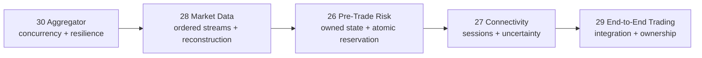

# HLD 26–30 Owner Learning Roadmap

This is the single source of truth for **learning order, interview ROI, readiness, and revision priority** across HLD 26–30. Project-level guides own technical content; do not repeat rankings inside them.

## The Two Rankings

Learning order and interview revision order are intentionally different.

### Learn in this order

1. **HLD 30 — Multi-Service Aggregator**: concurrency, deadlines, retry safety, partial failure, idempotency.
2. **HLD 28 — Market Data Platform**: ordered streams, packet loss, replay, state reconstruction, slow consumers.
3. **HLD 26 — Pre-Trade Risk Platform**: low-latency owned state, atomic check/reserve, configuration, recovery, fencing.
4. **HLD 27 — Exchange Connectivity Platform**: sessions, protocol sequences, throttling, failover, duplicate and uncertain outcomes.
5. **HLD 29 — End-to-End Electronic Trading Platform**: integrate the four mental models into one business lifecycle.

This order minimizes cognitive load. HLD 29 is studied last because it references all subsystem boundaries; starting with it in depth encourages shallow memorization of too many boxes.

### Revise in this order for a trading interview

1. **HLD 29** — broadest question and best opening system story.
2. **HLD 26** — strongest low-latency/state-consistency deep dive.
3. **HLD 27** — strongest trading-specific correctness discussion.
4. **HLD 28** — important when the role emphasizes feeds, streaming, or pricing.
5. **HLD 30** — high general-backend ROI and useful resilience fallback.

Revision starts with HLD 29 because by then the subsystem concepts are already learned.

## ROI Scorecard

Scores are relative within this five-project pack: 5 is highest.

| HLD                     | Learning foundation | Trading-interview ROI | General-backend ROI | Difficulty | Primary payoff                                        |
| ----------------------- | ------------------: | --------------------: | ------------------: | ---------: | ----------------------------------------------------- |
| 30 — Aggregator         |                   5 |                     3 |                   5 |          2 | Deadlines, concurrency, retry and partial failure     |
| 28 — Market Data        |                   4 |                     4 |                   3 |          4 | Sequencing, replay, stateful streams and backpressure |
| 26 — Pre-Trade Risk     |                   5 |                     5 |                   4 |          4 | Low-latency state ownership and atomic decisions      |
| 27 — Connectivity       |                   3 |                     5 |                   3 |          5 | Protocol sessions, failover and uncertain outcomes    |
| 29 — End-to-End Trading |                   3 |                     5 |                   4 |          5 | Architecture synthesis and cross-service ownership    |

For a general backend interview, prioritize **30 → 26 → 29 → 28 → 27**. For a low-latency electronic-trading role, use the trading revision order above.

## What “Interview-Ready” Means

Code completion is not the readiness test. For each HLD, progress through these gates:

| Gate           | Demonstration                                                                          |
| -------------- | -------------------------------------------------------------------------------------- |
| R0 — Recognize | Explain the problem and name the hardest constraint                                    |
| R1 — Pitch     | Give a coherent two-minute summary without notes                                       |
| R2 — Draw      | Reproduce the high-level diagram and ownership boundaries in ten minutes               |
| R3 — Deliver   | Complete a structured 40–60 minute answer                                              |
| R4 — Defend    | Answer failures, alternatives, bottlenecks, and red-flag follow-ups                    |
| R5 — Adapt     | Modify the design live when scale, latency, consistency, or failure assumptions change |

**Interview-ready = R4.** R5 is the stretch goal. Production readiness is tracked separately in each project’s `PRODUCTION_READINESS.md`.

## Minimum Exit Criteria by Project

### HLD 30 — Aggregator

You can explain why latency is approximately `max(A, B, C)` rather than their sum; allocate an end-to-end deadline; retry only safe transient failures; isolate downstreams with bulkheads/breakers; define partial-result semantics; and persist one winner under concurrent duplicate request IDs.

### HLD 28 — Market Data

You can explain A/B feeds and missing sequences; buffer/replay before book mutation; reconstruct an order book; restore snapshot plus tail; partition channel order versus symbol ownership; and prevent slow clients from blocking ingestion.

### HLD 26 — Pre-Trade Risk

You can explain why no database sits on the hot path; make check plus reservation atomic; distribute committed limit versions; recover snapshot plus journal tail through the live transition logic; fence one partition owner; and fail closed on stale/missing state.

### HLD 27 — Connectivity

You can explain session affinity; sender/target sequences and resend; venue throttling with cancel priority; fenced active/standby ownership; duplicate client intent; and why disconnect-after-write becomes `UNKNOWN` rather than an automatic retry.

### HLD 29 — End-to-End Trading

You can assign authoritative ownership across gateway, OMS, risk, market data, connectivity, executions, and positions; walk success/reject/cancel/fill/unknown flows; explain asynchronous position lag versus synchronous reservation; recover from ordered events; and avoid duplicating HLD 26–28 internals.

## Crunch-Time Paths

### Two hours available

1. Read the HLD 29 timed guide and redraw its architecture.
2. Read HLD 26’s atomic reservation, recovery, and fencing sections.
3. Memorize the HLD 27 uncertain-outcome explanation.
4. Review the red flags below.

Goal: one strong integrated answer with two credible deep dives.

### One day available

1. HLD 29 overview and diagram.
2. HLD 26 full timed answer.
3. HLD 27 session/sequence/unknown deep dive.
4. HLD 28 gap and slow-consumer deep dive.
5. HLD 30 deadline/retry/partial-result deep dive.
6. Finish with one 45-minute HLD 29 mock.

### Three days available

| Day | Work                                                                       |
| --- | -------------------------------------------------------------------------- |
| 1   | Learn HLD 30 and 28; draw both from memory                                 |
| 2   | Learn HLD 26 and 27; practice their failure drills                         |
| 3   | Learn HLD 29; run one full mock, review weak follow-ups, run a second mock |

### Seven days available

| Day | Focus                                                       |
| --- | ----------------------------------------------------------- |
| 1   | HLD 30: guide, demo, draw, 20-minute explanation            |
| 2   | HLD 28: guide, demo, gap/recovery mock                      |
| 3   | HLD 26: guide, demo, atomicity/recovery mock                |
| 4   | HLD 27: guide, demo, uncertainty/failover mock              |
| 5   | HLD 29: complete flow and ownership                         |
| 6   | Two random 45-minute mocks; record weak answers             |
| 7   | Revise only weak points and deliver one no-notes final mock |

## Effort Allocation

Until every project reaches R4:

- **70%** drawing and verbal delivery.
- **20%** failure drills and interviewer follow-ups.
- **10%** runnable code/demo review.

After R4, use production-readiness documents for broader learning. Do not spend interview preparation time implementing Kubernetes, complete vendor protocols, every schema, or multi-region infrastructure.

## Progress Board

Update only this table; do not create competing status files.

| HLD                     | Pitch R1 | Draw R2 | Deliver R3 | Defend R4 | Adapt R5 | Next action                                |
| ----------------------- | -------- | ------- | ---------- | --------- | -------- | ------------------------------------------ |
| 30 — Aggregator         | ☐        | ☐       | ☐          | ☐         | ☐        | Give two-minute deadline/retry explanation |
| 28 — Market Data        | ☐        | ☐       | ☐          | ☐         | ☐        | Draw loss → replay → book flow             |
| 26 — Pre-Trade Risk     | ☐        | ☐       | ☐          | ☐         | ☐        | Explain atomic reservation without a DB    |
| 27 — Connectivity       | ☐        | ☐       | ☐          | ☐         | ☐        | Explain disconnect-after-write             |
| 29 — End-to-End Trading | ☐        | ☐       | ☐          | ☐         | ☐        | Draw ownership and walk one order          |

Check a gate only after a no-notes attempt. Reading a guide does not complete a gate.

## Interview Red Flags to Eliminate

- Starting with technology names before requirements and scale.
- Drawing many services without saying who owns mutable state.
- Claiming exactly-once, zero loss, or active-active without defining the boundary.
- Putting a remote database on a strict low-latency hot path without justification.
- Blindly retrying an order after an uncertain venue write.
- Applying market-data events after a sequence gap as if the book were valid.
- Letting a slow client backpressure a feed or trading hot path.
- Treating eventual position projections as a substitute for synchronous risk reservation.
- Repeating full risk/connectivity/market-data internals inside HLD 29.
- Claiming local unit tests or Docker files prove production readiness.
- Giving no failure recovery, capacity bottleneck, or explicit trade-off.

## Repository-Owner Rules

1. Keep this file as the only ranking and progress source.
2. Keep technical answers inside each project’s interview guide.
3. Keep deployment gaps inside each project’s production-readiness document.
4. Keep HLD 26–28 as deep subsystem owners and HLD 29 as the integration owner.
5. Change rankings only when the target role changes; do not reorder them after every study session.
6. Prefer mock-interview evidence over additional feature count.
7. Review this roadmap monthly or before a new interview campaign—not daily.

## Navigation

- [Runnable interview pack](HLD-26-30-INTERVIEW-PACK.md)
- [Interview versus production readiness](docs/READINESS_LEVELS.md)
- [HLD 26 — Pre-Trade Risk](trading-risk-platform/pretrade-risk-engine/40-60_MINUTE_HLD.md)
- [HLD 27 — Exchange Connectivity](exchange-connectivity-platform/INTERVIEW_GUIDE.md)
- [HLD 28 — Market Data](market-data-platform/INTERVIEW_GUIDE.md)
- [HLD 29 — End-to-End Trading](electronic-trading-platform/INTERVIEW_GUIDE.md)
- [HLD 30 — Multi-Service Aggregator](multi-service-aggregator/INTERVIEW_GUIDE.md)
