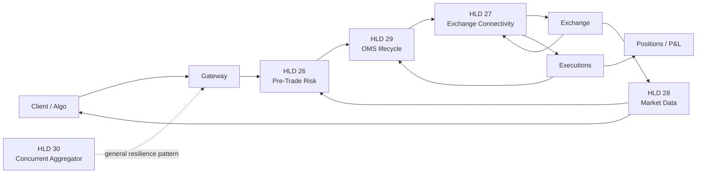

# System Design Projects

Runnable Java system-design projects for learning, interview practice, and production-readiness study. This README is the repository owner map: start here to choose a path, find the project that owns a concept, run its proof, and distinguish interview evidence from production evidence.

<!-- project-catalog:summary:start -->

The tracked portfolio contains **30 canonical projects**. Keep them separate: focused projects teach one hard idea, while flagship projects integrate multiple ideas without reimplementing every subsystem.

<!-- project-catalog:summary:end -->

## Start Here

| Goal                                          | First document                                                   | Outcome                                                                     |
| --------------------------------------------- | ---------------------------------------------------------------- | --------------------------------------------------------------------------- |
| Follow one exhaustive repo-wide learning rank | [Repository learning order](LEARNING-ORDER.md)                   | All projects ordered by prerequisites and interview ROI                     |
| Learn a reusable 40–60 minute HLD method      | [Common HLD interview flows](docs/COMMON_HLD_INTERVIEW_FLOWS.md) | A repeatable requirements → estimates → design → failure-analysis structure |
| Prepare HLD 26–30 in the right order          | [HLD 26–30 owner roadmap](HLD-26-30-LEARNING-ROADMAP.md)         | Learning order, interview ROI, readiness gates, and crunch-time plans       |
| Run the five HLD 26–30 demonstrations         | [HLD 26–30 runnable pack](HLD-26-30-INTERVIEW-PACK.md)           | Commands and ownership boundaries for each runnable vertical slice          |
| Separate interview scope from production work | [Readiness levels](docs/READINESS_LEVELS.md)                     | I1 interview readiness versus P0–P4 production evidence                     |
| Choose a project by concept                   | [Complete portfolio map](#complete-portfolio-map)                | One canonical owner for every major learning story                          |

## Whole-Repository Learning Flow

```mermaid
flowchart LR
    F["1. Foundations<br/>web, cache, queue, KV, concurrency"]
    S["2. Service design<br/>API, auth, data, validation"]
    W["3. Business workflows<br/>orders, jobs, notifications, rides"]
    D["4. Distributed correctness<br/>idempotency, logs, replay, recovery"]
    X["5. Domain specialization<br/>trading, payments, fraud, AI"]
    I["6. Interview delivery<br/>draw, explain, defend, adapt"]
    P["Optional production track<br/>SLOs, HA, security, load, DR, operations"]

    F --> S --> W --> D --> X --> I
    I -. "only with a real deployment objective" .-> P
```



<!-- project-catalog:learning-stages:start -->

| Stage                       | Learn here                                                                                                                                                                                                                                                                                       | Exit condition                                                            |
| --------------------------- | ------------------------------------------------------------------------------------------------------------------------------------------------------------------------------------------------------------------------------------------------------------------------------------------------ | ------------------------------------------------------------------------- |
| 1 — Foundations             | `web-server-lab`, `cache-lab`, `message-queue-lab`, `mini-kv-storage-engine`, `java-concurrency-lab`                                                                                                                                                                                             | Explain the primitive, its invariant, and its main failure mode           |
| 2 — Service design          | `product-catalog-api`, `authentication-service`, `url-shortener`                                                                                                                                                                                                                                 | Design a clean API, persistence boundary, validation, and authorization   |
| 3 — Workflows               | `hotel-booking-service`, `notification-platform`, `distributed-task-scheduler`, `ride-sharing-backend`, `ecommerce-backend`                                                                                                                                                                      | Walk a stateful business flow through success, retry, and partial failure |
| 4 — Distributed correctness | `multi-service-aggregator`, `reliable-order-platform`, `distributed-database`, `dropbox-file-sync-demo`, `real-time-inventory-platform`, `amazon-order-tracking`, `employee-document-upload-system`                                                                                              | Defend ordering, idempotency, replay, state ownership, and recovery       |
| 5 — Specialization          | `fraud-detection-platform`, `ai-risk-fraud-investigation-assistant`, `stripe-ledger-reconciliation`, `exchange-lite`, `trading-risk-platform`, `mini-risk-management-platform`, `exchange-connectivity-platform`, `market-data-platform`, `electronic-trading-platform`, `cloud-ai-coding-agent` | Connect general patterns to domain-specific constraints                   |
| 6 — Interview delivery      | Project interview guides plus the shared HLD framework                                                                                                                                                                                                                                           | Reach R4: explain, draw, deliver, and defend without notes                |

<!-- project-catalog:learning-stages:end -->

Do not create competing repo-wide rankings. Follow the single [repository learning order](LEARNING-ORDER.md), make each dependency credible, and use focused labs to repair weak concepts before continuing.

## Complete Portfolio Map

The **Owns** column is the reason the project exists. If two projects touch the same technology, follow the owner rather than merging them.

<!-- project-catalog:portfolio:start -->

### Foundations and focused labs

| Project                                                    | Owns                                                                       | Maven entry              |
| ---------------------------------------------------------- | -------------------------------------------------------------------------- | ------------------------ |
| [Web Server Lab](web-server-lab/README.md)                 | Minimal blocking HTTP parsing and response lifecycle                       | `web-server-lab`         |
| [Cache Lab](cache-lab/README.md)                           | LRU, TTL, eviction, and cache metrics                                      | `cache-lab`              |
| [Message Queue Lab](message-queue-lab/README.md)           | Acknowledgement, retry, and dead-letter behavior                           | `message-queue-lab`      |
| [Mini KV Storage Engine](mini-kv-storage-engine/README.md) | WAL-backed key-value storage, TTL, and compaction                          | `mini-kv-storage-engine` |
| [Java Concurrency Lab](java-concurrency-lab/README.md)     | Failure-first concurrency, bounded executors, locks, atomics, JMH, and JFR | `java-concurrency-lab`   |

### APIs and business workflows

| Project                                                            | Owns                                                                     | Maven entry                  |
| ------------------------------------------------------------------ | ------------------------------------------------------------------------ | ---------------------------- |
| [Product Catalog API](product-catalog-api/README.md)               | CRUD lifecycle, validation, duplicate SKU handling, and schema migration | `product-catalog-api`        |
| [Authentication Service](authentication-service/README.md)         | Registration, login, JWT, roles, and OAuth boundary                      | `authentication-service`     |
| [URL Shortener](url-shortener/README.md)                           | Short-code generation, redirect reads, hit tracking, and rate limiting   | `url-shortener`              |
| [Hotel Booking Service](hotel-booking-service/README.md)           | Search/read API, soft deletion, security, UI, OpenAPI, and metrics       | `hotel-booking-service`      |
| [Notification Platform](notification-platform/README.md)           | Multi-channel delivery, provider failure, retry, and DLQ                 | `notification-platform`      |
| [Distributed Task Scheduler](distributed-task-scheduler/README.md) | Scheduling, worker leases, retries, and leader/lock behavior             | `distributed-task-scheduler` |
| [Ride-Sharing Backend](ride-sharing-backend/README.md)             | Driver location, nearby search, matching, and ride state                 | `ride-sharing-backend`       |
| [E-Commerce Backend](ecommerce-backend/README.md)                  | Inventory reservation, order creation, payment, and order events         | `ecommerce-backend`          |

### Distributed correctness and reliability

| Project                                                                                    | Owns                                                                                | Maven entry                                                 |
| ------------------------------------------------------------------------------------------ | ----------------------------------------------------------------------------------- | ----------------------------------------------------------- |
| [Multi-Service Aggregator](multi-service-aggregator/README.md)                             | Concurrent fan-out, deadlines, retries, partial results, and idempotent persistence | `multi-service-aggregator`                                  |
| [Reliable Order Platform](reliable-order-platform/README.md)                               | Idempotent commands, transactional outbox, consumer dedupe, and operations          | `reliable-order-platform`                                   |
| [Distributed Database](distributed-database/README.md)                                     | TCP KV cluster, consistent hashing, replication, quorum, and recovery               | `distributed-database`                                      |
| [Replicated Log Simulation](distributed-database/labs/replicated-log-simulation/)          | Focused partition and slow-replica log behavior                                     | `distributed-database/labs/replicated-log-simulation`       |
| [Dropbox File Sync](dropbox-file-sync-demo/README.md)                                      | Chunk upload, version commit, conflict copies, tombstones, and cursor replay        | `dropbox-file-sync-demo`                                    |
| [Real-Time Inventory](real-time-inventory-platform/real-time-inventory-platform/README.md) | Versioned latest-state reduction and exact/time-window transaction dedupe           | `real-time-inventory-platform/real-time-inventory-platform` |
| [Amazon Order Tracking](amazon-order-tracking/README.md)                                   | Idempotent ingest, out-of-order replay, projections, authorization, and audit       | `amazon-order-tracking`                                     |
| [Employee Document Upload](employee-document-upload-system/README.md)                      | Signed upload intent, document review policy, roles, and infrastructure boundary    | `employee-document-upload-system/app`                       |

### Trading, payments, fraud, and risk

| Project                                                                                    | Owns                                                                                       | Maven entry                             |
| ------------------------------------------------------------------------------------------ | ------------------------------------------------------------------------------------------ | --------------------------------------- |
| [Fraud Detection Platform](fraud-detection-platform/README.md)                             | Deterministic transaction ingestion and risk scoring                                       | `fraud-detection-platform`              |
| [AI Risk & Fraud Investigation Assistant](ai-risk-fraud-investigation-assistant/README.md) | Guarded casework, RAG citations, RBAC, approvals, audit, and outbox seams                  | `ai-risk-fraud-investigation-assistant` |
| [Stripe Ledger Reconciliation](stripe-ledger-reconciliation/README.md)                     | Idempotent payments, immutable double-entry accounting, webhook dedupe, and reconciliation | `stripe-ledger-reconciliation`          |
| [ExchangeLite](exchange-lite/README.md)                                                    | Matching-engine internals, binary protocol, IPC, sidecar, and CLI                          | `exchange-lite`                         |
| [Trading Risk Platform](trading-risk-platform/README.md)                                   | Venue-neutral risk services and the HLD 26 pre-trade risk engine                           | `trading-risk-platform`                 |
| [Mini Risk Management Platform](mini-risk-management-platform/README.md)                   | Broad Java 21 risk microservices, messaging, deployment, and observability                 | `mini-risk-management-platform`         |
| [Exchange Connectivity Platform](exchange-connectivity-platform/README.md)                 | HLD 27 sessions, sequence recovery, throttling, failover, dedupe, and uncertain outcomes   | `exchange-connectivity-platform`        |
| [Market Data Platform](market-data-platform/README.md)                                     | HLD 28 sequencing, gap repair, normalization, books, fan-out, and slow consumers           | `market-data-platform`                  |
| [End-to-End Electronic Trading Platform](electronic-trading-platform/README.md)            | HLD 29 gateway-to-exchange lifecycle, executions, positions, recovery, and observability   | `electronic-trading-platform`           |

### AI engineering

| Project                                                  | Owns                                                                                     | Maven entry             |
| -------------------------------------------------------- | ---------------------------------------------------------------------------------------- | ----------------------- |
| [Cloud AI Coding Agent](cloud-ai-coding-agent/README.md) | Agent orchestration, provider-neutral LLM boundary, WebSockets, React UI, and sandboxing | `cloud-ai-coding-agent` |

<!-- project-catalog:portfolio:end -->

## Trading Platform Ownership and Flow

HLD 29 integrates the flow; HLD 26–28 own the detailed subsystems. HLD 30 is a reusable resilience pattern and remains independent.



| Capability                                                                    | Deep owner | Integration rule                                           |
| ----------------------------------------------------------------------------- | ---------- | ---------------------------------------------------------- |
| Synchronous limits, reservation, dynamic configuration, recovery, fencing     | HLD 26     | HLD 29 calls a thin risk contract                          |
| FIX/OUCH sessions, protocol sequences, throttling, failover, unknown orders   | HLD 27     | HLD 29 consumes normalized venue outcomes                  |
| Feed recovery, normalization, books, and fan-out                              | HLD 28     | HLD 29 consumes fresh market state                         |
| OMS lifecycle, cross-service ownership, executions, positions, reconciliation | HLD 29     | Integrates the platform without cloning HLD 26–28          |
| Generic concurrent downstream aggregation                                     | HLD 30     | Reuse the pattern; do not force it into the trading domain |

## How to Work Through Any Project

1. Read its `README.md` for scope and the smallest runnable path.
2. Read `docs/INTERVIEW_GUIDE.md` or the project’s timed HLD guide.
3. Draw the architecture and critical sequence without notes.
4. Run `mvn test`, then execute the documented demo.
5. Explain which invariant each important test protects.
6. Practice one dependency failure, duplicate, timeout, recovery, or overload scenario.
7. Record interview progress only in the owning roadmap or guide.
8. Open `PRODUCTION_READINESS.md` only after the interview answer reaches R4.

Reading code is not completion. The interview output is a coherent design you can draw, defend, and modify under a changed requirement.

## Build and Tooling Conventions

- **Maven is the only canonical Java build system.** There are no Gradle files in canonical project paths.
- A multi-module project uses its root `pom.xml`; exceptions are listed in the portfolio map.
- Root `package.json` is documentation tooling, not a second Java build.
- Node is also used by the Cloud AI Coding Agent frontend.
- Java 17 is the baseline; projects that declare Java 21 must be run with JDK 21 explicitly.

For a typical project:

```powershell
cd G:\TechStudyNotes\SystemDesignProjects\<project>
mvn clean verify
mvn exec:java        # when the project README provides an exec entry point
mvn spring-boot:run  # when the project is a Spring Boot service
```

For a Java 21 project:

```powershell
$studyJdk = "C:\Program Files\Eclipse Adoptium\jdk-21.0.12.8-hotspot"
$env:JAVA_HOME = $studyJdk
$env:Path = "$studyJdk\bin;$env:Path"
mvn clean verify
```

For the HLD 26 module:

```powershell
cd G:\TechStudyNotes\SystemDesignProjects\trading-risk-platform
mvn -pl pretrade-risk-engine -am test
mvn -pl pretrade-risk-engine spring-boot:run
```

For the nested employee-document application:

```powershell
cd G:\TechStudyNotes\SystemDesignProjects\employee-document-upload-system\app
mvn clean verify
```

Always prefer the exact commands in a project README when they differ from these defaults.

## Documentation Map

### Repository-level sources of truth

| Document                                                         | Owns                                                                              |
| ---------------------------------------------------------------- | --------------------------------------------------------------------------------- |
| This `README.md`                                                 | Whole-repository navigation, project ownership, and learning flow                 |
| [`project-catalog.json`](project-catalog.json)                   | Machine-readable project identity, category, stage, build entry, and HLD metadata |
| [Repository learning order](LEARNING-ORDER.md)                   | The single exhaustive prerequisite and interview-ROI ranking                      |
| [Common HLD interview flows](docs/COMMON_HLD_INTERVIEW_FLOWS.md) | Reusable 40–60 minute system-design method                                        |
| [HLD 26–30 roadmap](HLD-26-30-LEARNING-ROADMAP.md)               | Ranking, ROI, readiness gates, progress, and revision order                       |
| [HLD 26–30 runnable pack](HLD-26-30-INTERVIEW-PACK.md)           | Runnable locations and commands for HLD 26–30                                     |
| [Readiness levels](docs/READINESS_LEVELS.md)                     | Interview versus production evidence vocabulary                                   |

### Project-level convention

- `README.md`: purpose, scope, prerequisites, run commands, and smoke test.
- `docs/INTERVIEW_GUIDE.md`: pitch, timed answer, trade-offs, failures, and follow-ups.
- `docs/DIAGRAMS.md`: context, architecture, sequence, state, and deployment views.
- `docs/DEMO_SCRIPT.md`: exact live-demo steps and talking points.
- `PRODUCTION_READINESS.md`: real adapters, SLOs, HA, security, load, DR, rollout, and remaining gaps.

Flagships may add ADRs, operations guides, failure drills, API references, and technology deep dives. Those additions should not duplicate repository-level ranking.

## Interview Scope Versus Production Scope

| Track            | Good-enough boundary                                                                                                                    | Do not claim                                                         |
| ---------------- | --------------------------------------------------------------------------------------------------------------------------------------- | -------------------------------------------------------------------- |
| Interview I1     | Requirements, estimates, architecture, ownership, core flows, one or two deep dives, failures, trade-offs, and a runnable key invariant | That local code or a Docker file proves production readiness         |
| Production P0–P4 | SLOs, capacity, real adapters, security, HA/recovery, load/soak, fault injection, observability, DR, rollout, and real-traffic evidence | Completion without measured evidence in a representative environment |

Use the labels `VERIFIED_LOCAL`, `IMPLEMENTED_UNVERIFIED`, `DESIGNED_ONLY`, and `EXTERNAL_DEPENDENCY`. A strong interview project is intentionally allowed to stop at I1.

## Redundancy and Repository Boundaries

- Keep separate learning stories separate; do not build one giant application.
- HLD 29 integrates HLD 26–28 through contracts and does not own their detailed implementations.
- `exchange-lite`, `trading-risk-platform`, and `mini-risk-management-platform` respectively own exchange internals, focused pre-trade risk, and broad microservice/platform architecture.
- `fraud-detection-platform` owns deterministic scoring; `ai-risk-fraud-investigation-assistant` owns guarded investigation workflows.
- `ecommerce-backend` owns the business workflow; `reliable-order-platform` owns delivery/idempotency correctness.
- `java-concurrency-lab` is a reusable failure lab, not another trading product.
- The canonical Real-Time Inventory application currently lives at `real-time-inventory-platform/real-time-inventory-platform`. Other project copies inside the outer wrapper are legacy mirror debt: do not edit or treat them as canonical. Flattening that wrapper is a separate destructive repository-maintenance task.

Local-only `_archive` and `_meta` directories are ignored by Git and are not part of the tracked project map.

## Adding a Project: One Entry, All Indexes

`project-catalog.json` is the only project registry. Do not manually edit content between `project-catalog:*` comments.

1. Create or reuse the canonical project directory with its `README.md` and Maven `pom.xml`.
2. Add one `kind: "project"` entry to `project-catalog.json`. Choose one category and learning stage, state what the project owns, and point `mavenEntry` at the directory containing its canonical `pom.xml`.
3. Insert its ID once in `learningOrder`, add earlier prerequisites in `learningDependencies`, and assign its `interviewRoi`. Renumbering is generated automatically.
4. Add the optional `hld` object only when the project belongs in the HLD runnable pack.
5. Run the refresh command from the repository root:

```powershell
npm run docs:refresh
```

That one command regenerates:

- the canonical project count;
- the whole-repository learning-stage index;
- the exhaustive repository learning-order ranking;
- every category table in the complete portfolio map;
- the HLD runnable index for entries carrying HLD metadata;
- each canonical project's `CODE_FLOW.md`;
- Markdown formatting.

Then verify generated state:

```powershell
npm run docs:index:check
npm run docs:code-flow:check
npm run docs:audit
```

The fast checks fail when a top-level project is unregistered, missing from the learning order, assigned a later dependency, missing ROI, backed by a missing path/build root, or represented by stale generated documentation. GitHub Actions runs both checks on every push and pull request. The order is curated metadata: change it deliberately when prerequisites or target-role ROI genuinely change, not after every study session.

## Shared Documentation Tooling

Install the root documentation dependencies once:

```powershell
cd G:\TechStudyNotes\SystemDesignProjects
npm install
```

Format and audit tracked Markdown, Mermaid/JSON blocks, local links, and documentation coverage:

```powershell
npm run docs:format
npm run docs:audit
```

Render the shared example or any `.mmd` file:

```powershell
npm run diagram:example
.\scripts\render-mermaid.ps1 -Source .\url-shortener\docs\architecture.mmd
```

## Verification Snapshot

Last repository-map refresh: **2026-08-22**.

- HLD 26 passed 13 tests and a local health check on JDK 21.
- HLD 27–30 passed 16 tests; their CLI demonstrations passed, and HLD 30's HTTP path was exercised locally.
- Canonical Java projects use Maven. Remaining Gradle files exist only in the non-canonical Real-Time Inventory mirror described above.
- Docker/Compose and Kubernetes files are implementation evidence only until run against a responsive engine/cluster.
- A local unit test, generated manifest, or static configuration check must not be reported as a production runtime proof.

## Repository-Owner Checklist

When adding or materially changing a project:

1. Reuse the closest canonical project instead of creating a duplicate.
2. Keep Java builds Maven-only.
3. Add or update one entry in `project-catalog.json`; never hand-maintain generated index blocks.
4. Add or update its README, interview guide, diagrams, demo path, and readiness boundary in proportion to scope.
5. Verify the smallest real execution path and state the evidence level honestly.
6. Run `npm run docs:refresh` and `npm run docs:audit` from the repository root.
7. Keep rankings in the HLD roadmap and technical detail in project documentation.
8. Commit only the intended files and keep `main` aligned with `origin/main`.
