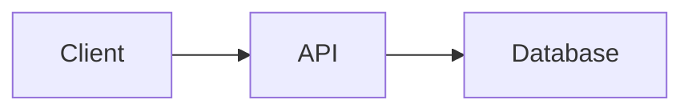

# System Design Projects

This folder is organized for hands-on backend learning and interview explanation. Projects live directly under this directory. Old wrapper folders such as `capstone-projects` and `Backend5` are archived locally under `_archive`; generated learning metadata lives locally under `_meta`. Both local-only folders are ignored by Git.

For trading/system-design topics 26–30, start with [HLD-26-30-INTERVIEW-PACK.md](HLD-26-30-INTERVIEW-PACK.md). Interview scope and production readiness use the same canonical projects but separate evidence standards defined in [docs/READINESS_LEVELS.md](docs/READINESS_LEVELS.md).

## Recommended Learning Path

Do not merge everything into one giant application. For interviews, it is stronger to have one or two deep flagship projects plus smaller focused labs you can explain quickly.

1. `trading-risk-platform`
   - Best live interview demo for risk/exchange discussion.
   - Includes a standalone `pretrade-risk-engine` with accepted/rejected orders, FIX input, fail-closed checks, market-data freshness, kill switch, circuit breaker, audit trail, race-condition demo, and P&L.
2. `exchange-lite`
   - Best low-level exchange internals project.
   - Shows order book, binary protocol, engine runtime, IPC, sidecar, and CLI operations.
3. `mini-risk-management-platform`
   - Best broader microservices/platform project.
   - Shows API gateway, order/risk/history/notification services, PostgreSQL, Kafka, Redis, Docker Compose, Kubernetes, metrics, and dashboards.
4. Specialized capstones
   - Use `reliable-order-platform` for outbox/idempotency/ops, `ai-risk-fraud-investigation-assistant` for guarded AI casework, and `cloud-ai-coding-agent` for agent orchestration and sandboxing.
5. Focused services and labs
   - Use these to practice one concept at a time: auth, CRUD, URL shortener, notification retries, scheduling, ride matching, fraud scoring, caching, queues, web servers, and KV storage.

## Consolidation Decision

The current layout should stay as separate runnable projects, not one giant application. The apparent overlaps have different interview purposes:

- `fraud-detection-platform` is the deterministic scoring service; `ai-risk-fraud-investigation-assistant` is the casework, RAG, approval, and audit layer.
- `ecommerce-backend` teaches inventory, order, and payment flow; `reliable-order-platform` teaches idempotency, transactional outbox, consumer dedupe, JWT, and operations.
- `exchange-lite`, `trading-risk-platform`, and `mini-risk-management-platform` should stay separate because they teach matching-engine internals, pre-trade risk, and microservice/platform architecture respectively.
- `java-concurrency-lab` is not another risk product; it is a failure-first concurrency lab.
- `dropbox-file-sync-demo` and `cloud-ai-coding-agent` are unique domains and should remain standalone.

## Active Projects

| Folder                                                | Purpose                                                                                                                                                         |
| ----------------------------------------------------- | --------------------------------------------------------------------------------------------------------------------------------------------------------------- |
| `product-catalog-api`                                 | CRUD API with product lifecycle, validation, duplicate SKU handling, PostgreSQL/Flyway shape.                                                                   |
| `authentication-service`                              | Registration, login, JWT, roles, mock OAuth2 flow.                                                                                                              |
| `url-shortener`                                       | Short-code generation, redirects, hit tracking, Redis-style rate limiting.                                                                                      |
| `distributed-database`                                | TCP key-value cluster with replication, quorum behavior, consistent hashing, recovery.                                                                          |
| `distributed-database/labs/replicated-log-simulation` | Focused replicated log and partition/slowness simulation.                                                                                                       |
| `ecommerce-backend`                                   | Inventory reservation, order creation, payments, order events.                                                                                                  |
| `notification-platform`                               | Multi-channel notification, retry, dead-letter behavior.                                                                                                        |
| `distributed-task-scheduler`                          | Job scheduling, retries, worker flow, leader/lock concept.                                                                                                      |
| `ride-sharing-backend`                                | Driver location, nearby search, ride request/status flow.                                                                                                       |
| `fraud-detection-platform`                            | Transaction event ingestion and risk scoring.                                                                                                                   |
| `ai-risk-fraud-investigation-assistant`               | Guarded AI fraud casework with deterministic rules, RAG citations, RBAC, approvals, audit, and outbox seams.                                                    |
| `hotel-booking-service`                               | Hotel read/search/delete API, basic auth, browser UI, OpenAPI, metrics.                                                                                         |
| `employee-document-upload-system`                     | Signed upload intent, document review policy, security roles, infra docs.                                                                                       |
| `dropbox-file-sync-demo`                              | Dropbox-style sync invariants with chunk upload, version commits, conflict copies, tombstones, and cursor replay.                                               |
| `exchange-lite`                                       | Matching engine, risk checks, binary protocol, engine/sidecar/CLI runtime.                                                                                      |
| `trading-risk-platform`                               | Venue-neutral risk platform plus live pre-trade risk engine demo.                                                                                               |
| `mini-risk-management-platform`                       | Java 21 microservices risk platform with Docker/Kubernetes/observability.                                                                                       |
| `exchange-connectivity-platform`                      | HLD 27 venue gateway: FIX/OUCH sessions, sequence recovery, throttling, failover, dedupe, and uncertain outcomes.                                               |
| `market-data-platform`                                | HLD 28 feed plant: gap repair, normalization, order-book reconstruction, fan-out, and slow-consumer isolation.                                                  |
| `electronic-trading-platform`                         | HLD 29 end-to-end order flow through gateway, risk, OMS, venue connectivity, executions, positions, recovery, and metrics.                                      |
| `multi-service-aggregator`                            | HLD 30 concurrent three-service aggregation with deadlines, retry, partial results, HTTP, and idempotent persistence.                                           |
| `reliable-order-platform`                             | Java 21 reliability project for idempotent order creation, transactional outbox, consumer dedupe, JWT, Redis, Kafka, and ops.                                   |
| `real-time-inventory-platform`                        | Versioned retail inventory visibility, latest-state stream reduction, and exact/time-window transaction deduplication.                                          |
| `amazon-order-tracking`                               | Event-first multi-carrier tracking with idempotent ingest, out-of-order replay, projections, caching, buyer/support authorization, audit, and a live dashboard. |
| `cloud-ai-coding-agent`                               | Cloud coding-agent demo with React, Spring Boot, WebSockets, provider-neutral LLM boundary, and Docker sandboxing.                                              |
| `java-concurrency-lab`                                | Java 21 backend concurrency lab with failure demos, bounded executors, locks, atomics, JMH, and JFR.                                                            |
| `cache-lab`                                           | LRU plus TTL cache behavior and metrics.                                                                                                                        |
| `message-queue-lab`                                   | Queue retry, acknowledgement, and dead-letter behavior.                                                                                                         |
| `mini-kv-storage-engine`                              | WAL-backed key-value store with TTL and compaction.                                                                                                             |
| `web-server-lab`                                      | Minimal blocking HTTP server.                                                                                                                                   |

## Documentation Standard

Each active project now has Markdown learning support. For most projects, start with:

- `README.md`: business purpose, stack, run commands, and smoke test.
- `docs/INTERVIEW_GUIDE.md`: two-minute pitch, tradeoffs, failure cases, and FAQ.
- `docs/DIAGRAMS.md`: Mermaid architecture and request-flow diagrams.
- `docs/DEMO_SCRIPT.md`: exact commands and talking points for a live interview demo.

Flagship projects may include additional deeper material such as ADRs, incident drills, operations guides, technology deep dives, and appendices.

### Shared Mermaid tooling

The repository root contains one Mermaid CLI setup shared by every project. Install it once from `G:\TechStudyNotes\SystemDesignProjects`:

```powershell
npm install
```

Render the included flowchart example:

```powershell
npm run diagram:example
```

Format and validate all tracked Markdown documentation, Mermaid blocks, JSON blocks, local links, and project HLD/LLD coverage:

```powershell
npm run docs:format
npm run docs:audit
```

Render any `.mmd` file from the root or a subdirectory. If `-Output` is omitted, an SVG is created next to the source file:

```powershell
.\scripts\render-mermaid.ps1 -Source .\url-shortener\docs\architecture.mmd
.\scripts\render-mermaid.ps1 -Source .\url-shortener\docs\architecture.mmd -Output .\url-shortener\docs\architecture.png
```

Markdown files on GitHub can also display Mermaid without generating an image:

````markdown

````

## Verification Notes

Last portfolio audit: 2026-08-05. Focused consolidation re-audit: 2026-08-13. Real-time inventory platform added and verified: 2026-08-16. HLD 26–30 interview pack added and verified: 2026-08-22.

- Maven 3.9 currently uses Java 17 by default. Temurin JDK 21 is installed at `C:\Program Files\Eclipse Adoptium\jdk-21.0.12.8-hotspot`; set `JAVA_HOME` explicitly for Java 21 modules.
- The HLD 26 pre-trade module passed 13 tests and a live health check on JDK 21. HLD 27–30 passed 15 tests plus CLI demos; the aggregator HTTP endpoint also passed a live request.
- Docker, Docker Compose, and kubectl CLIs are on PATH, but the Docker daemon is not reachable from this terminal and kubectl has no current context. Full container and cluster smoke tests still require a responsive Docker Desktop engine and Kubernetes context.
- The old `Booking` folder has been archived as `_archive/2026-08-05-flattened-wrappers/Booking-legacy`. Use `hotel-booking-service` as the active copy.
- The 2026-08-13 re-audit found no project that should be merged immediately. It updated the active list and documentation standard for the newer tracked projects.
- Docker Compose structural validation passed for 17 files. Kubernetes offline checks passed for four kustomization directories and 41 raw resource files, but Kubernetes runtime apply tests are not confirmed without a cluster.
- Focused runtime checks passed for `dropbox-file-sync-demo`, `java-concurrency-lab`, `ai-risk-fraud-investigation-assistant`, `reliable-order-platform`, and the frontend part of `cloud-ai-coding-agent`. The cloud-agent backend Gradle test was not run locally because Gradle is not installed and the project has no wrapper; its Dockerfile builds through a Gradle image once Docker Desktop is working.
- `real-time-inventory-platform` passed all six Maven unit/integration tests and a live H2-backed HTTP smoke test. Its PostgreSQL Compose topology is provided but was not runtime-validated in that check.

## Common Verification Commands

For most Java 17 projects:

```powershell
mvn test
mvn "-DskipTests" package
```

For `employee-document-upload-system`:

```powershell
cd app
mvn test
mvn "-DskipTests" package
```

For `mini-risk-management-platform` until a real JDK 21 is installed:

```powershell
$jdk = "C:\Users\Chiranjeev Jain\.jdks\openjdk-25"
$env:JAVA_HOME = $jdk
$env:Path = "$jdk\bin;$env:Path"
mvn "-Dnet.bytebuddy.experimental=true" test
mvn "-Dnet.bytebuddy.experimental=true" "-DskipTests" package
```

For the fast live pre-trade demo:

```powershell
cd G:\TechStudyNotes\SystemDesignProjects\trading-risk-platform
mvn -pl pretrade-risk-engine spring-boot:run
```

Open `http://localhost:8090`.

For the exchange engine demo:

```powershell
cd G:\TechStudyNotes\SystemDesignProjects\exchange-lite
mvn test
mvn package
```

Then follow the three-terminal engine, sidecar, and CLI commands in `exchange-lite/README.md`.

For the Dropbox-style sync demo:

```powershell
cd G:\TechStudyNotes\SystemDesignProjects\dropbox-file-sync-demo
mvn test
powershell -ExecutionPolicy Bypass -File scripts\smoke-test.ps1
mvn spring-boot:run
```

Open `http://127.0.0.1:8080`.

For the Java concurrency lab:

```powershell
cd G:\TechStudyNotes\SystemDesignProjects\java-concurrency-lab
$jdk = "C:\Users\Chiranjeev Jain\.jdks\openjdk-25"
$env:JAVA_HOME = $jdk
$env:Path = "$jdk\bin;$env:Path"
mvn test
mvn exec:java "-Dexec.args=safe 100000"
mvn exec:java "-Dexec.args=failures"
```
