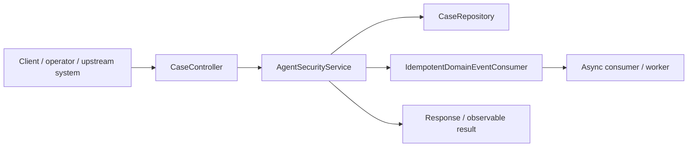
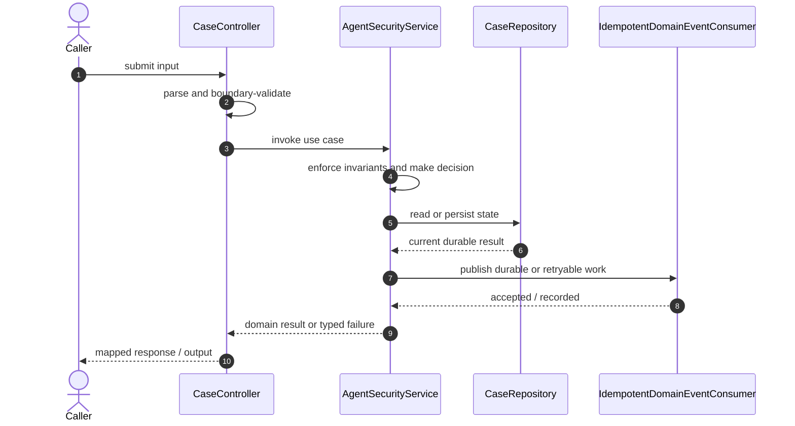

# Ai Risk Fraud Investigation Assistant Code Flow

This is the single code-flow guide for the project. It connects the business request to concrete source files, explains both architectural levels, and shows where validation, state changes, asynchronous work, and responses occur.

## Scope and outcome

> User → LLM → deterministic risk/policy engine → read-only tools/data → human approval for privileged action → audit log

The tracked production-code inventory used by this guide contains **24 source units** and **6 annotation-discovered HTTP operations**. Generated/build output and test sources are intentionally excluded from the runtime path.

## High-Level Design

At the system level, callers enter through an inbound adapter. The adapter owns transport concerns; application/domain code owns use-case decisions; repositories and gateways isolate state and external systems. Asynchronous adapters extend the flow without moving business invariants into controllers or consumers.

### Runtime stages

1. **Enter:** a request, command, scheduled trigger, protocol message, or UI action reaches the inbound boundary.
2. **Validate:** transport shape and required fields are rejected before domain mutation.
3. **Decide:** application/domain logic loads required state and applies invariants, idempotency, authorization, limits, or algorithms.
4. **Commit:** durable state changes pass through a repository/store; external calls pass through gateways; asynchronous work passes through message boundaries.
5. **Return and observe:** the adapter maps the result to an HTTP response, protocol response, CLI output, event, or metric.

## Low-Level Design

The low-level path keeps orchestration directional: inbound adapter → application/domain unit → persistence/outbound adapter. Contracts carry data between layers; configuration and security apply cross-cutting policy without becoming business logic.

### Component map

| Responsibility           | Concrete code                                                                                                                                   |
| ------------------------ | ----------------------------------------------------------------------------------------------------------------------------------------------- |
| User interface           | `src`, `vite-env.d`, `vite.config`                                                                                                              |
| Entry point              | `FraudAssistantApplication`                                                                                                                     |
| Application/domain logic | `AgentSecurityService`, `AiInvestigationService`, `PolicyRagService`, `CaseWorkflowService`, `AuditService`, `OutboxService`, `FraudRuleEngine` |
| Supporting logic         | `ApprovedToolRegistry`                                                                                                                          |
| API/message contract     | `InvestigationResult`, `CaseView`, `TransactionRequest`                                                                                         |
| Inbound adapter          | `CaseController`, `SecurityExceptionHandler`                                                                                                    |
| Domain/data model        | `CaseEntity`, `TransactionEntity`                                                                                                               |
| Persistence adapter      | `CaseRepository`, `TransactionRepository`                                                                                                       |
| Messaging/async adapter  | `IdempotentDomainEventConsumer`, `OutboxPublisher`                                                                                              |
| Configuration/security   | `SecurityConfig`                                                                                                                                |

### Inbound operations

| Verb/trigger | Path or input             | Owning code      |
| ------------ | ------------------------- | ---------------- |
| `POST`       | `/transactions`           | `CaseController` |
| `GET`        | `/cases`                  | `CaseController` |
| `GET`        | `/cases/{id}/signals`     | `CaseController` |
| `POST`       | `/cases/{id}/investigate` | `CaseController` |
| `POST`       | `/cases/{id}/approve`     | `CaseController` |
| `GET`        | `/cases/{id}/audit`       | `CaseController` |

## Detailed source walkthrough

Read this table top-down by category, then follow the linked files. “Key methods” are discovered from the checked-in implementation and identify useful debugging/interview entry points.

| Source file                                                                                                             | Role                     | Responsibility and important methods                                                                                                                                                   |
| ----------------------------------------------------------------------------------------------------------------------- | ------------------------ | -------------------------------------------------------------------------------------------------------------------------------------------------------------------------------------- |
| [`src.tsx`](./frontend/src.tsx)                                                                                         | User interface           | src presents state and initiates user actions.                                                                                                                                         |
| [`vite-env.d.ts`](./frontend/vite-env.d.ts)                                                                             | User interface           | vite-env.d presents state and initiates user actions.                                                                                                                                  |
| [`vite.config.ts`](./frontend/vite.config.ts)                                                                           | User interface           | vite.config presents state and initiates user actions.                                                                                                                                 |
| [`FraudAssistantApplication.java`](./src/main/java/com/interview/fraud/FraudAssistantApplication.java)                  | Entry point              | FraudAssistantApplication bootstraps the process and wires the runtime. Key methods: `main()`.                                                                                         |
| [`AgentSecurityService.java`](./src/main/java/com/interview/fraud/ai/AgentSecurityService.java)                         | Application/domain logic | AgentSecurityService coordinates the use case and enforces domain decisions. Key methods: `inspect()`, `assertSafeOutput()`, `Inspection()`, `InvestigationRequest()`.                 |
| [`AiInvestigationService.java`](./src/main/java/com/interview/fraud/ai/AiInvestigationService.java)                     | Application/domain logic | AiInvestigationService coordinates the use case and enforces domain decisions. Key methods: `investigate()`, `validateModelOutput()`.                                                  |
| [`ApprovedToolRegistry.java`](./src/main/java/com/interview/fraud/ai/ApprovedToolRegistry.java)                         | Supporting logic         | ApprovedToolRegistry provides a focused algorithm or shared implementation detail. Key methods: `call()`.                                                                              |
| [`InvestigationResult.java`](./src/main/java/com/interview/fraud/ai/InvestigationResult.java)                           | API/message contract     | InvestigationResult carries validated data across an API or messaging boundary. Key methods: `Evidence()`.                                                                             |
| [`PolicyRagService.java`](./src/main/java/com/interview/fraud/ai/PolicyRagService.java)                                 | Application/domain logic | PolicyRagService coordinates the use case and enforces domain decisions. Key methods: `search()`, `Citation()`.                                                                        |
| [`CaseController.java`](./src/main/java/com/interview/fraud/casework/CaseController.java)                               | Inbound adapter          | CaseController accepts an inbound call, validates its boundary contract, and delegates work. Key methods: `ingest()`, `cases()`, `signals()`, `investigate()`, `approve()`, `audit()`. |
| [`CaseEntity.java`](./src/main/java/com/interview/fraud/casework/CaseEntity.java)                                       | Domain/data model        | CaseEntity represents domain state, identity, or an invariant-bearing value.                                                                                                           |
| [`CaseRepository.java`](./src/main/java/com/interview/fraud/casework/CaseRepository.java)                               | Persistence adapter      | CaseRepository reads or writes durable state behind a storage boundary.                                                                                                                |
| [`CaseView.java`](./src/main/java/com/interview/fraud/casework/CaseView.java)                                           | API/message contract     | CaseView carries validated data across an API or messaging boundary. Key methods: `from()`.                                                                                            |
| [`CaseWorkflowService.java`](./src/main/java/com/interview/fraud/casework/CaseWorkflowService.java)                     | Application/domain logic | CaseWorkflowService coordinates the use case and enforces domain decisions. Key methods: `ingest()`, `list()`, `require()`, `signals()`, `approve()`.                                  |
| [`AuditService.java`](./src/main/java/com/interview/fraud/platform/AuditService.java)                                   | Application/domain logic | AuditService coordinates the use case and enforces domain decisions. Key methods: `log()`, `forEntity()`.                                                                              |
| [`IdempotentDomainEventConsumer.java`](./src/main/java/com/interview/fraud/platform/IdempotentDomainEventConsumer.java) | Messaging/async adapter  | IdempotentDomainEventConsumer publishes, consumes, retries, or records asynchronous work. Key methods: `consume()`.                                                                    |
| [`OutboxPublisher.java`](./src/main/java/com/interview/fraud/platform/OutboxPublisher.java)                             | Messaging/async adapter  | OutboxPublisher publishes, consumes, retries, or records asynchronous work. Key methods: `publish()`.                                                                                  |
| [`OutboxService.java`](./src/main/java/com/interview/fraud/platform/OutboxService.java)                                 | Application/domain logic | OutboxService coordinates the use case and enforces domain decisions. Key methods: `add()`.                                                                                            |
| [`FraudRuleEngine.java`](./src/main/java/com/interview/fraud/risk/FraudRuleEngine.java)                                 | Application/domain logic | FraudRuleEngine coordinates the use case and enforces domain decisions. Key methods: `evaluate()`, `Signal()`, `Evaluation()`.                                                         |
| [`SecurityConfig.java`](./src/main/java/com/interview/fraud/security/SecurityConfig.java)                               | Configuration/security   | SecurityConfig defines runtime wiring, authentication, authorization, or cross-cutting policy.                                                                                         |
| [`SecurityExceptionHandler.java`](./src/main/java/com/interview/fraud/security/SecurityExceptionHandler.java)           | Inbound adapter          | SecurityExceptionHandler accepts an inbound call, validates its boundary contract, and delegates work.                                                                                 |
| [`TransactionEntity.java`](./src/main/java/com/interview/fraud/transaction/TransactionEntity.java)                      | Domain/data model        | TransactionEntity represents domain state, identity, or an invariant-bearing value.                                                                                                    |
| [`TransactionRepository.java`](./src/main/java/com/interview/fraud/transaction/TransactionRepository.java)              | Persistence adapter      | TransactionRepository reads or writes durable state behind a storage boundary.                                                                                                         |
| [`TransactionRequest.java`](./src/main/java/com/interview/fraud/transaction/TransactionRequest.java)                    | API/message contract     | TransactionRequest carries validated data across an API or messaging boundary.                                                                                                         |

## End-to-end code-flow narrative

1. Start at `CaseController`. It receives the external input and should perform only boundary parsing, authentication/authorization handoff, and request validation.
2. Follow the call into `AgentSecurityService`. This is the principal place to explain the use case, invariant checks, deduplication/concurrency decision, and success/failure result.
3. Continue into `CaseRepository` for the durable or in-memory state transition. Transaction and consistency guarantees belong at this boundary, not in response mapping.
4. Follow `IdempotentDomainEventConsumer` when the synchronous decision emits follow-up work. Verify retry, duplicate-delivery, and dead-letter behavior independently of the request thread.
5. External-system behavior is either absent or represented behind another listed adapter.
6. Return to `CaseController`, where typed outcomes become the public response or protocol result. Logging and metrics should preserve correlation identifiers without leaking secrets.

## Failure and correctness checkpoints

- **Invalid input:** rejected at the inbound contract before state mutation.
- **Domain conflict:** returned as a typed result; do not hide it as an infrastructure exception.
- **Duplicate or concurrent work:** handled where the project’s idempotency, locking, ordering, or atomic data structure is implemented.
- **Storage/integration failure:** transaction is rolled back or the operation remains safely retryable.
- **Async failure:** consumer retries must preserve idempotency; poison work must become observable rather than loop silently.
- **Observability:** trace the same request/correlation identity through inbound, domain, persistence, and async logs.

## How to trace a scenario in the debugger

1. Choose one operation from the inbound-operations table or the project’s demo script.
2. Break at `CaseController`, then step into `AgentSecurityService` rather than framework internals.
3. Inspect the command/request object immediately after validation.
4. Stop before and after the call to `CaseRepository` to compare intended and durable state.
5. If messaging exists, capture the emitted identifier and continue from `IdempotentDomainEventConsumer`.
6. Confirm the final public result and the corresponding logs/metrics.

## Related project documentation

- [Project README](./README.md)
- [Specialized diagrams](./docs/DIAGRAMS.md)
- [Interview guide](./docs/INTERVIEW_GUIDE.md)
