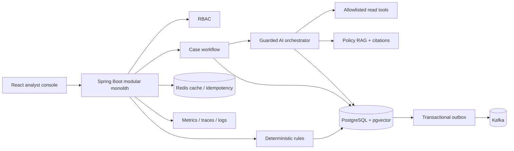
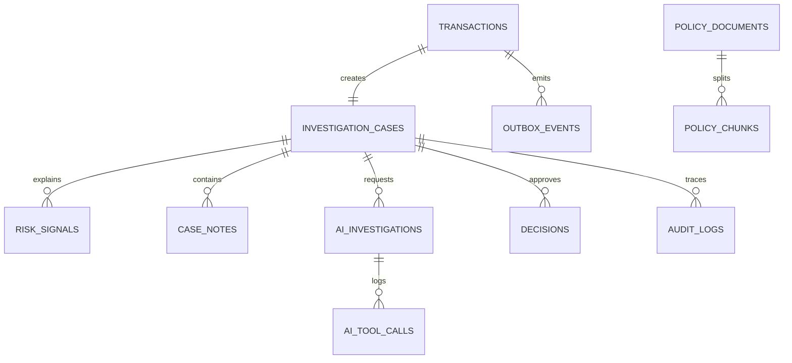
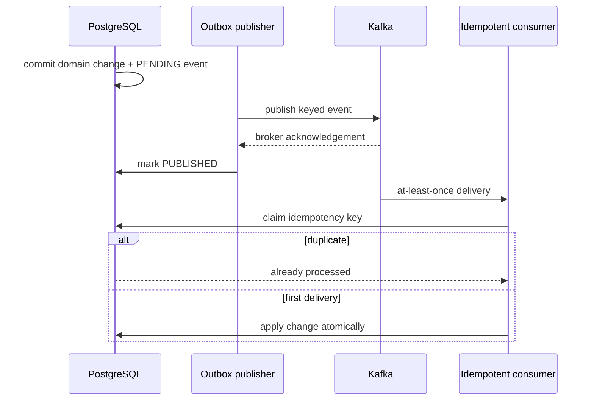
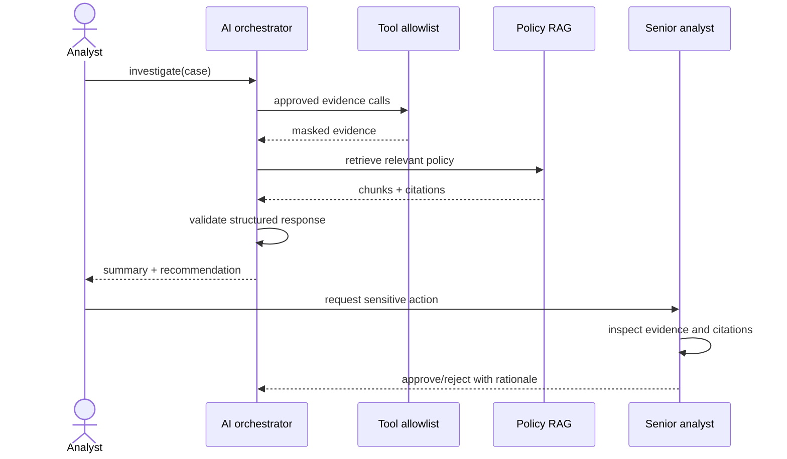

# AI Risk & Fraud Investigation Assistant

Interview-grade Java 21 + React modular monolith for deterministic fraud detection, evidence-grounded AI investigation, and human-controlled actions.

## Working local demo

Fast mode needs Java 21, Maven, Node 22:

```powershell
mvn spring-boot:run
cd frontend
npm.cmd install
npm.cmd run dev
```

Open `http://localhost:5173`. Demo accounts: `analyst / analyst-demo`, `senior / senior-demo`, `admin / admin-demo`, `auditor / auditor-demo`.

Full infrastructure mode:

```powershell
docker compose up --build
```

Open UI `http://localhost:3000`, API `http://localhost:8080`, Prometheus `http://localhost:9090`, Grafana `http://localhost:3001`.

## Architecture



The local profile substitutes file-backed H2 and a deterministic mock LLM. PostgreSQL remains the production source of truth; Redis is never authoritative.

## Vertical slice

1. Analyst ingests a transaction with an idempotency key.
2. Rules create explainable signals and a score; a case and outbox event are committed together.
3. Analyst runs an investigation. Only allowlisted tools can read evidence.
4. Policy retrieval returns cited chunks; the structured response contains all required fields.
5. A risky recommendation cannot execute an action. A senior analyst must approve it with a rationale and matching optimistic-lock version.
6. Prompts, evidence calls, response, decision, and approval are audited with basic PII masking.

## Package boundaries

- `transaction`: ingestion and immutable payment facts
- `risk`: deterministic policy rules only
- `casework`: case state machine and human decisions
- `ai`: RAG, tool allowlist, structured mocked LLM orchestration
- `platform`: audit and outbox infrastructure
- `security`: authentication and RBAC

## Database relationships



## Kafka and delivery semantics



## AI investigation sequence



## Verification

```powershell
mvn verify
cd frontend
npm.cmd run build
```

Tests cover deterministic scoring and the complete HTTP flow including RBAC denial, RAG citations, AI structure, and human approval. `evals/investigation-cases.jsonl` is a starter AI evaluation set.

See [docs/INTERVIEW_GUIDE.md](docs/INTERVIEW_GUIDE.md), [docs/FAILURE_HANDLING.md](docs/FAILURE_HANDLING.md), and [docs/THREAT_MODEL.md](docs/THREAT_MODEL.md).

## Honest scope

The local vertical slice is real and deterministic. The LLM is mocked, embeddings are stored as portable JSON in local mode, Kafka outbox publication is represented by persisted events, and Terraform provisions only ECR. Production model serving, a pgvector similarity query, active Kafka publisher/consumer workers, complete Grafana dashboards, and full EKS/RDS/ElastiCache/MSK modules are explicit evolution work—not falsely presented as finished.
