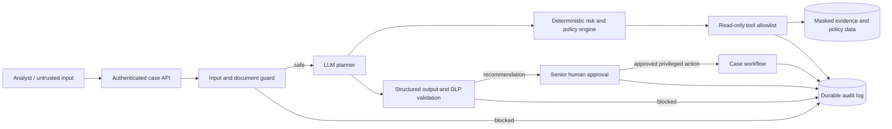
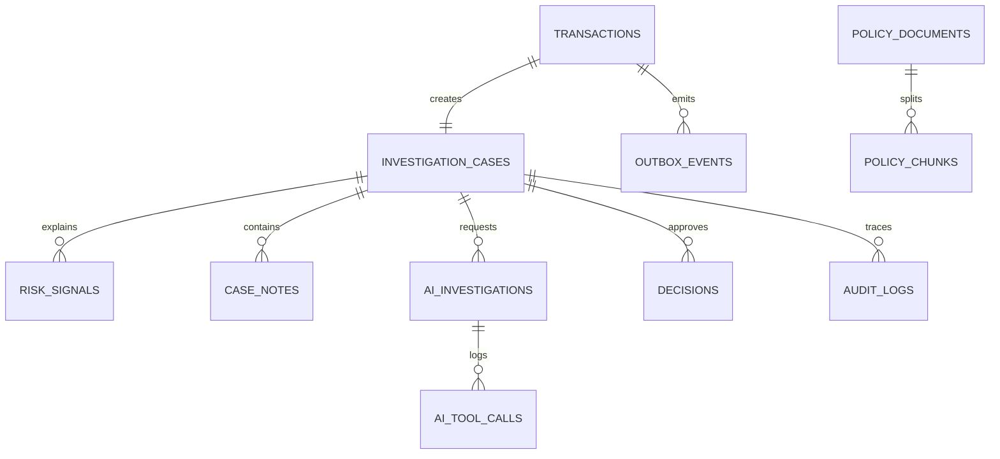
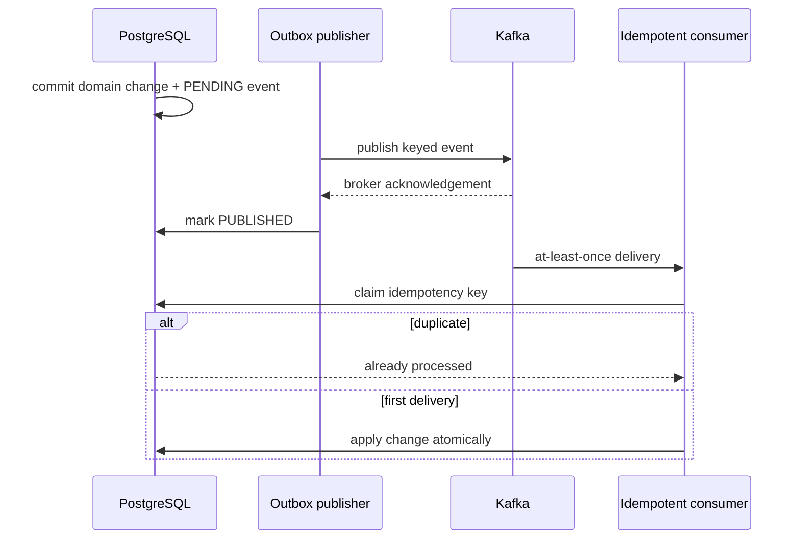
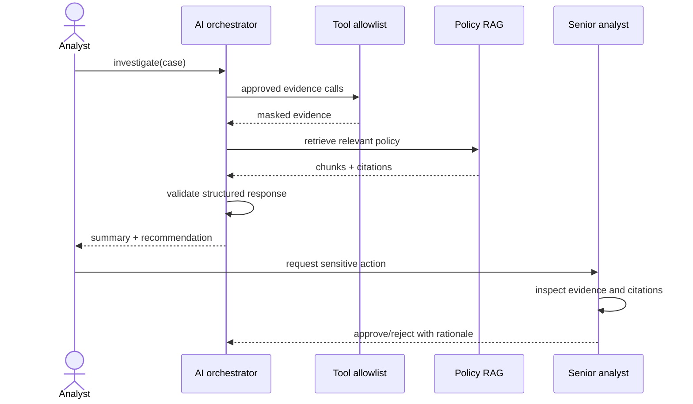

# Secure AI Risk Analyst Agent

> User → LLM → deterministic risk/policy engine → read-only tools/data → human approval for privileged action → audit log

Interview-grade Java 21 + React modular monolith for deterministic fraud detection, evidence-grounded AI investigation, and human-controlled actions.

## Why this project matters

This is not a chatbot wrapped around a database. It demonstrates the security architecture required when an LLM participates in a regulated decision workflow:

- the model proposes; deterministic code authorizes;
- retrieved documents and user prompts remain untrusted;
- the model receives read-only, allowlisted tools without write credentials;
- privileged customer actions cross a separate RBAC-protected human approval boundary;
- input, tool, output, approval, and denial events produce durable audit records;
- red-team tests prove the controls with hostile inputs instead of merely documenting them.

## Working local demo

Fast mode needs Java 21, Maven, Node 22:

```powershell
.\scripts\start-demo.cmd
```

Open `http://localhost:5173`. Demo accounts: `analyst / analyst-demo`, `senior / senior-demo`, `admin / admin-demo`, `auditor / auditor-demo`.

Stop it with:

```powershell
.\scripts\stop-demo.cmd
```

Full infrastructure mode:

```powershell
docker compose up --build
```

Open UI `http://localhost:3000`, API `http://localhost:8080`, Prometheus `http://localhost:9090`, Grafana `http://localhost:3001`.

## Architecture



The local profile substitutes file-backed H2 and a deterministic mock LLM. PostgreSQL remains the production source of truth; Redis is never authoritative.

## Vertical slice

1. Analyst ingests a transaction with an idempotency key.
2. Rules create explainable signals and a score; a case and outbox event are committed together.
3. Analyst runs an investigation. Only allowlisted tools can read evidence.
4. User text and retrieved documents pass through a deterministic injection boundary before reaching the model.
5. Policy retrieval returns cited chunks; structured output passes secret/DLP validation.
6. A risky recommendation cannot execute an action. A senior analyst must approve it with a rationale and matching optimistic-lock version.
7. Prompts, evidence calls, blocked attacks, decisions, and approvals are audited with sensitive-value masking. Security denials use an independent transaction so the evidence survives request rollback.

## Security invariants

| Invariant | Enforcement point |
|---|---|
| The LLM cannot write business state | `ApprovedToolRegistry` exposes exact-name read tools only |
| Untrusted text cannot redefine agent policy | `AgentSecurityService` inspects prompts and retrieved documents before orchestration |
| Model output cannot leak recognizable secrets | Output DLP validation rejects secret-bearing responses |
| The model cannot approve its own recommendation | Separate `/approve` endpoint requires `SENIOR_ANALYST` or `ADMIN` |
| Rejected attacks remain observable | `AuditService` writes denial events with `REQUIRES_NEW` |
| Concurrent approvals cannot silently overwrite | Optimistic-lock version is required |

## Package boundaries

- `transaction`: ingestion and immutable payment facts
- `risk`: deterministic policy rules only
- `casework`: case state machine and human decisions
- `ai`: RAG, tool allowlist, structured mocked LLM orchestration
- `platform`: audit and outbox infrastructure
- `security`: authentication and RBAC

## Database relationships



## Kafka and delivery semantics



## AI investigation sequence



## Verification

```powershell
mvn verify
cd frontend
npm.cmd run build
```

Focused red-team run:

```powershell
mvn -Dtest=AdversarialAgentSecurityTest test
```

Tests cover deterministic scoring and the complete HTTP flow including RBAC denial, RAG citations, AI structure, and human approval. `AdversarialAgentSecurityTest` deliberately attacks the system with direct prompt injection, a malicious retrieved document, an unauthorized write-tool request, and secret-bearing output. Every blocked boundary emits an audit event. See [the adversarial security report](docs/ADVERSARIAL_SECURITY.md). `evals/investigation-cases.jsonl` is a starter AI evaluation set.

See [the architecture diagrams](docs/DIAGRAMS.md), [the adversarial security report](docs/ADVERSARIAL_SECURITY.md), [the interview guide](docs/INTERVIEW_GUIDE.md), [failure handling](docs/FAILURE_HANDLING.md), and [the threat model](docs/THREAT_MODEL.md).

## Honest scope

The local vertical slice is real and deterministic. The LLM is mocked, embeddings are stored as portable JSON in local mode, Kafka outbox publication is represented by persisted events, and Terraform provisions only ECR. Production model serving, a pgvector similarity query, active Kafka publisher/consumer workers, complete Grafana dashboards, and full EKS/RDS/ElastiCache/MSK modules are explicit evolution work—not falsely presented as finished.
