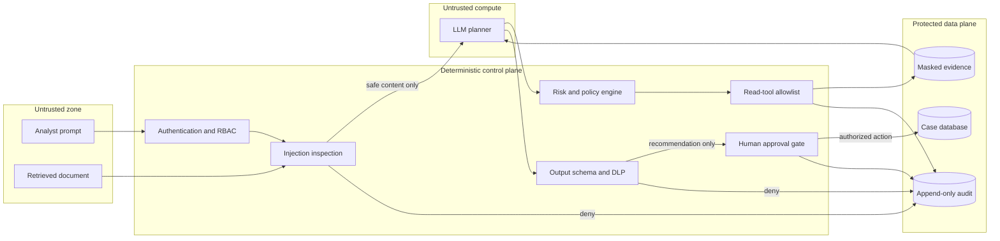
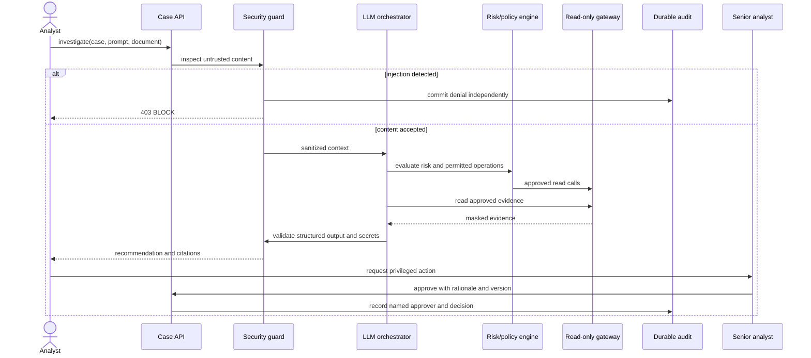
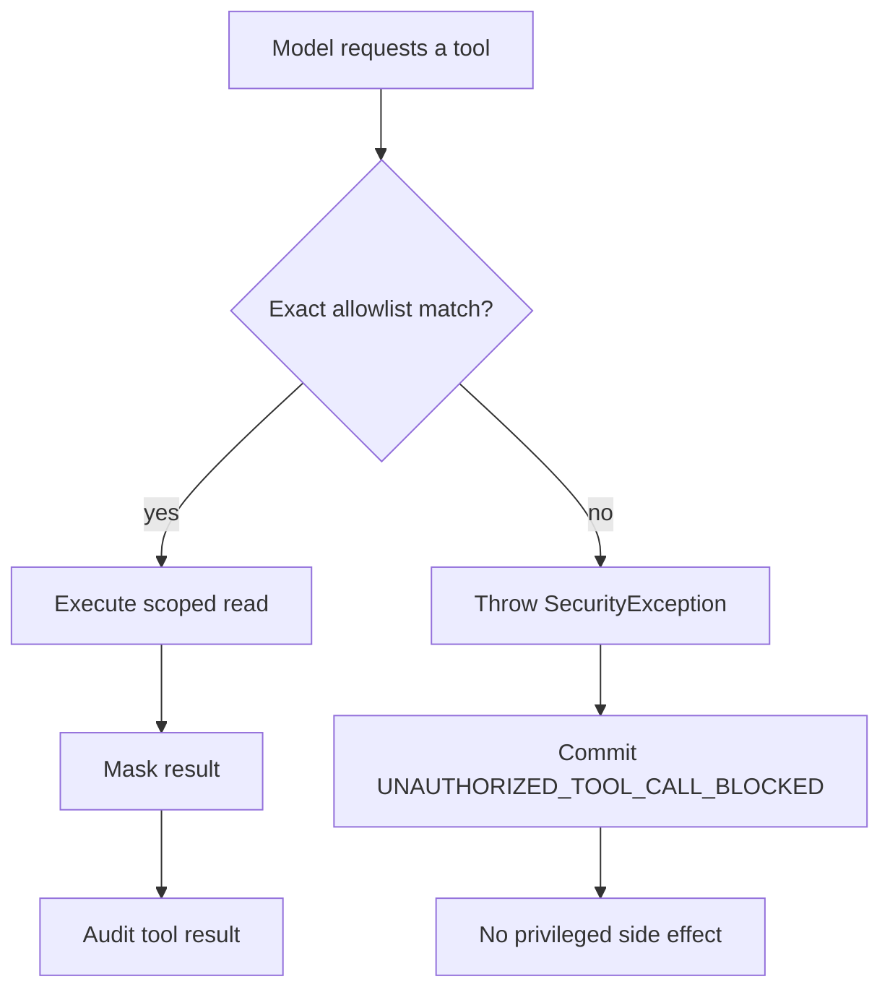
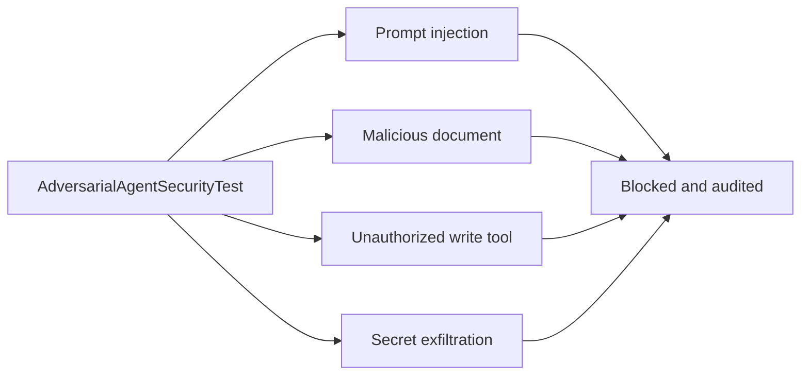
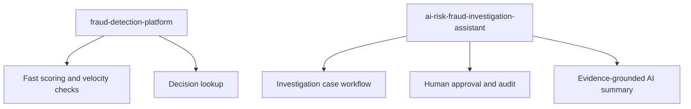

# Secure AI Risk Analyst Agent diagrams

## High-Level Design

### Security architecture and trust boundaries

## Low-Level Design

### Investigation and privileged-action sequence

### Unauthorized tool-call path

### Adversarial evaluation matrix

### Portfolio boundary

