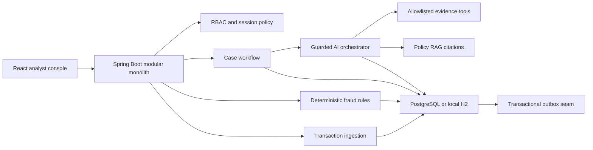
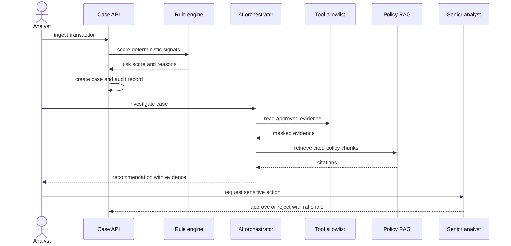
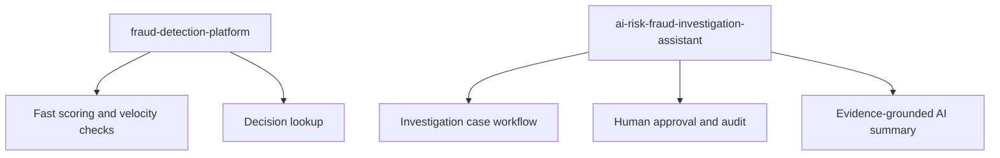

# AI Risk Fraud Investigation Assistant Diagrams

## Product Architecture

```mermaid
flowchart LR
    UI["React analyst console"] --> API["Spring Boot modular monolith"]
    API --> Security["RBAC and session policy"]
    API --> Transactions["Transaction ingestion"]
    API --> Rules["Deterministic fraud rules"]
    API --> Cases["Case workflow"]
    Cases --> AI["Guarded AI orchestrator"]
    AI --> Tools["Allowlisted evidence tools"]
    AI --> RAG["Policy RAG citations"]
    Transactions --> DB["PostgreSQL or local H2"]
    Rules --> DB
    Cases --> DB
    AI --> DB
    DB --> Outbox["Transactional outbox seam"]
```

## Investigation Flow

```mermaid
sequenceDiagram
    actor Analyst
    participant API as Case API
    participant Rules as Rule engine
    participant AI as AI orchestrator
    participant Tools as Tool allowlist
    participant RAG as Policy RAG
    participant Senior as Senior analyst
    Analyst->>API: ingest transaction
    API->>Rules: score deterministic signals
    Rules-->>API: risk score and reasons
    API->>API: create case and audit record
    Analyst->>AI: investigate case
    AI->>Tools: read approved evidence
    Tools-->>AI: masked evidence
    AI->>RAG: retrieve cited policy chunks
    RAG-->>AI: citations
    AI-->>Analyst: recommendation with evidence
    Analyst->>Senior: request sensitive action
    Senior-->>API: approve or reject with rationale
```

## Boundary Against The Smaller Fraud Platform

```mermaid
flowchart TB
    FraudPlatform["fraud-detection-platform"] --> Scoring["Fast scoring and velocity checks"]
    FraudPlatform --> DecisionRead["Decision lookup"]
    Assistant["ai-risk-fraud-investigation-assistant"] --> Casework["Investigation case workflow"]
    Assistant --> HumanReview["Human approval and audit"]
    Assistant --> EvidenceAI["Evidence-grounded AI summary"]
```
