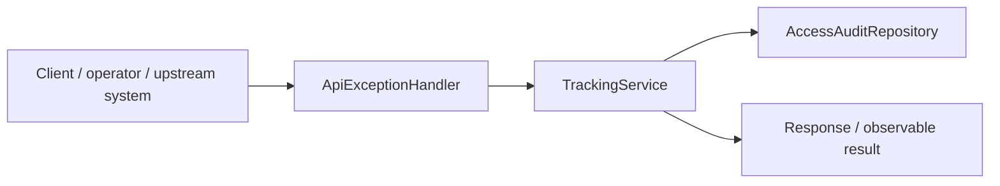
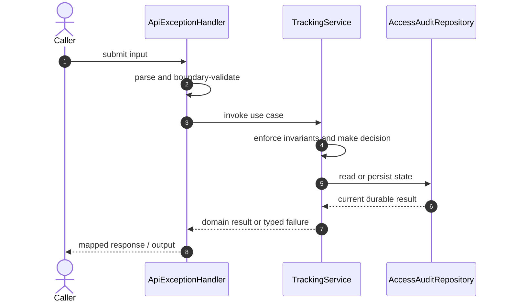

# Amazon Order Tracking Code Flow

This is the single code-flow guide for the project. It connects the business request to concrete source files, explains both architectural levels, and shows where validation, state changes, asynchronous work, and responses occur.

## Scope and outcome

A runnable interview portfolio project for tracking millions of orders per day across unreliable carrier feeds. It demonstrates the hardest parts of the design instead of hiding them in slides: duplicate delivery, out-of-order scans, immutable history, derived state, multi-package reads, cache invalidation, authorization, and support auditing.

The tracked production-code inventory used by this guide contains **19 source units** and **4 annotation-discovered HTTP operations**. Generated/build output and test sources are intentionally excluded from the runtime path.

## High-Level Design

At the system level, callers enter through an inbound adapter. The adapter owns transport concerns; application/domain code owns use-case decisions; repositories and gateways isolate state and external systems. Asynchronous adapters extend the flow without moving business invariants into controllers or consumers.

### Runtime stages

1. **Enter:** a request, command, scheduled trigger, protocol message, or UI action reaches the inbound boundary.
2. **Validate:** transport shape and required fields are rejected before domain mutation.
3. **Decide:** application/domain logic loads required state and applies invariants, idempotency, authorization, limits, or algorithms.
4. **Commit:** durable state changes pass through a repository/store; external calls pass through gateways; asynchronous work passes through message boundaries.
5. **Return and observe:** the adapter maps the result to an HTTP response, protocol response, CLI output, event, or metric.

## Low-Level Design

The low-level path keeps orchestration directional: inbound adapter → application/domain unit → persistence/outbound adapter. Contracts carry data between layers; configuration and security apply cross-cutting policy without becoming business logic.

### Component map

| Responsibility           | Concrete code                                                                                                          |
| ------------------------ | ---------------------------------------------------------------------------------------------------------------------- |
| Entry point              | `TrackingApplication`                                                                                                  |
| Inbound adapter          | `ApiExceptionHandler`, `TrackingController`                                                                            |
| Supporting logic         | `ApiModels`, `DemoData`, `AccessAudit`, `Shipment`, `ShipmentState`, `TrackingStatus`, `Repositories`                  |
| Domain/data model        | `OrderEntity`                                                                                                          |
| API/message contract     | `TrackingEvent`                                                                                                        |
| Persistence adapter      | `AccessAuditRepository`, `OrderRepository`, `ShipmentRepository`, `ShipmentStateRepository`, `TrackingEventRepository` |
| Application/domain logic | `TrackingService`                                                                                                      |
| User interface           | `app`                                                                                                                  |

### Inbound operations

| Verb/trigger | Path or input                 | Owning code          |
| ------------ | ----------------------------- | -------------------- |
| `GET`        | `/orders/{orderId}/tracking`  | `TrackingController` |
| `GET`        | `/orders/{orderId}/shipments` | `TrackingController` |
| `POST`       | `/carrier/events`             | `TrackingController` |
| `GET`        | `/support/dead-letters`       | `TrackingController` |

## Detailed source walkthrough

Read this table top-down by category, then follow the linked files. “Key methods” are discovered from the checked-in implementation and identify useful debugging/interview entry points.

| Source file                                                                                                | Role                     | Responsibility and important methods                                                                                                                                                                             |
| ---------------------------------------------------------------------------------------------------------- | ------------------------ | ---------------------------------------------------------------------------------------------------------------------------------------------------------------------------------------------------------------- |
| [`TrackingApplication.java`](./src/main/java/dev/portfolio/tracking/TrackingApplication.java)              | Entry point              | TrackingApplication bootstraps the process and wires the runtime. Key methods: `main()`.                                                                                                                         |
| [`ApiExceptionHandler.java`](./src/main/java/dev/portfolio/tracking/api/ApiExceptionHandler.java)          | Inbound adapter          | ApiExceptionHandler accepts an inbound call, validates its boundary contract, and delegates work.                                                                                                                |
| [`ApiModels.java`](./src/main/java/dev/portfolio/tracking/api/ApiModels.java)                              | Supporting logic         | ApiModels provides a focused algorithm or shared implementation detail. Key methods: `CarrierEventRequest()`, `IngestResponse()`, `TimelineItem()`, `ShipmentView()`, `TrackingResponse()`, `ShipmentSummary()`. |
| [`TrackingController.java`](./src/main/java/dev/portfolio/tracking/api/TrackingController.java)            | Inbound adapter          | TrackingController accepts an inbound call, validates its boundary contract, and delegates work. Key methods: `tracking()`, `shipments()`, `ingest()`, `deadLetters()`.                                          |
| [`DemoData.java`](./src/main/java/dev/portfolio/tracking/config/DemoData.java)                             | Supporting logic         | DemoData provides a focused algorithm or shared implementation detail.                                                                                                                                           |
| [`AccessAudit.java`](./src/main/java/dev/portfolio/tracking/domain/AccessAudit.java)                       | Supporting logic         | AccessAudit provides a focused algorithm or shared implementation detail.                                                                                                                                        |
| [`OrderEntity.java`](./src/main/java/dev/portfolio/tracking/domain/OrderEntity.java)                       | Domain/data model        | OrderEntity represents domain state, identity, or an invariant-bearing value. Key methods: `getId()`, `getUserId()`, `getCreatedAt()`.                                                                           |
| [`Shipment.java`](./src/main/java/dev/portfolio/tracking/domain/Shipment.java)                             | Supporting logic         | Shipment provides a focused algorithm or shared implementation detail. Key methods: `getId()`, `getOrderId()`, `getCarrier()`, `getTrackingNumber()`, `getAddressHash()`.                                        |
| [`ShipmentState.java`](./src/main/java/dev/portfolio/tracking/domain/ShipmentState.java)                   | Supporting logic         | ShipmentState provides a focused algorithm or shared implementation detail. Key methods: `update()`, `getShipmentId()`, `getStatus()`, `getStatusTime()`, `getVersion()`.                                        |
| [`TrackingEvent.java`](./src/main/java/dev/portfolio/tracking/domain/TrackingEvent.java)                   | API/message contract     | TrackingEvent carries validated data across an API or messaging boundary. Key methods: `getId()`, `getShipmentId()`, `getEventType()`, `getEventTime()`, `getReceivedTime()`, `getLocation()`.                   |
| [`TrackingStatus.java`](./src/main/java/dev/portfolio/tracking/domain/TrackingStatus.java)                 | Supporting logic         | TrackingStatus provides a focused algorithm or shared implementation detail. Key methods: `rank()`.                                                                                                              |
| [`AccessAuditRepository.java`](./src/main/java/dev/portfolio/tracking/repo/AccessAuditRepository.java)     | Persistence adapter      | AccessAuditRepository reads or writes durable state behind a storage boundary.                                                                                                                                   |
| [`OrderRepository.java`](./src/main/java/dev/portfolio/tracking/repo/OrderRepository.java)                 | Persistence adapter      | OrderRepository reads or writes durable state behind a storage boundary.                                                                                                                                         |
| [`Repositories.java`](./src/main/java/dev/portfolio/tracking/repo/Repositories.java)                       | Supporting logic         | Repositories provides a focused algorithm or shared implementation detail.                                                                                                                                       |
| [`ShipmentRepository.java`](./src/main/java/dev/portfolio/tracking/repo/ShipmentRepository.java)           | Persistence adapter      | ShipmentRepository reads or writes durable state behind a storage boundary.                                                                                                                                      |
| [`ShipmentStateRepository.java`](./src/main/java/dev/portfolio/tracking/repo/ShipmentStateRepository.java) | Persistence adapter      | ShipmentStateRepository reads or writes durable state behind a storage boundary.                                                                                                                                 |
| [`TrackingEventRepository.java`](./src/main/java/dev/portfolio/tracking/repo/TrackingEventRepository.java) | Persistence adapter      | TrackingEventRepository reads or writes durable state behind a storage boundary.                                                                                                                                 |
| [`TrackingService.java`](./src/main/java/dev/portfolio/tracking/service/TrackingService.java)              | Application/domain logic | TrackingService coordinates the use case and enforces domain decisions. Key methods: `ingest()`, `tracking()`, `shipmentList()`, `deadLetters()`, `deadLetter()`.                                                |
| [`app.js`](./src/main/resources/static/app.js)                                                             | User interface           | app presents state and initiates user actions.                                                                                                                                                                   |

## End-to-end code-flow narrative

1. Start at `ApiExceptionHandler`. It receives the external input and should perform only boundary parsing, authentication/authorization handoff, and request validation.
2. Follow the call into `TrackingService`. This is the principal place to explain the use case, invariant checks, deduplication/concurrency decision, and success/failure result.
3. Continue into `AccessAuditRepository` for the durable or in-memory state transition. Transaction and consistency guarantees belong at this boundary, not in response mapping.
4. This flow completes synchronously; background work is not part of the primary checked-in path.
5. External-system behavior is either absent or represented behind another listed adapter.
6. Return to `ApiExceptionHandler`, where typed outcomes become the public response or protocol result. Logging and metrics should preserve correlation identifiers without leaking secrets.

## Failure and correctness checkpoints

- **Invalid input:** rejected at the inbound contract before state mutation.
- **Domain conflict:** returned as a typed result; do not hide it as an infrastructure exception.
- **Duplicate or concurrent work:** handled where the project’s idempotency, locking, ordering, or atomic data structure is implemented.
- **Storage/integration failure:** transaction is rolled back or the operation remains safely retryable.
- **Async failure:** consumer retries must preserve idempotency; poison work must become observable rather than loop silently.
- **Observability:** trace the same request/correlation identity through inbound, domain, persistence, and async logs.

## How to trace a scenario in the debugger

1. Choose one operation from the inbound-operations table or the project’s demo script.
2. Break at `ApiExceptionHandler`, then step into `TrackingService` rather than framework internals.
3. Inspect the command/request object immediately after validation.
4. Stop before and after the call to `AccessAuditRepository` to compare intended and durable state.
5. If messaging exists, capture the emitted identifier and continue from `the consumer/worker`.
6. Confirm the final public result and the corresponding logs/metrics.

## Related project documentation

- [Project README](./README.md)
- [Architecture details](./docs/ARCHITECTURE.md)
- [Interview guide](./docs/INTERVIEW_GUIDE.md)
