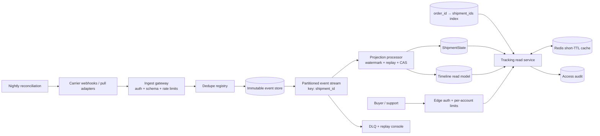
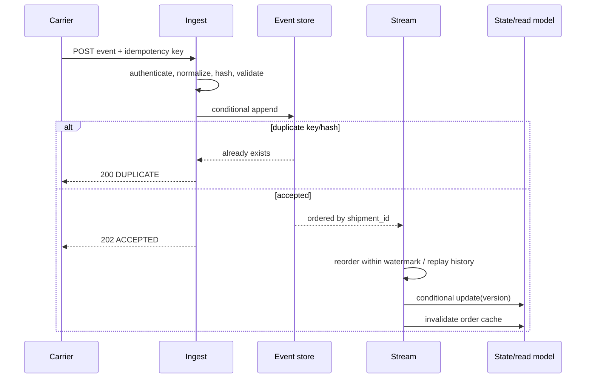

# Architecture

## Requirements pinned before design

1. Buyers see current shipment status and the full ordered → delivered/exception timeline.
2. Carrier scans appear near real time while duplicates, delay, and event reordering are normal.
3. Millions of orders/day, refresh-heavy customer reads, multi-package orders, and deeper support views.
4. Only the buyer or audited customer support can read an order.

Non-goals: purchasing, warehouse allocation, route optimization, and carrier label creation.

## High-level design

## Write and projection sequence

## Out-of-order rule

Normalized events are never deleted. `event_time` drives the customer state; `received_time` is observability evidence. A late earlier event is inserted into the timeline, then the shipment projection is deterministically rebuilt. Equal timestamps break ties by lifecycle rank, then receive time. `EXCEPTION` is an operational branch, not proof of delivery; a later valid delivery may supersede it.

Production processors buffer within a carrier-specific watermark (for example, 2–10 minutes), emit an eventually consistent state, and replay any event arriving after the watermark. Consumers are idempotent and updates use version/CAS so retrying never corrupts state.

## Partitioning and read fanout

- Ingest/stream partition key: `shipment_id`, preserving per-package processing order and distributing writes.
- Customer read key: `order_id`; maintain a compact `order_id → shipment_ids` index.
- Timeline rows: `(order_id, shipment_id, event_time, event_id)` for range reads.
- A normal order has few shipments, so parallel fanout is bounded. For pathological marketplace orders, materialize an order summary.

## Capacity sketch

Assume 10 million orders/day, 1.4 shipments/order, and 8 events/shipment: 112 million events/day, about 1.3k average writes/s and 13k at a 10× peak. At 1.2 KB normalized per event, hot event storage grows about 134 GB/day before replication/indexes. Customer traffic at 20 tracking reads/order gives 200 million reads/day, about 2.3k average and 23k peak. A 10–30 second Redis TTL absorbs repeated refreshes and notification-driven bursts.

Keep normalized events for the audit retention period. Expire or archive bulky carrier raw payloads separately after their shorter policy window.

## Consistency and multi-region

Tracking is eventually consistent: seconds normally, minutes during carrier or stream degradation. A region owns each shipment partition; event IDs make cross-region replication safe. Reads can be active-active from replicated projections. Support can bypass cache and compare normalized/raw events with the projection, clearly labeled with freshness.
