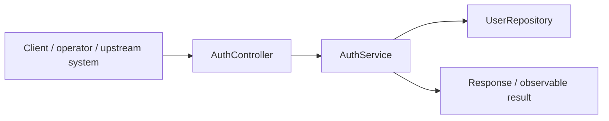
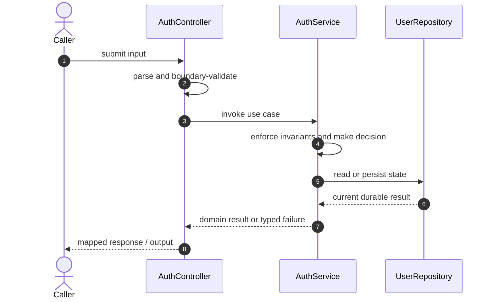

# Authentication Service Code Flow

This is the single code-flow guide for the project. It connects the business request to concrete source files, explains both architectural levels, and shows where validation, state changes, asynchronous work, and responses occur.

## Scope and outcome

A Spring Boot authentication service with user registration, BCrypt password hashing, JWT bearer tokens, role-based access control, PostgreSQL persistence, and a local OAuth2-style identity endpoint for development workflows.

The tracked production-code inventory used by this guide contains **23 source units** and **5 annotation-discovered HTTP operations**. Generated/build output and test sources are intentionally excluded from the runtime path.

## High-Level Design

At the system level, callers enter through an inbound adapter. The adapter owns transport concerns; application/domain code owns use-case decisions; repositories and gateways isolate state and external systems. Asynchronous adapters extend the flow without moving business invariants into controllers or consumers.

### Runtime stages

1. **Enter:** a request, command, scheduled trigger, protocol message, or UI action reaches the inbound boundary.
2. **Validate:** transport shape and required fields are rejected before domain mutation.
3. **Decide:** application/domain logic loads required state and applies invariants, idempotency, authorization, limits, or algorithms.
4. **Commit:** durable state changes pass through a repository/store; external calls pass through gateways; asynchronous work passes through message boundaries.
5. **Return and observe:** the adapter maps the result to an HTTP response, protocol response, CLI output, event, or metric.

## Low-Level Design

The low-level path keeps orchestration directional: inbound adapter → application/domain unit → persistence/outbound adapter. Contracts carry data between layers; configuration and security apply cross-cutting policy without becoming business logic.

### Component map

| Responsibility           | Concrete code                                                                                                                         |
| ------------------------ | ------------------------------------------------------------------------------------------------------------------------------------- |
| Entry point              | `AuthServiceApplication`                                                                                                              |
| Inbound adapter          | `AuthController`, `GlobalExceptionHandler`, `UserController`                                                                          |
| Supporting logic         | `AuthException`, `DuplicateEmailException`, `AdminSeeder`, `ApiError`, `JwtPrincipal`, `Role`, `UserAccount`, `UserNotFoundException` |
| API/message contract     | `AuthResponse`, `LoginRequest`, `MockOAuth2LoginRequest`, `RegisterRequest`, `UserResponse`                                           |
| Application/domain logic | `AuthService`, `JwtService`, `UserService`                                                                                            |
| Configuration/security   | `SecurityConfig`, `JwtAuthenticationFilter`                                                                                           |
| Persistence adapter      | `UserRepository`                                                                                                                      |

### Inbound operations

| Verb/trigger | Path or input      | Owning code      |
| ------------ | ------------------ | ---------------- |
| `POST`       | `/register`        | `AuthController` |
| `POST`       | `/login`           | `AuthController` |
| `POST`       | `/oauth2/mock`     | `AuthController` |
| `GET`        | `/api/users/me`    | `UserController` |
| `GET`        | `/api/admin/users` | `UserController` |

## Detailed source walkthrough

Read this table top-down by category, then follow the linked files. “Key methods” are discovered from the checked-in implementation and identify useful debugging/interview entry points.

| Source file                                                                                                       | Role                     | Responsibility and important methods                                                                                                                                                                                    |
| ----------------------------------------------------------------------------------------------------------------- | ------------------------ | ----------------------------------------------------------------------------------------------------------------------------------------------------------------------------------------------------------------------- |
| [`AuthServiceApplication.java`](./src/main/java/com/example/capstone/auth/AuthServiceApplication.java)            | Entry point              | AuthServiceApplication bootstraps the process and wires the runtime. Key methods: `main()`.                                                                                                                             |
| [`AuthController.java`](./src/main/java/com/example/capstone/auth/auth/AuthController.java)                       | Inbound adapter          | AuthController accepts an inbound call, validates its boundary contract, and delegates work. Key methods: `register()`, `login()`, `mockOAuth2Login()`.                                                                 |
| [`AuthException.java`](./src/main/java/com/example/capstone/auth/auth/AuthException.java)                         | Supporting logic         | AuthException provides a focused algorithm or shared implementation detail.                                                                                                                                             |
| [`AuthResponse.java`](./src/main/java/com/example/capstone/auth/auth/AuthResponse.java)                           | API/message contract     | AuthResponse carries validated data across an API or messaging boundary.                                                                                                                                                |
| [`AuthService.java`](./src/main/java/com/example/capstone/auth/auth/AuthService.java)                             | Application/domain logic | AuthService coordinates the use case and enforces domain decisions. Key methods: `register()`, `login()`, `mockOAuth2Login()`.                                                                                          |
| [`DuplicateEmailException.java`](./src/main/java/com/example/capstone/auth/auth/DuplicateEmailException.java)     | Supporting logic         | DuplicateEmailException provides a focused algorithm or shared implementation detail.                                                                                                                                   |
| [`LoginRequest.java`](./src/main/java/com/example/capstone/auth/auth/LoginRequest.java)                           | API/message contract     | LoginRequest carries validated data across an API or messaging boundary.                                                                                                                                                |
| [`MockOAuth2LoginRequest.java`](./src/main/java/com/example/capstone/auth/auth/MockOAuth2LoginRequest.java)       | API/message contract     | MockOAuth2LoginRequest carries validated data across an API or messaging boundary.                                                                                                                                      |
| [`RegisterRequest.java`](./src/main/java/com/example/capstone/auth/auth/RegisterRequest.java)                     | API/message contract     | RegisterRequest carries validated data across an API or messaging boundary.                                                                                                                                             |
| [`AdminSeeder.java`](./src/main/java/com/example/capstone/auth/config/AdminSeeder.java)                           | Supporting logic         | AdminSeeder provides a focused algorithm or shared implementation detail. Key methods: `run()`.                                                                                                                         |
| [`SecurityConfig.java`](./src/main/java/com/example/capstone/auth/config/SecurityConfig.java)                     | Configuration/security   | SecurityConfig defines runtime wiring, authentication, authorization, or cross-cutting policy. Key methods: `securityFilterChain()`, `passwordEncoder()`.                                                               |
| [`ApiError.java`](./src/main/java/com/example/capstone/auth/error/ApiError.java)                                  | Supporting logic         | ApiError provides a focused algorithm or shared implementation detail. Key methods: `of()`, `withFields()`.                                                                                                             |
| [`GlobalExceptionHandler.java`](./src/main/java/com/example/capstone/auth/error/GlobalExceptionHandler.java)      | Inbound adapter          | GlobalExceptionHandler accepts an inbound call, validates its boundary contract, and delegates work. Key methods: `handleAuth()`, `handleAccessDenied()`, `handleConflict()`, `handleNotFound()`, `handleValidation()`. |
| [`JwtAuthenticationFilter.java`](./src/main/java/com/example/capstone/auth/security/JwtAuthenticationFilter.java) | Configuration/security   | JwtAuthenticationFilter defines runtime wiring, authentication, authorization, or cross-cutting policy. Key methods: `doFilterInternal()`.                                                                              |
| [`JwtPrincipal.java`](./src/main/java/com/example/capstone/auth/security/JwtPrincipal.java)                       | Supporting logic         | JwtPrincipal provides a focused algorithm or shared implementation detail.                                                                                                                                              |
| [`JwtService.java`](./src/main/java/com/example/capstone/auth/security/JwtService.java)                           | Application/domain logic | JwtService coordinates the use case and enforces domain decisions. Key methods: `createToken()`, `parse()`, `ttlSeconds()`.                                                                                             |
| [`Role.java`](./src/main/java/com/example/capstone/auth/user/Role.java)                                           | Supporting logic         | Role provides a focused algorithm or shared implementation detail.                                                                                                                                                      |
| [`UserAccount.java`](./src/main/java/com/example/capstone/auth/user/UserAccount.java)                             | Supporting logic         | UserAccount provides a focused algorithm or shared implementation detail. Key methods: `getId()`, `getEmail()`, `getDisplayName()`, `getPasswordHash()`, `getRole()`, `getProvider()`.                                  |
| [`UserController.java`](./src/main/java/com/example/capstone/auth/user/UserController.java)                       | Inbound adapter          | UserController accepts an inbound call, validates its boundary contract, and delegates work. Key methods: `me()`, `users()`.                                                                                            |
| [`UserNotFoundException.java`](./src/main/java/com/example/capstone/auth/user/UserNotFoundException.java)         | Supporting logic         | UserNotFoundException provides a focused algorithm or shared implementation detail.                                                                                                                                     |
| [`UserRepository.java`](./src/main/java/com/example/capstone/auth/user/UserRepository.java)                       | Persistence adapter      | UserRepository reads or writes durable state behind a storage boundary.                                                                                                                                                 |
| [`UserResponse.java`](./src/main/java/com/example/capstone/auth/user/UserResponse.java)                           | API/message contract     | UserResponse carries validated data across an API or messaging boundary. Key methods: `from()`.                                                                                                                         |
| [`UserService.java`](./src/main/java/com/example/capstone/auth/user/UserService.java)                             | Application/domain logic | UserService coordinates the use case and enforces domain decisions. Key methods: `byEmail()`, `listUsers()`.                                                                                                            |

## End-to-end code-flow narrative

1. Start at `AuthController`. It receives the external input and should perform only boundary parsing, authentication/authorization handoff, and request validation.
2. Follow the call into `AuthService`. This is the principal place to explain the use case, invariant checks, deduplication/concurrency decision, and success/failure result.
3. Continue into `UserRepository` for the durable or in-memory state transition. Transaction and consistency guarantees belong at this boundary, not in response mapping.
4. This flow completes synchronously; background work is not part of the primary checked-in path.
5. External-system behavior is either absent or represented behind another listed adapter.
6. Return to `AuthController`, where typed outcomes become the public response or protocol result. Logging and metrics should preserve correlation identifiers without leaking secrets.

## Failure and correctness checkpoints

- **Invalid input:** rejected at the inbound contract before state mutation.
- **Domain conflict:** returned as a typed result; do not hide it as an infrastructure exception.
- **Duplicate or concurrent work:** handled where the project’s idempotency, locking, ordering, or atomic data structure is implemented.
- **Storage/integration failure:** transaction is rolled back or the operation remains safely retryable.
- **Async failure:** consumer retries must preserve idempotency; poison work must become observable rather than loop silently.
- **Observability:** trace the same request/correlation identity through inbound, domain, persistence, and async logs.

## How to trace a scenario in the debugger

1. Choose one operation from the inbound-operations table or the project’s demo script.
2. Break at `AuthController`, then step into `AuthService` rather than framework internals.
3. Inspect the command/request object immediately after validation.
4. Stop before and after the call to `UserRepository` to compare intended and durable state.
5. If messaging exists, capture the emitted identifier and continue from `the consumer/worker`.
6. Confirm the final public result and the corresponding logs/metrics.

## Related project documentation

- [Project README](./README.md)
- [Specialized diagrams](./docs/DIAGRAMS.md)
- [Interview guide](./docs/INTERVIEW_GUIDE.md)
