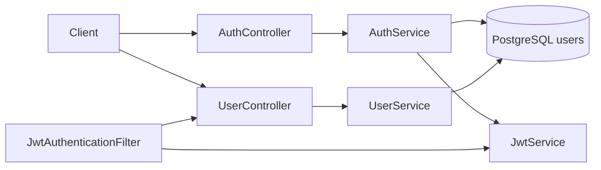
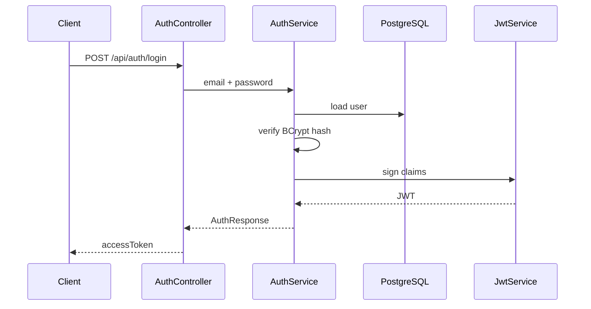
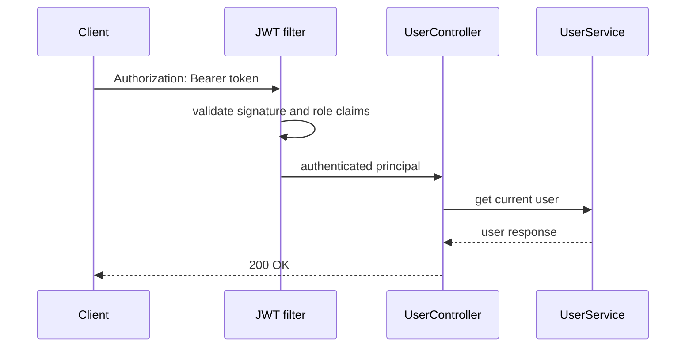

# Authentication Service Diagrams

## Component View

```mermaid
flowchart LR
    Client["Client"] --> AuthApi["AuthController"]
    Client --> UserApi["UserController"]
    AuthApi --> AuthService["AuthService"]
    UserApi --> UserService["UserService"]
    AuthService --> Users[("PostgreSQL users")]
    UserService --> Users
    AuthService --> Jwt["JwtService"]
    Security["JwtAuthenticationFilter"] --> Jwt
    Security --> UserApi
```

## Login Flow

```mermaid
sequenceDiagram
    participant C as Client
    participant A as AuthController
    participant S as AuthService
    participant DB as PostgreSQL
    participant J as JwtService
    C->>A: POST /api/auth/login
    A->>S: email + password
    S->>DB: load user
    S->>S: verify BCrypt hash
    S->>J: sign claims
    J-->>S: JWT
    S-->>A: AuthResponse
    A-->>C: accessToken
```

## Protected Request Flow

```mermaid
sequenceDiagram
    participant C as Client
    participant F as JWT filter
    participant U as UserController
    participant S as UserService
    C->>F: Authorization: Bearer token
    F->>F: validate signature and role claims
    F->>U: authenticated principal
    U->>S: get current user
    S-->>U: user response
    U-->>C: 200 OK
```
