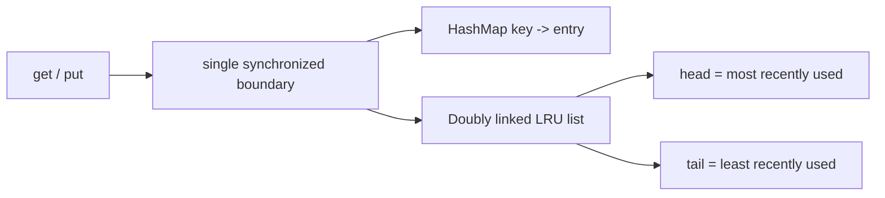
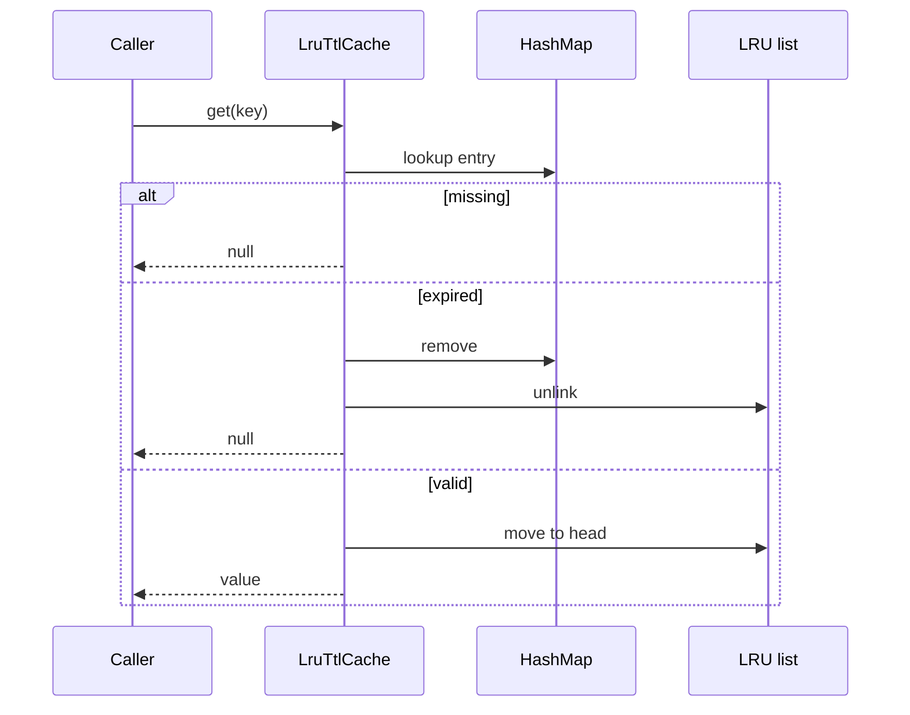
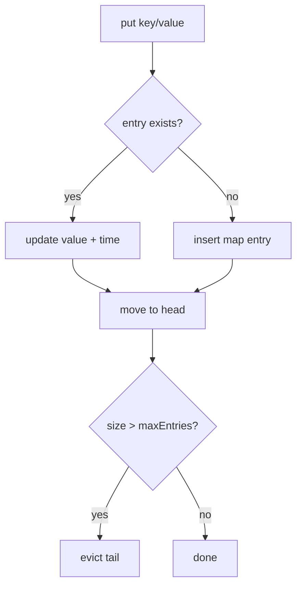

# Cache Lab Diagrams

## High-Level Design

### Data Structure View

```mermaid
flowchart LR
    GetPut["get / put"] --> Lock["single synchronized boundary"]
    Lock --> Map["HashMap key -> entry"]
    Lock --> List["Doubly linked LRU list"]
    List --> Head["head = most recently used"]
    List --> Tail["tail = least recently used"]
```

## Low-Level Design

### Read Flow

```mermaid
sequenceDiagram
    participant C as Caller
    participant Cache as LruTtlCache
    participant Map as HashMap
    participant List as LRU list
    C->>Cache: get(key)
    Cache->>Map: lookup entry
    alt missing
        Cache-->>C: null
    else expired
        Cache->>Map: remove
        Cache->>List: unlink
        Cache-->>C: null
    else valid
        Cache->>List: move to head
        Cache-->>C: value
    end
```

### Write Flow

```mermaid
flowchart TB
    Put["put key/value"] --> Existing{"entry exists?"}
    Existing -->|yes| Update["update value + time"]
    Existing -->|no| Insert["insert map entry"]
    Update --> Promote["move to head"]
    Insert --> Promote
    Promote --> Capacity{"size > maxEntries?"}
    Capacity -->|yes| Evict["evict tail"]
    Capacity -->|no| Done["done"]
```
