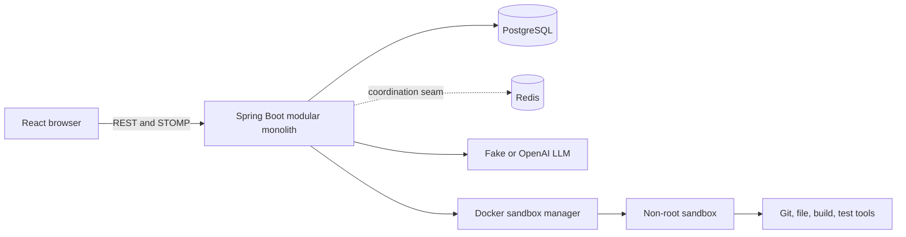
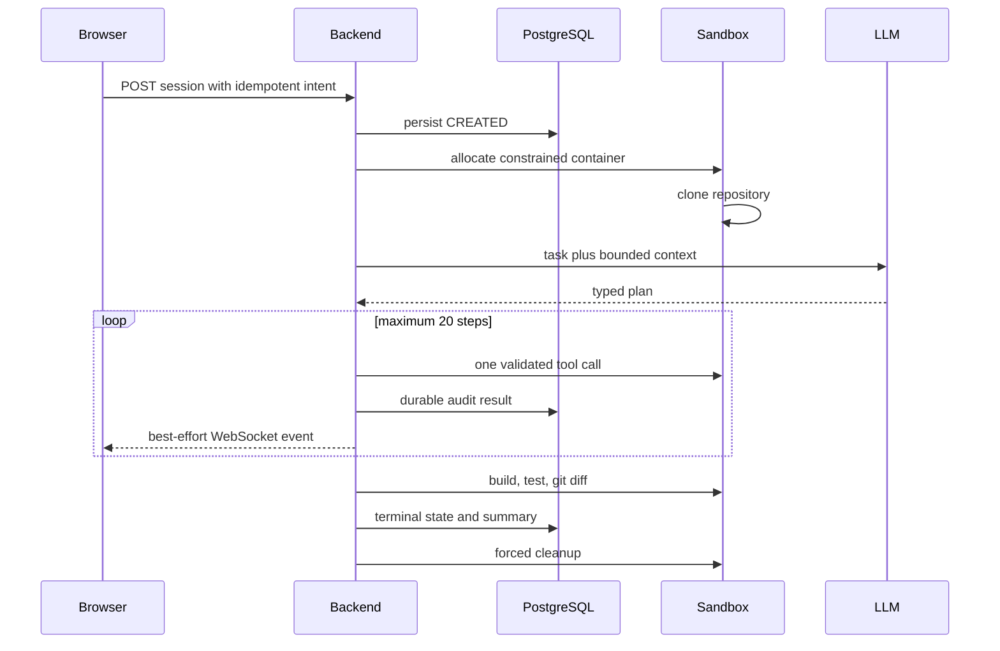
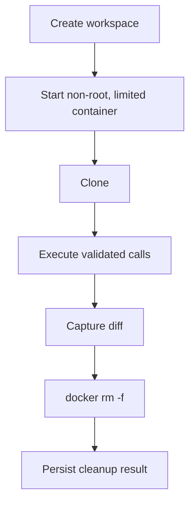
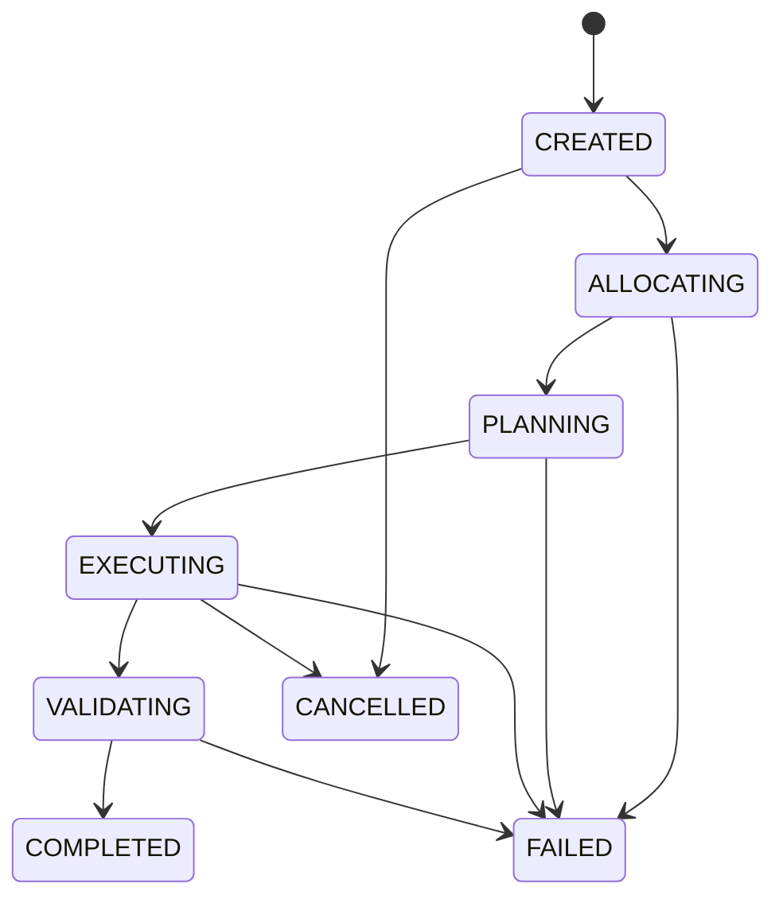
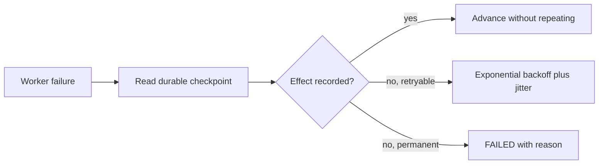
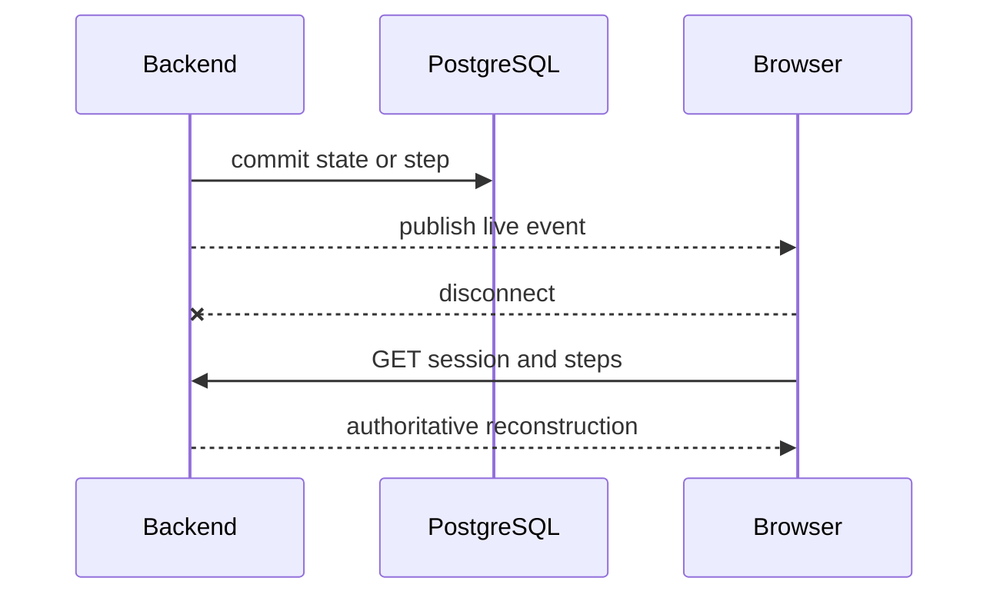

# Architecture

## High level

The backend owns orchestration, authorization, budgets, checkpoints, and credentials. Untrusted repository data stays data; it cannot redefine system policy. The sandbox owns all agent-generated command execution.

## Execution and sandbox lifecycle

## State and recovery

PostgreSQL is the truth. Optimistic locking rejects concurrent stale updates; `(session_id, sequence_no)` deduplicates step writes. A production recovery scanner would lease non-terminal checkpoints through Redis and resume only idempotent steps. External effects use idempotency keys; execution is at-least-once, never assumed exactly-once.

## WebSocket flow

Kafka is unnecessary while one database transaction and a bounded worker pool are enough. Add an outbox plus Kafka when multiple independent consumers need replayable high-volume events, cross-region buffering, or long-running workflow fan-out.
