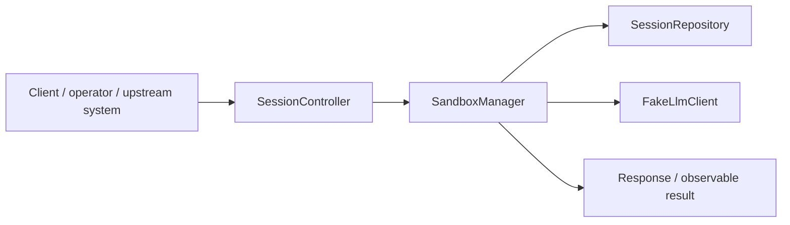
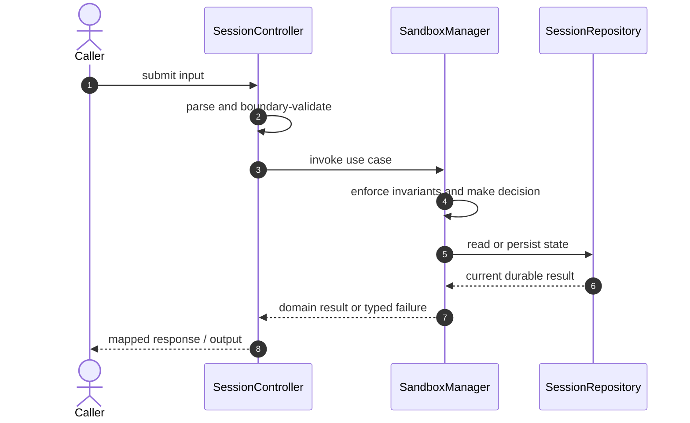

# Cloud Ai Coding Agent Code Flow

This is the single code-flow guide for the project. It connects the business request to concrete source files, explains both architectural levels, and shows where validation, state changes, asynchronous work, and responses occur.

## Scope and outcome

An interview-sized, end-to-end cloud coding agent: React UI, Spring Boot modular monolith, PostgreSQL source of truth, provider-neutral LLM planning, auditable tool calls, and disposable non-root Docker sandboxes.

The tracked production-code inventory used by this guide contains **17 source units** and **8 annotation-discovered HTTP operations**. Generated/build output and test sources are intentionally excluded from the runtime path.

## High-Level Design

At the system level, callers enter through an inbound adapter. The adapter owns transport concerns; application/domain code owns use-case decisions; repositories and gateways isolate state and external systems. Asynchronous adapters extend the flow without moving business invariants into controllers or consumers.

### Runtime stages

1. **Enter:** a request, command, scheduled trigger, protocol message, or UI action reaches the inbound boundary.
2. **Validate:** transport shape and required fields are rejected before domain mutation.
3. **Decide:** application/domain logic loads required state and applies invariants, idempotency, authorization, limits, or algorithms.
4. **Commit:** durable state changes pass through a repository/store; external calls pass through gateways; asynchronous work passes through message boundaries.
5. **Return and observe:** the adapter maps the result to an HTTP response, protocol response, CLI output, event, or metric.

## Low-Level Design

The low-level path keeps orchestration directional: inbound adapter → application/domain unit → persistence/outbound adapter. Contracts carry data between layers; configuration and security apply cross-cutting policy without becoming business logic.

### Component map

| Responsibility           | Concrete code                                               |
| ------------------------ | ----------------------------------------------------------- |
| Entry point              | `AgentApplication`                                          |
| Inbound adapter          | `SessionController`                                         |
| Configuration/security   | `AppConfig`, `WebSocketConfig`                              |
| Outbound adapter         | `FakeLlmClient`, `LlmClient`, `OpenAiLlmClient`             |
| Application/domain logic | `SandboxManager`, `SessionService`                          |
| Supporting logic         | `AgentSession`, `AgentStep`, `SessionState`, `ToolExecutor` |
| Persistence adapter      | `SessionRepository`                                         |
| User interface           | `src.test`, `src`, `vite-env.d`                             |

### Inbound operations

| Verb/trigger | Path or input                 | Owning code         |
| ------------ | ----------------------------- | ------------------- |
| `POST`       | `/sessions`                   | `SessionController` |
| `GET`        | `/sessions/{id}`              | `SessionController` |
| `GET`        | `/sessions/{id}/steps`        | `SessionController` |
| `GET`        | `/sessions/{id}/diff`         | `SessionController` |
| `POST`       | `/sessions/{id}/cancel`       | `SessionController` |
| `POST`       | `/sessions/{id}/retry`        | `SessionController` |
| `POST`       | `/sessions/{id}/pull-request` | `SessionController` |
| `GET`        | `/health`                     | `SessionController` |

## Detailed source walkthrough

Read this table top-down by category, then follow the linked files. “Key methods” are discovered from the checked-in implementation and identify useful debugging/interview entry points.

| Source file                                                                                        | Role                     | Responsibility and important methods                                                                                                                                                   |
| -------------------------------------------------------------------------------------------------- | ------------------------ | -------------------------------------------------------------------------------------------------------------------------------------------------------------------------------------- |
| [`AgentApplication.java`](./backend/src/main/java/dev/interview/agent/AgentApplication.java)       | Entry point              | AgentApplication bootstraps the process and wires the runtime. Key methods: `main()`.                                                                                                  |
| [`SessionController.java`](./backend/src/main/java/dev/interview/agent/api/SessionController.java) | Inbound adapter          | SessionController accepts an inbound call, validates its boundary contract, and delegates work. Key methods: `create()`, `get()`, `steps()`, `cancel()`, `retry()`, `CreateSession()`. |
| [`AppConfig.java`](./backend/src/main/java/dev/interview/agent/config/AppConfig.java)              | Configuration/security   | AppConfig defines runtime wiring, authentication, authorization, or cross-cutting policy. Key methods: `addCorsMappings()`.                                                            |
| [`WebSocketConfig.java`](./backend/src/main/java/dev/interview/agent/config/WebSocketConfig.java)  | Configuration/security   | WebSocketConfig defines runtime wiring, authentication, authorization, or cross-cutting policy. Key methods: `configureMessageBroker()`, `registerStompEndpoints()`.                   |
| [`FakeLlmClient.java`](./backend/src/main/java/dev/interview/agent/llm/FakeLlmClient.java)         | Outbound adapter         | FakeLlmClient calls an external system through an isolated integration boundary. Key methods: `plan()`.                                                                                |
| [`LlmClient.java`](./backend/src/main/java/dev/interview/agent/llm/LlmClient.java)                 | Outbound adapter         | LlmClient calls an external system through an isolated integration boundary.                                                                                                           |
| [`OpenAiLlmClient.java`](./backend/src/main/java/dev/interview/agent/llm/OpenAiLlmClient.java)     | Outbound adapter         | OpenAiLlmClient calls an external system through an isolated integration boundary. Key methods: `plan()`.                                                                              |
| [`SandboxManager.java`](./backend/src/main/java/dev/interview/agent/sandbox/SandboxManager.java)   | Application/domain logic | SandboxManager coordinates the use case and enforces domain decisions. Key methods: `allocate()`, `cleanup()`, `Sandbox()`.                                                            |
| [`AgentSession.java`](./backend/src/main/java/dev/interview/agent/session/AgentSession.java)       | Supporting logic         | AgentSession provides a focused algorithm or shared implementation detail. Key methods: `getId()`, `getOwnerId()`, `getRepositoryUrl()`, `getBranchName()`, `getTask()`, `getState()`. |
| [`AgentStep.java`](./backend/src/main/java/dev/interview/agent/session/AgentStep.java)             | Supporting logic         | AgentStep provides a focused algorithm or shared implementation detail. Key methods: `getId()`, `getSessionId()`, `getSequenceNo()`, `getType()`, `getStatus()`, `getInputJson()`.     |
| [`Repositories.java`](./backend/src/main/java/dev/interview/agent/session/Repositories.java)       | Persistence adapter      | SessionRepository reads or writes durable state behind a storage boundary.                                                                                                             |
| [`SessionService.java`](./backend/src/main/java/dev/interview/agent/session/SessionService.java)   | Application/domain logic | SessionService coordinates the use case and enforces domain decisions. Key methods: `create()`, `run()`, `get()`, `steps()`, `cancel()`, `retry()`.                                    |
| [`SessionState.java`](./backend/src/main/java/dev/interview/agent/session/SessionState.java)       | Supporting logic         | SessionState provides a focused algorithm or shared implementation detail. Key methods: `terminal()`.                                                                                  |
| [`ToolExecutor.java`](./backend/src/main/java/dev/interview/agent/tools/ToolExecutor.java)         | Supporting logic         | ToolExecutor provides a focused algorithm or shared implementation detail. Key methods: `execute()`, `ToolResult()`.                                                                   |
| [`src.test.ts`](./frontend/src.test.ts)                                                            | User interface           | src.test presents state and initiates user actions.                                                                                                                                    |
| [`src.tsx`](./frontend/src.tsx)                                                                    | User interface           | src presents state and initiates user actions.                                                                                                                                         |
| [`vite-env.d.ts`](./frontend/vite-env.d.ts)                                                        | User interface           | vite-env.d presents state and initiates user actions.                                                                                                                                  |

## End-to-end code-flow narrative

1. Start at `SessionController`. It receives the external input and should perform only boundary parsing, authentication/authorization handoff, and request validation.
2. Follow the call into `SandboxManager`. This is the principal place to explain the use case, invariant checks, deduplication/concurrency decision, and success/failure result.
3. Continue into `SessionRepository` for the durable or in-memory state transition. Transaction and consistency guarantees belong at this boundary, not in response mapping.
4. This flow completes synchronously; background work is not part of the primary checked-in path.
5. Inspect `FakeLlmClient` for timeout, retry, circuit-breaking, and external-contract mapping.
6. Return to `SessionController`, where typed outcomes become the public response or protocol result. Logging and metrics should preserve correlation identifiers without leaking secrets.

## Failure and correctness checkpoints

- **Invalid input:** rejected at the inbound contract before state mutation.
- **Domain conflict:** returned as a typed result; do not hide it as an infrastructure exception.
- **Duplicate or concurrent work:** handled where the project’s idempotency, locking, ordering, or atomic data structure is implemented.
- **Storage/integration failure:** transaction is rolled back or the operation remains safely retryable.
- **Async failure:** consumer retries must preserve idempotency; poison work must become observable rather than loop silently.
- **Observability:** trace the same request/correlation identity through inbound, domain, persistence, and async logs.

## How to trace a scenario in the debugger

1. Choose one operation from the inbound-operations table or the project’s demo script.
2. Break at `SessionController`, then step into `SandboxManager` rather than framework internals.
3. Inspect the command/request object immediately after validation.
4. Stop before and after the call to `SessionRepository` to compare intended and durable state.
5. If messaging exists, capture the emitted identifier and continue from `the consumer/worker`.
6. Confirm the final public result and the corresponding logs/metrics.

## Related project documentation

- [Project README](./README.md)
- [Specialized diagrams](./docs/DIAGRAMS.md)
- [Interview guide](./docs/INTERVIEW_GUIDE.md)
