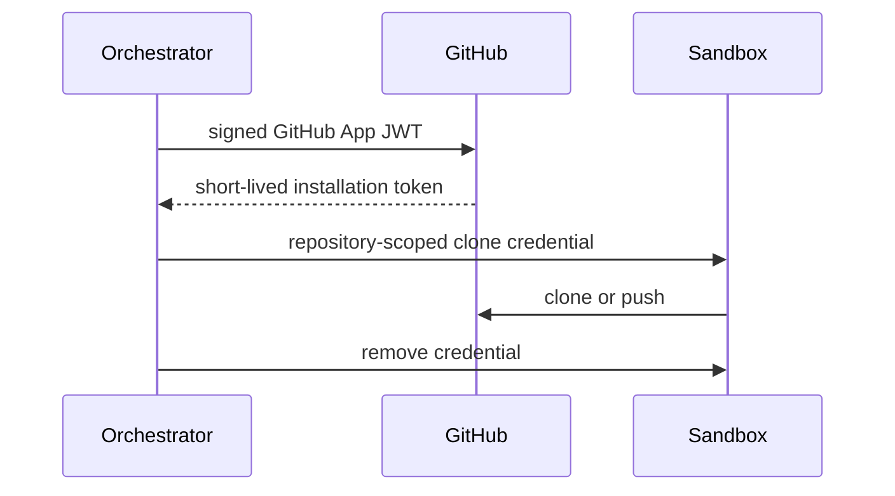

# Security

Repositories and their instructions are untrusted. System prompts state that repository text is data; the planner receives bounded context. Tool names are allowlisted, inputs typed, paths normalized under a session root, shell metacharacters rejected, commands executed without a shell, outputs redacted, and every call audited.

Sandboxes run as UID 10001 with CPU, memory, PID, timeout, read-only-root, and temporary-filesystem limits. They receive no host Docker socket or ambient secrets. The orchestrator has Docker control in local Compose only; protect that host as privileged infrastructure. Production should use a remote worker API and gVisor, Kata Containers, or Firecracker; deny egress by default and proxy only approved package registries.

The sample `X-User-Id` is a local-development identity seam, not production authentication. Production must validate OIDC/JWT and enforce owner access on every session query. GitHub access should use:

Never store development tokens in the database or logs. Rotate secrets, redact environment-like values, scan output, use repository-scoped permissions, require branch protections for PRs, and retain immutable audit logs. Known gaps: production auth, network policy, encrypted credential injection, malware scanning, and the GitHub App adapter are documented seams, not falsely claimed features.
