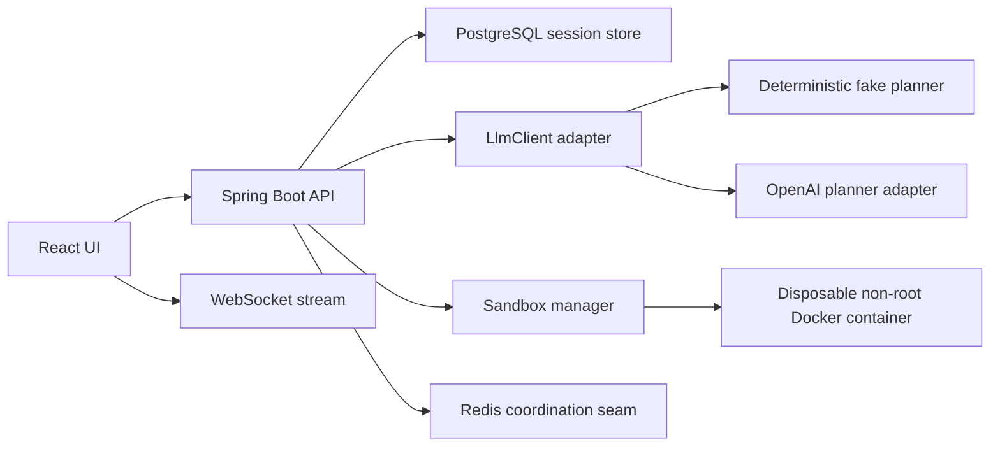
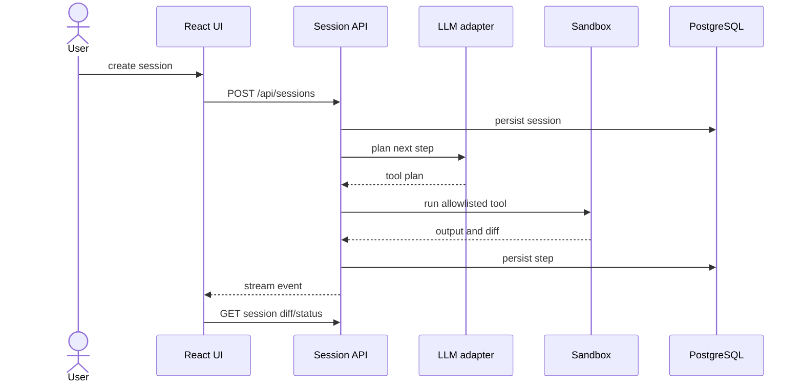
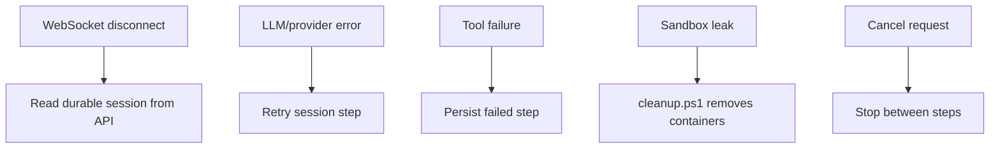

# Cloud AI Coding Agent Diagrams

## High-Level Design

### Runtime Architecture

```mermaid
flowchart LR
    UI["React UI"] --> API["Spring Boot API"]
    UI --> WS["WebSocket stream"]
    API --> DB["PostgreSQL session store"]
    API --> LLM["LlmClient adapter"]
    LLM --> Fake["Deterministic fake planner"]
    LLM --> OpenAI["OpenAI planner adapter"]
    API --> Sandbox["Sandbox manager"]
    Sandbox --> Container["Disposable non-root Docker container"]
    API --> Redis["Redis coordination seam"]
```

## Low-Level Design

### Agent Session Flow

```mermaid
sequenceDiagram
    actor User
    participant UI as React UI
    participant API as Session API
    participant LLM as LLM adapter
    participant SB as Sandbox
    participant DB as PostgreSQL
    User->>UI: create session
    UI->>API: POST /api/sessions
    API->>DB: persist session
    API->>LLM: plan next step
    LLM-->>API: tool plan
    API->>SB: run allowlisted tool
    SB-->>API: output and diff
    API->>DB: persist step
    API-->>UI: stream event
    UI->>API: GET session diff/status
```

### Failure Boundaries

```mermaid
flowchart TB
    Disconnect["WebSocket disconnect"] --> Replay["Read durable session from API"]
    PlannerError["LLM/provider error"] --> Retry["Retry session step"]
    BadTool["Tool failure"] --> Persist["Persist failed step"]
    SandboxLeak["Sandbox leak"] --> Cleanup["cleanup.ps1 removes containers"]
    UserCancel["Cancel request"] --> Cooperative["Stop between steps"]
```
