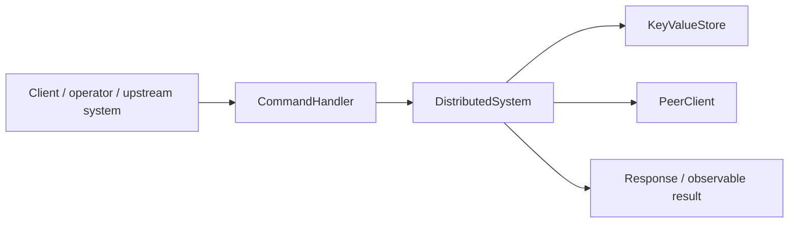
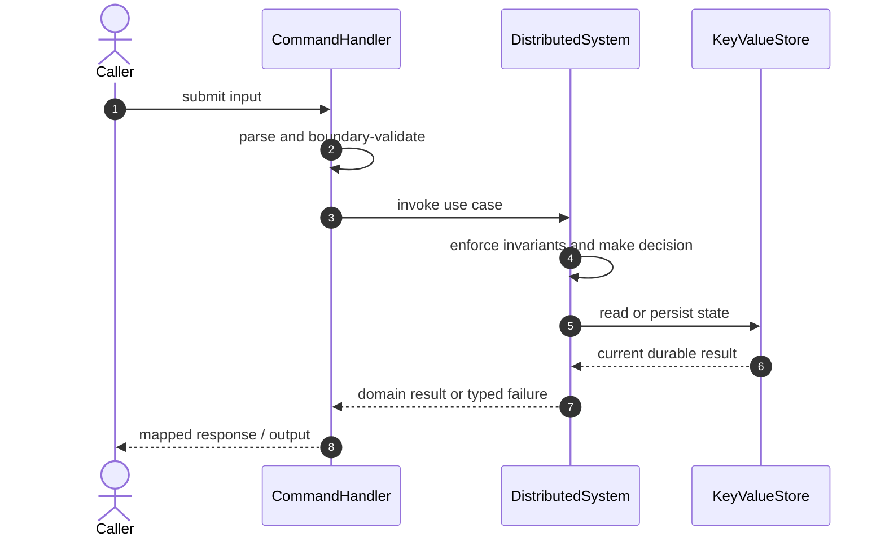

# Distributed Database Code Flow

This is the single code-flow guide for the project. It connects the business request to concrete source files, explains both architectural levels, and shows where validation, state changes, asynchronous work, and responses occur.

## Scope and outcome

An interview-sized distributed key-value database. It deliberately avoids RocksDB, Cassandra-style breadth, external brokers, and heavyweight frameworks so the distributed systems mechanics stay visible in the code.

The tracked production-code inventory used by this guide contains **14 source units** and **0 annotation-discovered HTTP operations**. Generated/build output and test sources are intentionally excluded from the runtime path.

## High-Level Design

At the system level, callers enter through an inbound adapter. The adapter owns transport concerns; application/domain code owns use-case decisions; repositories and gateways isolate state and external systems. Asynchronous adapters extend the flow without moving business invariants into controllers or consumers.

### Runtime stages

1. **Enter:** a request, command, scheduled trigger, protocol message, or UI action reaches the inbound boundary.
2. **Validate:** transport shape and required fields are rejected before domain mutation.
3. **Decide:** application/domain logic loads required state and applies invariants, idempotency, authorization, limits, or algorithms.
4. **Commit:** durable state changes pass through a repository/store; external calls pass through gateways; asynchronous work passes through message boundaries.
5. **Return and observe:** the adapter maps the result to an HTTP response, protocol response, CLI output, event, or metric.

## Low-Level Design

The low-level path keeps orchestration directional: inbound adapter → application/domain unit → persistence/outbound adapter. Contracts carry data between layers; configuration and security apply cross-cutting policy without becoming business logic.

### Component map

| Responsibility         | Concrete code                                                                                             |
| ---------------------- | --------------------------------------------------------------------------------------------------------- |
| Supporting logic       | `DistributedSystem`, `AppendOnlyLog`, `ClusterNode`, `Codec`, `ConsistentHashRing`, `Peer`, `StoredValue` |
| Entry point            | `Main`, `DistributedDatabaseMain`, `TcpServer`                                                            |
| Inbound adapter        | `CommandHandler`                                                                                          |
| Persistence adapter    | `KeyValueStore`                                                                                           |
| Configuration/security | `NodeConfig`                                                                                              |
| Outbound adapter       | `PeerClient`                                                                                              |

### Inbound operations

| Verb/trigger | Path or input                                                                                                        | Owning code             |
| ------------ | -------------------------------------------------------------------------------------------------------------------- | ----------------------- |
| N/A          | No annotation-based HTTP endpoint; execution starts through the process API, CLI, test harness, or protocol adapter. | See entry points below. |

## Detailed source walkthrough

Read this table top-down by category, then follow the linked files. “Key methods” are discovered from the checked-in implementation and identify useful debugging/interview entry points.

| Source file                                                                                                  | Role                   | Responsibility and important methods                                                                                                      |
| ------------------------------------------------------------------------------------------------------------ | ---------------------- | ----------------------------------------------------------------------------------------------------------------------------------------- |
| [`DistributedSystem.java`](./labs/replicated-log-simulation/src/main/java/org/chijai/DistributedSystem.java) | Supporting logic       | DistributedSystem provides a focused algorithm or shared implementation detail. Key methods: `run()`, `main()`.                           |
| [`Main.java`](./labs/replicated-log-simulation/src/main/java/org/chijai/Main.java)                           | Entry point            | Main bootstraps the process and wires the runtime. Key methods: `main()`.                                                                 |
| [`AppendOnlyLog.java`](./src/main/java/com/example/distributeddb/AppendOnlyLog.java)                         | Supporting logic       | AppendOnlyLog provides a focused algorithm or shared implementation detail.                                                               |
| [`ClusterNode.java`](./src/main/java/com/example/distributeddb/ClusterNode.java)                             | Supporting logic       | ClusterNode provides a focused algorithm or shared implementation detail. Key methods: `start()`, `close()`.                              |
| [`Codec.java`](./src/main/java/com/example/distributeddb/Codec.java)                                         | Supporting logic       | Codec provides a focused algorithm or shared implementation detail.                                                                       |
| [`CommandHandler.java`](./src/main/java/com/example/distributeddb/CommandHandler.java)                       | Inbound adapter        | CommandHandler accepts an inbound call, validates its boundary contract, and delegates work.                                              |
| [`ConsistentHashRing.java`](./src/main/java/com/example/distributeddb/ConsistentHashRing.java)               | Supporting logic       | ConsistentHashRing provides a focused algorithm or shared implementation detail.                                                          |
| [`DistributedDatabaseMain.java`](./src/main/java/com/example/distributeddb/DistributedDatabaseMain.java)     | Entry point            | DistributedDatabaseMain bootstraps the process and wires the runtime. Key methods: `main()`.                                              |
| [`KeyValueStore.java`](./src/main/java/com/example/distributeddb/KeyValueStore.java)                         | Persistence adapter    | KeyValueStore reads or writes durable state behind a storage boundary.                                                                    |
| [`NodeConfig.java`](./src/main/java/com/example/distributeddb/NodeConfig.java)                               | Configuration/security | NodeConfig defines runtime wiring, authentication, authorization, or cross-cutting policy. Key methods: `fromArgs()`, `self()`, `peer()`. |
| [`Peer.java`](./src/main/java/com/example/distributeddb/Peer.java)                                           | Supporting logic       | Peer provides a focused algorithm or shared implementation detail. Key methods: `parse()`, `endpoint()`.                                  |
| [`PeerClient.java`](./src/main/java/com/example/distributeddb/PeerClient.java)                               | Outbound adapter       | PeerClient calls an external system through an isolated integration boundary.                                                             |
| [`StoredValue.java`](./src/main/java/com/example/distributeddb/StoredValue.java)                             | Supporting logic       | StoredValue provides a focused algorithm or shared implementation detail.                                                                 |
| [`TcpServer.java`](./src/main/java/com/example/distributeddb/TcpServer.java)                                 | Entry point            | TcpServer bootstraps the process and wires the runtime. Key methods: `close()`.                                                           |

## End-to-end code-flow narrative

1. Start at `CommandHandler`. It receives the external input and should perform only boundary parsing, authentication/authorization handoff, and request validation.
2. Follow the call into `DistributedSystem`. This is the principal place to explain the use case, invariant checks, deduplication/concurrency decision, and success/failure result.
3. Continue into `KeyValueStore` for the durable or in-memory state transition. Transaction and consistency guarantees belong at this boundary, not in response mapping.
4. This flow completes synchronously; background work is not part of the primary checked-in path.
5. Inspect `PeerClient` for timeout, retry, circuit-breaking, and external-contract mapping.
6. Return to `CommandHandler`, where typed outcomes become the public response or protocol result. Logging and metrics should preserve correlation identifiers without leaking secrets.

## Failure and correctness checkpoints

- **Invalid input:** rejected at the inbound contract before state mutation.
- **Domain conflict:** returned as a typed result; do not hide it as an infrastructure exception.
- **Duplicate or concurrent work:** handled where the project’s idempotency, locking, ordering, or atomic data structure is implemented.
- **Storage/integration failure:** transaction is rolled back or the operation remains safely retryable.
- **Async failure:** consumer retries must preserve idempotency; poison work must become observable rather than loop silently.
- **Observability:** trace the same request/correlation identity through inbound, domain, persistence, and async logs.

## How to trace a scenario in the debugger

1. Choose one operation from the inbound-operations table or the project’s demo script.
2. Break at `CommandHandler`, then step into `DistributedSystem` rather than framework internals.
3. Inspect the command/request object immediately after validation.
4. Stop before and after the call to `KeyValueStore` to compare intended and durable state.
5. If messaging exists, capture the emitted identifier and continue from `the consumer/worker`.
6. Confirm the final public result and the corresponding logs/metrics.

## Related project documentation

- [Project README](./README.md)
- [Specialized diagrams](./docs/DIAGRAMS.md)
- [Interview guide](./docs/INTERVIEW_GUIDE.md)
