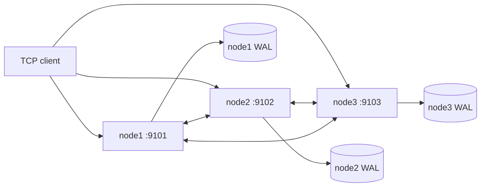
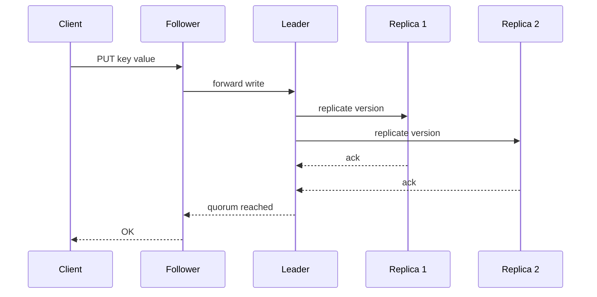
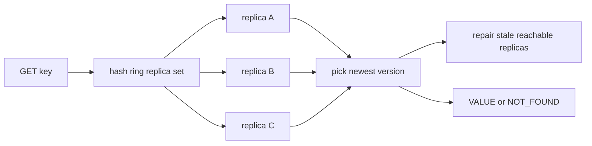

# Distributed Database Diagrams

## Cluster View

```mermaid
flowchart LR
    Client["TCP client"] --> N1["node1 :9101"]
    Client --> N2["node2 :9102"]
    Client --> N3["node3 :9103"]
    N1 <--> N2
    N2 <--> N3
    N1 <--> N3
    N1 --> WAL1[("node1 WAL")]
    N2 --> WAL2[("node2 WAL")]
    N3 --> WAL3[("node3 WAL")]
```

## Follower Write Forwarding

```mermaid
sequenceDiagram
    participant C as Client
    participant F as Follower
    participant L as Leader
    participant R1 as Replica 1
    participant R2 as Replica 2
    C->>F: PUT key value
    F->>L: forward write
    L->>R1: replicate version
    L->>R2: replicate version
    R1-->>L: ack
    R2-->>L: ack
    L-->>F: quorum reached
    F-->>C: OK
```

## Read Quorum And Repair

```mermaid
flowchart LR
    Read["GET key"] --> Ring["hash ring replica set"]
    Ring --> A["replica A"]
    Ring --> B["replica B"]
    Ring --> C["replica C"]
    A --> Pick["pick newest version"]
    B --> Pick
    C --> Pick
    Pick --> Repair["repair stale reachable replicas"]
    Pick --> Response["VALUE or NOT_FOUND"]
```
