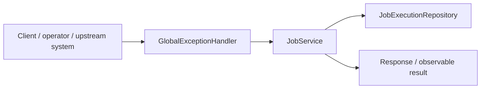
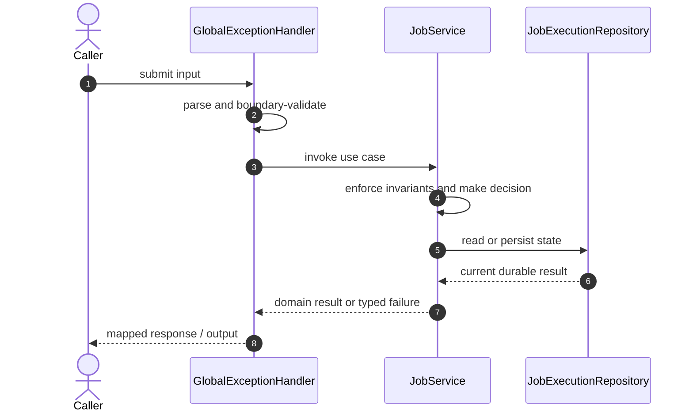

# Distributed Task Scheduler Code Flow

This is the single code-flow guide for the project. It connects the business request to concrete source files, explains both architectural levels, and shows where validation, state changes, asynchronous work, and responses occur.

## Scope and outcome

A Spring Boot distributed task scheduler with database-backed leader election, persistent job queue, retry backoff, and idempotent execution records.

The tracked production-code inventory used by this guide contains **19 source units** and **5 annotation-discovered HTTP operations**. Generated/build output and test sources are intentionally excluded from the runtime path.

## High-Level Design

At the system level, callers enter through an inbound adapter. The adapter owns transport concerns; application/domain code owns use-case decisions; repositories and gateways isolate state and external systems. Asynchronous adapters extend the flow without moving business invariants into controllers or consumers.

### Runtime stages

1. **Enter:** a request, command, scheduled trigger, protocol message, or UI action reaches the inbound boundary.
2. **Validate:** transport shape and required fields are rejected before domain mutation.
3. **Decide:** application/domain logic loads required state and applies invariants, idempotency, authorization, limits, or algorithms.
4. **Commit:** durable state changes pass through a repository/store; external calls pass through gateways; asynchronous work passes through message boundaries.
5. **Return and observe:** the adapter maps the result to an HTTP response, protocol response, CLI output, event, or metric.

## Low-Level Design

The low-level path keeps orchestration directional: inbound adapter → application/domain unit → persistence/outbound adapter. Contracts carry data between layers; configuration and security apply cross-cutting policy without becoming business logic.

### Component map

| Responsibility           | Concrete code                                                                                 |
| ------------------------ | --------------------------------------------------------------------------------------------- |
| Entry point              | `TaskSchedulerApplication`                                                                    |
| Supporting logic         | `ApiError`, `DomainException`, `NotFoundException`, `JobStatus`, `SchedulerLock`, `JobWorker` |
| Inbound adapter          | `GlobalExceptionHandler`, `JobController`, `LeaderController`                                 |
| API/message contract     | `CreateJobRequest`, `JobResponse`                                                             |
| Domain/data model        | `JobExecutionRecord`, `JobRecord`                                                             |
| Persistence adapter      | `JobExecutionRepository`, `JobRepository`, `SchedulerLockRepository`                          |
| Application/domain logic | `JobService`, `LeaderElectionService`                                                         |

### Inbound operations

| Verb/trigger | Path or input                | Owning code        |
| ------------ | ---------------------------- | ------------------ |
| `POST`       | `(class-level/default path)` | `JobController`    |
| `GET`        | `(class-level/default path)` | `JobController`    |
| `GET`        | `/{id}`                      | `JobController`    |
| `POST`       | `/{id}/run-now`              | `JobController`    |
| `GET`        | `/api/leader`                | `LeaderController` |

## Detailed source walkthrough

Read this table top-down by category, then follow the linked files. “Key methods” are discovered from the checked-in implementation and identify useful debugging/interview entry points.

| Source file                                                                                                          | Role                     | Responsibility and important methods                                                                                                                                          |
| -------------------------------------------------------------------------------------------------------------------- | ------------------------ | ----------------------------------------------------------------------------------------------------------------------------------------------------------------------------- |
| [`TaskSchedulerApplication.java`](./src/main/java/com/example/capstone/scheduler/TaskSchedulerApplication.java)      | Entry point              | TaskSchedulerApplication bootstraps the process and wires the runtime. Key methods: `main()`.                                                                                 |
| [`ApiError.java`](./src/main/java/com/example/capstone/scheduler/error/ApiError.java)                                | Supporting logic         | ApiError provides a focused algorithm or shared implementation detail. Key methods: `of()`.                                                                                   |
| [`DomainException.java`](./src/main/java/com/example/capstone/scheduler/error/DomainException.java)                  | Supporting logic         | DomainException provides a focused algorithm or shared implementation detail.                                                                                                 |
| [`GlobalExceptionHandler.java`](./src/main/java/com/example/capstone/scheduler/error/GlobalExceptionHandler.java)    | Inbound adapter          | GlobalExceptionHandler accepts an inbound call, validates its boundary contract, and delegates work. Key methods: `handleNotFound()`, `handleDomain()`, `handleValidation()`. |
| [`NotFoundException.java`](./src/main/java/com/example/capstone/scheduler/error/NotFoundException.java)              | Supporting logic         | NotFoundException provides a focused algorithm or shared implementation detail.                                                                                               |
| [`CreateJobRequest.java`](./src/main/java/com/example/capstone/scheduler/job/CreateJobRequest.java)                  | API/message contract     | CreateJobRequest carries validated data across an API or messaging boundary.                                                                                                  |
| [`JobController.java`](./src/main/java/com/example/capstone/scheduler/job/JobController.java)                        | Inbound adapter          | JobController accepts an inbound call, validates its boundary contract, and delegates work. Key methods: `create()`, `list()`, `get()`, `runNow()`.                           |
| [`JobExecutionRecord.java`](./src/main/java/com/example/capstone/scheduler/job/JobExecutionRecord.java)              | Domain/data model        | JobExecutionRecord represents domain state, identity, or an invariant-bearing value.                                                                                          |
| [`JobExecutionRepository.java`](./src/main/java/com/example/capstone/scheduler/job/JobExecutionRepository.java)      | Persistence adapter      | JobExecutionRepository reads or writes durable state behind a storage boundary.                                                                                               |
| [`JobRecord.java`](./src/main/java/com/example/capstone/scheduler/job/JobRecord.java)                                | Domain/data model        | JobRecord represents domain state, identity, or an invariant-bearing value. Key methods: `start()`, `markSucceeded()`, `markFailure()`, `runNow()`, `getId()`, `getName()`.   |
| [`JobRepository.java`](./src/main/java/com/example/capstone/scheduler/job/JobRepository.java)                        | Persistence adapter      | JobRepository reads or writes durable state behind a storage boundary.                                                                                                        |
| [`JobResponse.java`](./src/main/java/com/example/capstone/scheduler/job/JobResponse.java)                            | API/message contract     | JobResponse carries validated data across an API or messaging boundary. Key methods: `from()`.                                                                                |
| [`JobService.java`](./src/main/java/com/example/capstone/scheduler/job/JobService.java)                              | Application/domain logic | JobService coordinates the use case and enforces domain decisions. Key methods: `create()`, `list()`, `get()`, `runNow()`.                                                    |
| [`JobStatus.java`](./src/main/java/com/example/capstone/scheduler/job/JobStatus.java)                                | Supporting logic         | JobStatus provides a focused algorithm or shared implementation detail.                                                                                                       |
| [`LeaderController.java`](./src/main/java/com/example/capstone/scheduler/leader/LeaderController.java)               | Inbound adapter          | LeaderController accepts an inbound call, validates its boundary contract, and delegates work. Key methods: `leader()`.                                                       |
| [`LeaderElectionService.java`](./src/main/java/com/example/capstone/scheduler/leader/LeaderElectionService.java)     | Application/domain logic | LeaderElectionService coordinates the use case and enforces domain decisions. Key methods: `tryAcquireLeadership()`, `instanceId()`.                                          |
| [`SchedulerLock.java`](./src/main/java/com/example/capstone/scheduler/leader/SchedulerLock.java)                     | Supporting logic         | SchedulerLock provides a focused algorithm or shared implementation detail. Key methods: `renew()`, `getOwnerId()`, `getLockedUntil()`.                                       |
| [`SchedulerLockRepository.java`](./src/main/java/com/example/capstone/scheduler/leader/SchedulerLockRepository.java) | Persistence adapter      | SchedulerLockRepository reads or writes durable state behind a storage boundary.                                                                                              |
| [`JobWorker.java`](./src/main/java/com/example/capstone/scheduler/worker/JobWorker.java)                             | Supporting logic         | JobWorker provides a focused algorithm or shared implementation detail. Key methods: `poll()`.                                                                                |

## End-to-end code-flow narrative

1. Start at `GlobalExceptionHandler`. It receives the external input and should perform only boundary parsing, authentication/authorization handoff, and request validation.
2. Follow the call into `JobService`. This is the principal place to explain the use case, invariant checks, deduplication/concurrency decision, and success/failure result.
3. Continue into `JobExecutionRepository` for the durable or in-memory state transition. Transaction and consistency guarantees belong at this boundary, not in response mapping.
4. This flow completes synchronously; background work is not part of the primary checked-in path.
5. External-system behavior is either absent or represented behind another listed adapter.
6. Return to `GlobalExceptionHandler`, where typed outcomes become the public response or protocol result. Logging and metrics should preserve correlation identifiers without leaking secrets.

## Failure and correctness checkpoints

- **Invalid input:** rejected at the inbound contract before state mutation.
- **Domain conflict:** returned as a typed result; do not hide it as an infrastructure exception.
- **Duplicate or concurrent work:** handled where the project’s idempotency, locking, ordering, or atomic data structure is implemented.
- **Storage/integration failure:** transaction is rolled back or the operation remains safely retryable.
- **Async failure:** consumer retries must preserve idempotency; poison work must become observable rather than loop silently.
- **Observability:** trace the same request/correlation identity through inbound, domain, persistence, and async logs.

## How to trace a scenario in the debugger

1. Choose one operation from the inbound-operations table or the project’s demo script.
2. Break at `GlobalExceptionHandler`, then step into `JobService` rather than framework internals.
3. Inspect the command/request object immediately after validation.
4. Stop before and after the call to `JobExecutionRepository` to compare intended and durable state.
5. If messaging exists, capture the emitted identifier and continue from `the consumer/worker`.
6. Confirm the final public result and the corresponding logs/metrics.

## Related project documentation

- [Project README](./README.md)
- [Specialized diagrams](./docs/DIAGRAMS.md)
- [Interview guide](./docs/INTERVIEW_GUIDE.md)
