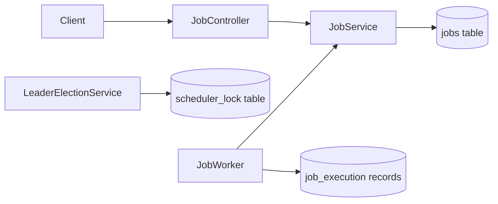
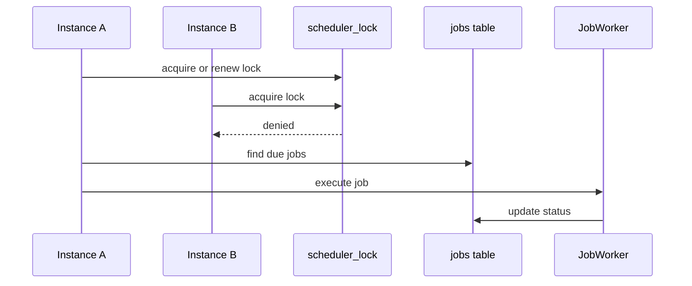
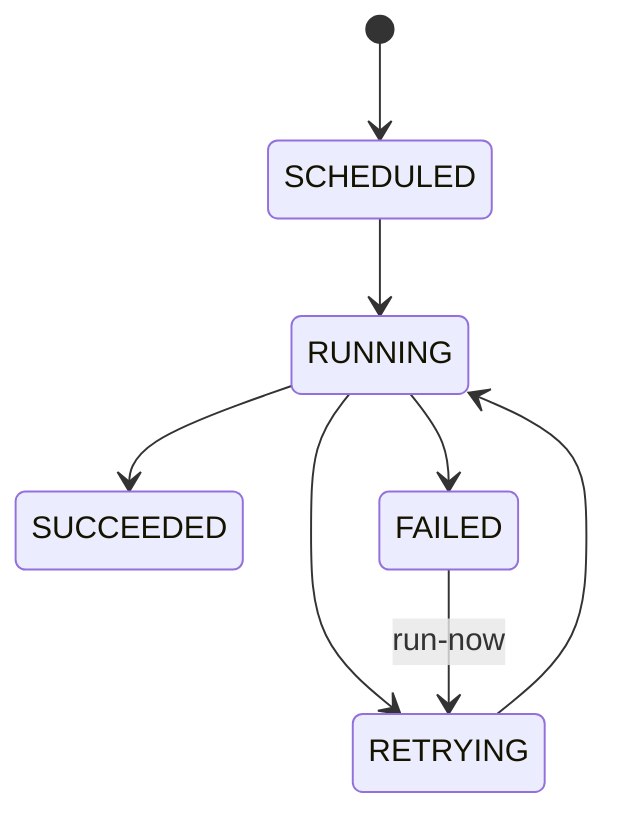

# Distributed Task Scheduler Diagrams

## Component View

```mermaid
flowchart LR
    Client["Client"] --> API["JobController"]
    API --> Service["JobService"]
    Service --> Jobs[("jobs table")]
    Leader["LeaderElectionService"] --> Lock[("scheduler_lock table")]
    Worker["JobWorker"] --> Service
    Worker --> Attempts[("job_execution records")]
```

## Leader And Worker Flow

```mermaid
sequenceDiagram
    participant A as Instance A
    participant B as Instance B
    participant L as scheduler_lock
    participant J as jobs table
    participant W as JobWorker
    A->>L: acquire or renew lock
    B->>L: acquire lock
    L-->>B: denied
    A->>J: find due jobs
    A->>W: execute job
    W->>J: update status
```

## Job State Flow

```mermaid
stateDiagram-v2
    [*] --> SCHEDULED
    SCHEDULED --> RUNNING
    RUNNING --> SUCCEEDED
    RUNNING --> RETRYING
    RETRYING --> RUNNING
    RUNNING --> FAILED
    FAILED --> RETRYING: run-now
```
