# Common HLD Interview Flows

> A reusable chapter for approaching most high-level system design interviews.
> The goal is not to memorize one architecture. It is to build a clear design from requirements, explain why each component exists, and discuss how the system behaves under load and failure.

## 1. What the Interviewer Is Evaluating

An HLD round usually evaluates whether you can:

- turn an ambiguous problem into precise requirements;
- identify the important quality attributes: scale, latency, availability, consistency, durability, security, and cost;
- estimate enough capacity to guide the design;
- define clean APIs, events, and data models;
- split the system into components with clear responsibilities;
- explain the important end-to-end flows;
- find bottlenecks, failure modes, and operational risks;
- make explicit trade-offs instead of claiming that one design solves everything;
- communicate in a structured way and incorporate interviewer feedback.

The interview is a collaborative design discussion. A simple design with justified decisions is stronger than a complicated diagram full of unexplained technologies.

---

## 2. The Reusable Interview Framework

Use this order for most questions:

1. Clarify scope and requirements.
2. Identify constraints and quality attributes.
3. Estimate scale.
4. Define core entities, APIs, and events.
5. Draw the high-level architecture.
6. Walk through the critical read and write flows.
7. Deep-dive into the hardest part.
8. Address scaling, reliability, consistency, security, and operations.
9. Summarize trade-offs and future improvements.

Do not silently assume important behavior. State an assumption, explain its consequence, and let the interviewer correct it.

### A useful opening

> “I’ll first clarify the functional scope and the most important non-functional requirements. Then I’ll estimate the traffic and storage, define the key APIs and data model, draw a high-level design, and deep-dive into the critical flows and trade-offs.”

This tells the interviewer where the discussion is going and keeps the round organized.

---

## 3. A 45-Minute Time Plan

| Time      | Activity                       | Expected output                          |
| --------- | ------------------------------ | ---------------------------------------- |
| 0–5 min   | Clarify scope                  | Actors, use cases, exclusions            |
| 5–8 min   | Non-functional requirements    | Scale, SLOs, consistency, durability     |
| 8–12 min  | Back-of-the-envelope estimates | Peak QPS, bandwidth, storage             |
| 12–16 min | APIs and data model            | Key contracts and entities               |
| 16–25 min | High-level architecture        | Components and data ownership            |
| 25–34 min | Critical flows and deep dive   | Read/write path and hardest problem      |
| 34–41 min | Scale and failure handling     | Bottlenecks, retries, failover, recovery |
| 41–45 min | Trade-offs and summary         | Decisions, limitations, next evolution   |

Treat this as a guide, not a rigid schedule. Spend the most time on the problem’s distinctive challenge.

---

## 4. Step 1 — Clarify Requirements

### Functional questions

Ask only questions that can change the architecture:

- Who are the actors: users, admins, merchants, drivers, devices, or other systems?
- What are the top three user journeys?
- Is the system read-heavy, write-heavy, or balanced?
- Is data created, updated, deleted, searched, shared, streamed, or ranked?
- Is communication synchronous, asynchronous, real-time, or batch?
- Are ordering, uniqueness, scheduling, payments, geolocation, or recommendations involved?
- What is explicitly out of scope?

### Non-functional questions

- Expected daily active users and peak requests per second?
- Required latency at p50, p95, and p99?
- Availability target: 99.9%, 99.99%, or higher?
- Strong consistency required everywhere, or only for selected operations?
- How much data loss is acceptable?
- How long must data be retained?
- Single region or multi-region?
- Any privacy, audit, compliance, or residency requirements?
- What is more important during a partition: availability or consistency?

### Convert vague words into measurable targets

| Vague requirement  | Better question or target        |
| ------------------ | -------------------------------- |
| “Fast”             | p95 reads under 200 ms?          |
| “Highly available” | 99.99% monthly availability?     |
| “Real time”        | Updates visible within 1 second? |
| “Large scale”      | Peak 100,000 requests/second?    |
| “No data loss”     | RPO = 0 for committed writes?    |
| “Recover quickly”  | RTO under 15 minutes?            |

### End this phase with a scope statement

> “For this design, I’ll support creating content, retrieving a personalized feed, and following users. I’ll optimize feed reads for 100 million daily active users, target p95 below 300 ms, accept eventual consistency for feed propagation, and exclude ads and recommendation-model training.”

---

## 5. Step 2 — Estimate Only What Drives Decisions

You are not expected to predict exact production numbers. Estimates reveal whether one machine, a replicated database, partitioning, caching, or asynchronous processing is necessary.

### Core formulas

```text
Average QPS = operations per day / 86,400
Peak QPS = average QPS × peak factor (often 3–10)
Daily storage = writes per day × average item size × replication factor
Retention storage = daily storage × retention days
Bandwidth = requests per second × average payload size
Concurrent connections ≈ connection rate × average connection duration
Cache memory ≈ hot objects × average object size × overhead
```

### Example

Assume:

- 10 million daily active users;
- 20 reads per user per day;
- 2 writes per user per day;
- 1 KB average stored record;
- 5× peak factor;
- 3 replicas.

Then:

```text
Average read QPS = 200,000,000 / 86,400 ≈ 2,315
Peak read QPS ≈ 11,575
Average write QPS = 20,000,000 / 86,400 ≈ 232
Peak write QPS ≈ 1,160
Raw daily storage = 20,000,000 × 1 KB ≈ 20 GB
Replicated daily storage ≈ 60 GB
```

The conclusions matter more than arithmetic precision: reads dominate, caching is valuable, and storage grows enough to require retention and partition planning.

### Common estimation mistakes

- spending ten minutes on arithmetic without using it;
- estimating average traffic but ignoring peaks;
- forgetting replication, indexes, metadata, and storage overhead;
- using exact-looking numbers based on unstated assumptions;
- calculating everything before knowing which constraints matter.

---

## 6. Step 3 — Define Contracts and Data

### APIs

Define only the APIs central to the main flows. Include the caller, request, response, authentication, pagination, and idempotency where relevant.

```http
POST /v1/orders
Authorization: Bearer <token>
Idempotency-Key: <client-generated-key>

{
  "customerId": "c-123",
  "items": [{"productId": "p-9", "quantity": 2}]
}
```

```http
GET /v1/orders/{orderId}
GET /v1/orders?customerId=c-123&cursor=...&limit=50
```

Prefer cursor pagination for large or frequently changing result sets. Explain versioning, rate limits, authorization, and error semantics when they matter.

### Events

An event is an immutable fact that has already happened:

```json
{
  "eventId": "evt-456",
  "eventType": "OrderCreated",
  "aggregateId": "order-789",
  "aggregateVersion": 3,
  "occurredAt": "2026-08-17T10:00:00Z",
  "schemaVersion": 1,
  "traceId": "trace-123",
  "payload": {}
}
```

Mention schema evolution, partition key, ordering scope, retention, replay, and consumer idempotency.

### Data model

For each important entity, identify:

- primary key and access patterns;
- fields used for filtering or ordering;
- required indexes;
- ownership and lifecycle;
- relationships and cardinality;
- uniqueness and consistency invariants;
- partition key and likely hotspots;
- retention, archival, and deletion rules.

Design the schema from access patterns, not from entity names alone.

---

## 7. The General-Purpose Architecture

This is a useful starting diagram for many web-scale systems. Remove components that the problem does not need.

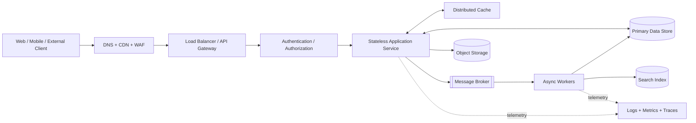

### Explain the boxes in terms of responsibility

- CDN: serves cacheable content close to users.
- WAF/API gateway: edge security, routing, throttling, and request policy.
- Stateless service: horizontal scaling and business orchestration.
- Cache: protects slower dependencies and reduces read latency.
- Primary store: source of truth for transactional state.
- Broker: buffers bursts and decouples non-immediate work.
- Worker: performs retryable background processing.
- Search index: supports full-text, filtering, and ranking; usually not the source of truth.
- Object storage: inexpensive durable storage for large blobs.
- Observability: enables detection, diagnosis, and capacity planning.

Never add a component merely because it is common. Say which requirement it satisfies.

---

## 8. Common End-to-End Flows

### 8.1 Synchronous read flow

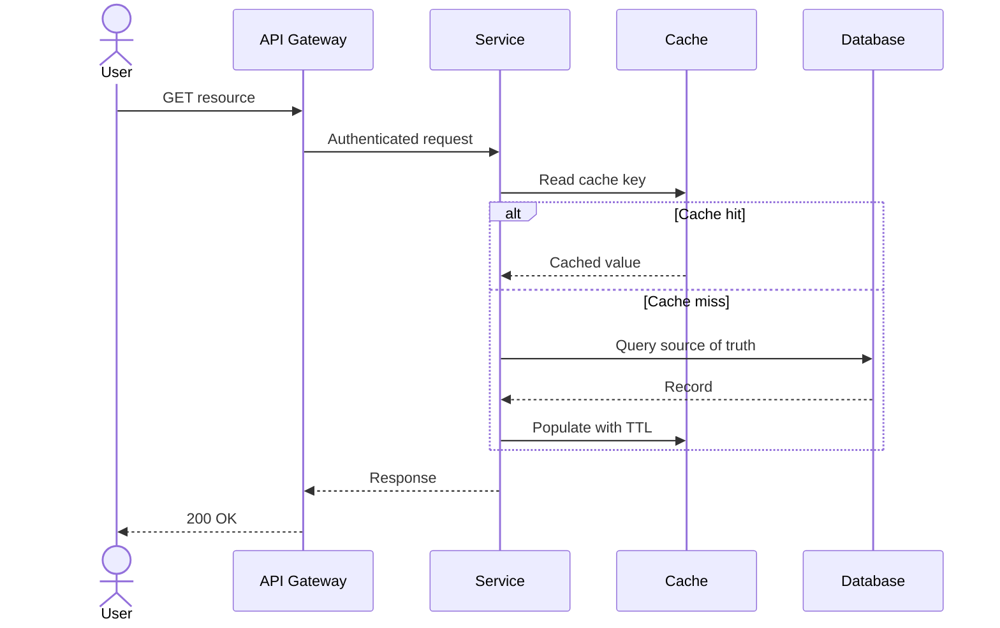

Discuss:

- cache-aside versus read-through;
- TTL and invalidation;
- stale data tolerance;
- cache stampede prevention using request coalescing, locks, or jitter;
- negative caching for repeated misses;
- pagination and read replicas;
- timeout and fallback behavior.

### 8.2 Transactional write plus asynchronous side effects

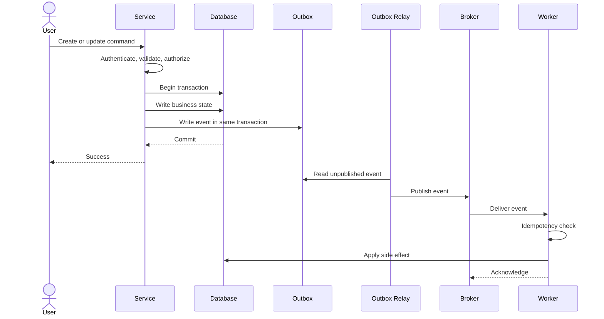

Discuss:

- input validation and authorization;
- database transaction boundary;
- idempotency key and duplicate requests;
- optimistic locking for concurrent updates;
- transactional outbox to avoid database/broker dual-write failure;
- at-least-once delivery and idempotent consumers;
- retry with exponential backoff and jitter;
- dead-letter handling, replay, and reconciliation.

### 8.3 Direct large-file upload

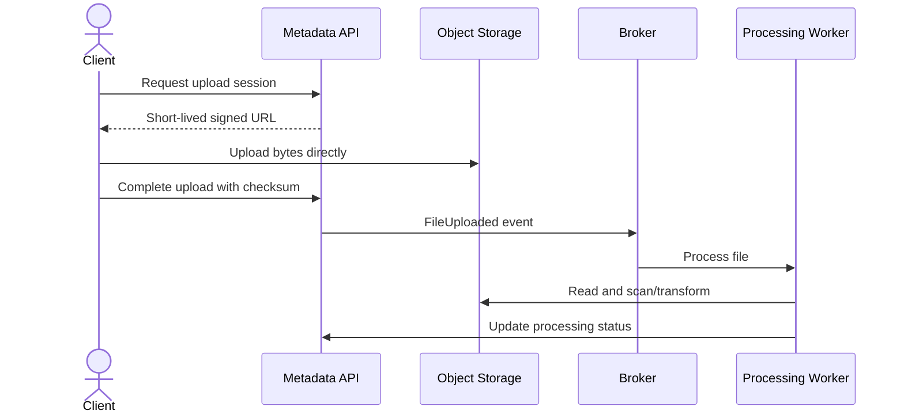

This prevents application servers from becoming bandwidth bottlenecks. Discuss multipart upload, checksum validation, malware scanning, content type, authorization, orphan cleanup, and download through signed URLs or a CDN.

### 8.4 Real-time update flow

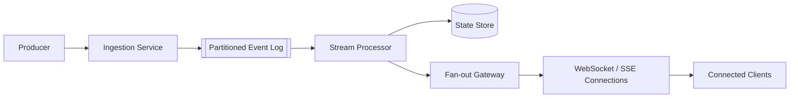

Discuss partitioning and per-key ordering, backpressure, reconnect and resume tokens, heartbeats, slow consumers, connection capacity, duplicate delivery, snapshots, and recovery from the durable log.

### 8.5 Search indexing flow

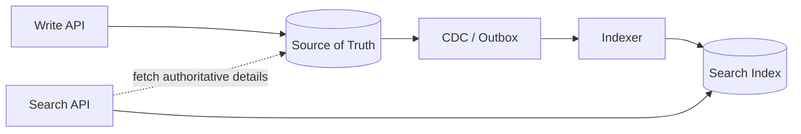

Search is normally eventually consistent. Explain indexing lag, schema changes, reindexing, alias-based cutover, failed-document replay, and how the system behaves when search is unavailable.

---

## 9. Choosing Storage

Start with access patterns and invariants, then choose technology.

| Need                             | Likely choice        | Important trade-off                           |
| -------------------------------- | -------------------- | --------------------------------------------- |
| Transactions, joins, constraints | Relational database  | Scaling writes and cross-shard operations     |
| Key-value lookup at high scale   | Key-value store      | Limited query flexibility                     |
| Flexible documents               | Document database    | Denormalization and consistency complexity    |
| Large files and media            | Object storage       | Separate metadata and lifecycle management    |
| Full-text search and ranking     | Search engine        | Eventual consistency; not source of truth     |
| Ordered durable event stream     | Distributed log      | Partitioning and consumer operations          |
| Time-window metrics              | Time-series database | Specialized access patterns                   |
| Relationship traversal           | Graph database       | Operational complexity and narrower use cases |

### Partitioning checklist

- Does the partition key distribute traffic and storage evenly?
- Does it support the primary queries?
- Can one celebrity, tenant, product, or timestamp create a hot partition?
- Is resharding supported?
- What operations require multiple partitions?
- How are global uniqueness and secondary indexes handled?

### Replication checklist

- synchronous or asynchronous replication?
- leader-follower, multi-leader, or leaderless?
- acceptable replication lag?
- read-your-writes requirement?
- failover detection and promotion process?
- recovery point objective and backup restoration evidence?

---

## 10. Consistency and Concurrency

Do not say “eventual consistency” for the whole system. State which invariant needs which consistency.

Examples:

- Payment ledger entries: strong consistency and durable audit trail.
- Social feed propagation: eventual consistency is usually acceptable.
- Username uniqueness: strongly enforced within the chosen uniqueness scope.
- Like counter: approximate or eventually consistent may be acceptable.
- Inventory reservation: atomic conditional update or serialized ownership per item.

### Common techniques

- Database transaction: protects invariants inside one database boundary.
- Optimistic locking: reject updates based on a stale version.
- Pessimistic lock: serialize access when conflicts are frequent and bounded.
- Compare-and-set: update only if the current value matches expectation.
- Idempotency key: return the original result for a retried command.
- Saga: coordinate a multi-service workflow with local transactions and compensation.
- Outbox: reliably publish state changes after committing business data.
- Reconciliation: detect and repair divergence after distributed failures.

### Saga flow

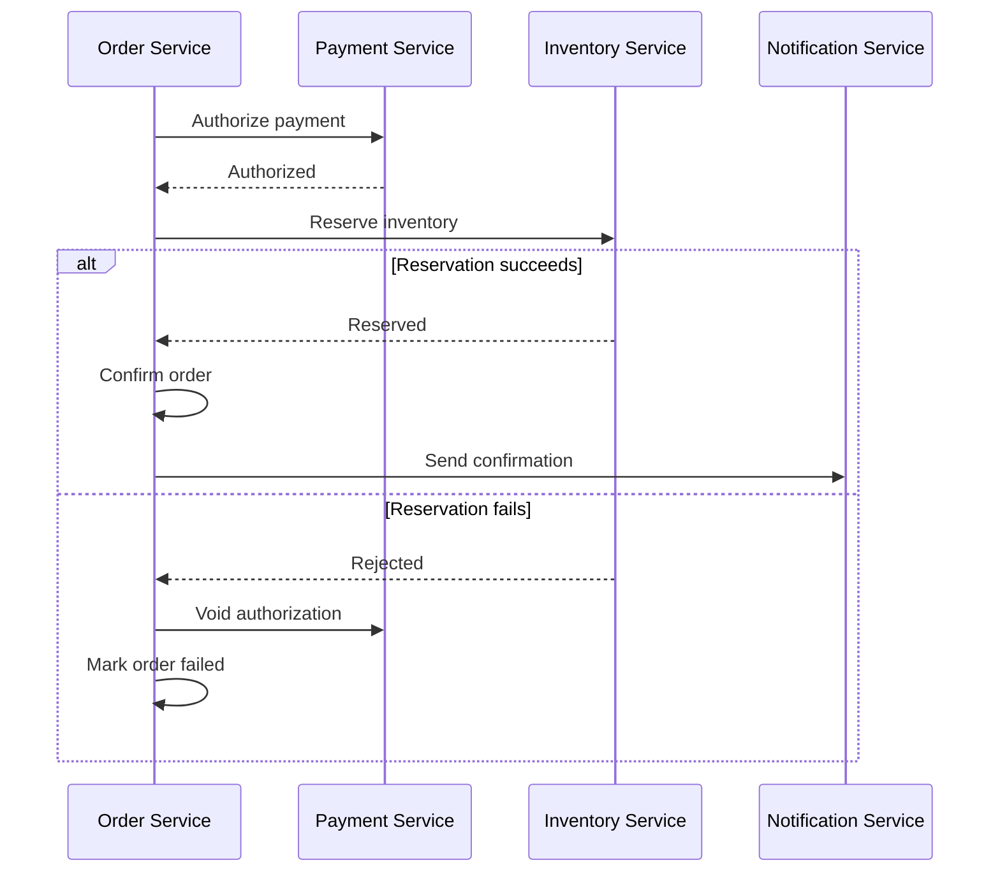

Explain the state machine, timeouts, retry policy, compensation, idempotency, and manual recovery. Compensation is a business action, not a magical rollback of time.

---

## 11. Scaling Playbook

Apply scaling changes in response to a measured bottleneck:

1. Optimize queries and indexes.
2. Cache hot reads.
3. Keep services stateless and scale horizontally.
4. Use asynchronous processing for work not required in the response.
5. Add read replicas when stale reads are acceptable.
6. Partition data and event streams.
7. Separate independently scaling workloads.
8. Introduce multi-region topology only when requirements justify its complexity.

### Hotspot strategies

- consistent hashing with virtual nodes;
- composite or hashed partition keys;
- time buckets for time-series writes;
- split celebrity fan-out from normal fan-out;
- request coalescing and local caching;
- per-tenant quotas and admission control;
- precomputation for expensive repeated reads.

### Protecting the system under overload

- rate limiting and quotas;
- bounded queues and thread pools;
- timeouts on every remote call;
- circuit breakers for failing dependencies;
- load shedding for non-critical work;
- backpressure instead of unbounded buffering;
- graceful degradation;
- priority lanes for critical traffic;
- autoscaling based on saturation and queue lag, not CPU alone.

---

## 12. Reliability and Failure Analysis

For each remote dependency, ask:

1. What if it is slow?
2. What if it is unavailable?
3. What if the request succeeded but the response was lost?
4. What if a message is duplicated, delayed, or reordered?
5. What if only part of the workflow completed?
6. How do we detect, recover, and prove correctness afterward?

### Generic resilient request flow

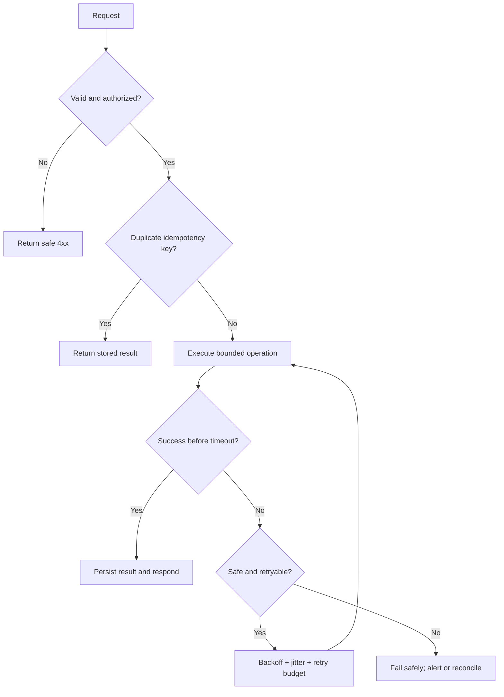

### Recovery vocabulary

- RPO: maximum tolerable data loss measured in time.
- RTO: maximum tolerable restoration time.
- Backup: a copy exists.
- Restore test: evidence that the copy can recover the system.
- Failover: traffic moves to a healthy replica or region.
- Failback: controlled return after recovery.
- Reconciliation: compare authoritative records and repair inconsistencies.

Avoid retry storms. Retries need bounded attempts, exponential backoff, jitter, time budgets, and idempotent operations.

---

## 13. Security and Abuse Prevention

Mention security throughout the flow, not as a final checkbox.

- TLS in transit and encryption at rest.
- Authentication at the boundary; authorization at the resource or business-action level.
- Least-privilege service identities and short-lived credentials.
- Secret management and rotation; no secrets in source code or logs.
- Input validation, output encoding, and protection from injection.
- Tenant isolation and object-level authorization.
- Rate limiting, quotas, bot detection, and abuse controls.
- Immutable or tamper-evident audit events for sensitive actions.
- Data classification, retention, export, and deletion workflows.
- Tokenization or encryption of sensitive fields.
- Signed URLs with short expiry for private objects.
- Redaction of personal or confidential information in telemetry.

State the trust boundaries in the architecture and identify which components handle sensitive data.

---

## 14. Observability and Operations

A production design must be operable.

### Golden signals

- Latency: p50, p95, and p99 by endpoint or operation.
- Traffic: request rate, event rate, and concurrent connections.
- Errors: by code, dependency, retryability, and tenant.
- Saturation: CPU, memory, connection pools, thread pools, queue depth, and disk.

Also monitor business and correctness signals:

- order/payment state mismatches;
- event processing lag and dead-letter volume;
- cache hit ratio and eviction rate;
- replication and search-index lag;
- idempotency conflicts and duplicate suppression;
- reconciliation differences;
- fraud, abuse, or authorization denials.

Use correlation or trace IDs across synchronous calls and asynchronous events. Alerts should map to user impact or an actionable operational condition.

### Deployment considerations

- backward-compatible API and event changes;
- expand-migrate-contract database changes;
- rolling, blue-green, or canary deployment;
- feature flags and rapid rollback;
- readiness and liveness checks;
- capacity headroom during deployment;
- runbooks, ownership, and incident response.

---

## 15. Common Design Patterns by Question Type

| Question family     | Critical flow                     | Likely deep dives                                       |
| ------------------- | --------------------------------- | ------------------------------------------------------- |
| URL shortener       | Redirect read path                | ID generation, cache, abuse, expiration                 |
| Social feed         | Publish and timeline read         | Fan-out-on-write/read, celebrity problem, ranking       |
| Chat/messaging      | Send, store, deliver, acknowledge | Ordering, WebSockets, presence, offline delivery        |
| Notification system | Accept request and deliver        | Preferences, provider routing, retries, deduplication   |
| File storage        | Upload, sync, download            | Chunking, deduplication, metadata, conflict resolution  |
| Video platform      | Upload, transcode, stream         | Object storage, CDN, encoding pipeline, recommendations |
| Ride sharing        | Driver location and matching      | Geospatial index, real-time updates, trip state machine |
| Ticket booking      | Search, hold, confirm             | Contention, temporary holds, payment saga, overselling  |
| E-commerce          | Browse, cart, checkout            | Inventory, pricing, payment, order workflow             |
| Payment system      | Authorize, capture, settle        | Idempotency, ledger, reconciliation, compliance         |
| Rate limiter        | Decide allow/deny                 | Algorithm, distributed counters, clock/window semantics |
| Web crawler         | Discover, schedule, fetch         | URL frontier, politeness, deduplication, retries        |
| Search autocomplete | Prefix query                      | Trie/index, ranking, freshness, top-K aggregation       |
| Metrics/logging     | Ingest, aggregate, query          | High write volume, time partitioning, retention         |
| Job scheduler       | Submit, lease, execute            | Durable state, fairness, retries, zombie workers        |
| Cache               | Get/set/evict                     | Partitioning, replication, eviction, hot keys           |
| Distributed storage | Put/get/delete                    | Replication, quorum, repair, rebalancing                |

Use the common framework, then focus the deep dive on what makes that family difficult.

---

## 16. Adaptable Diagrams for Most Interviews

### Diagram A — System context

Use first to establish actors and external boundaries.

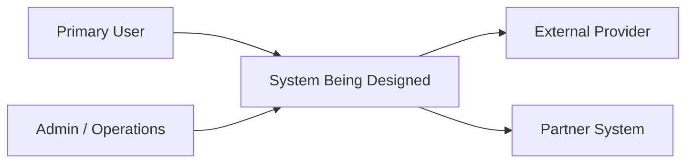

### Diagram B — Container-level architecture

Use to show major services and stores. Label ownership and avoid drawing every internal class.

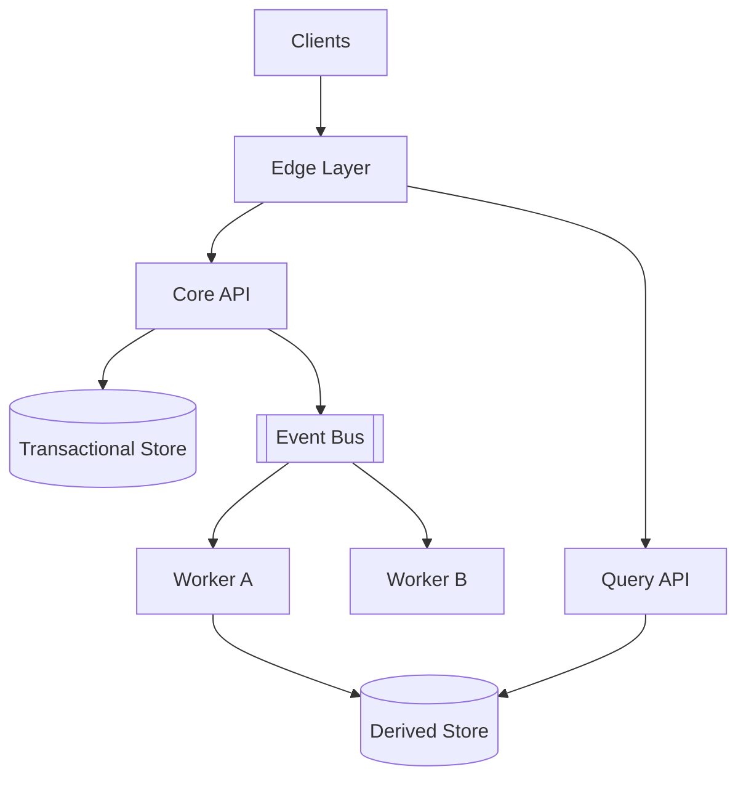

### Diagram C — Critical sequence

Use for correctness, transaction boundaries, retries, and user-visible timing.

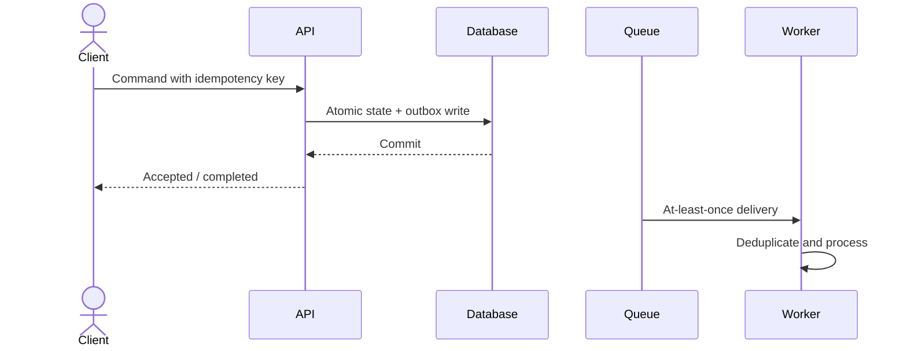

### Diagram D — State machine

Use for orders, payments, bookings, jobs, uploads, and other long-running workflows.

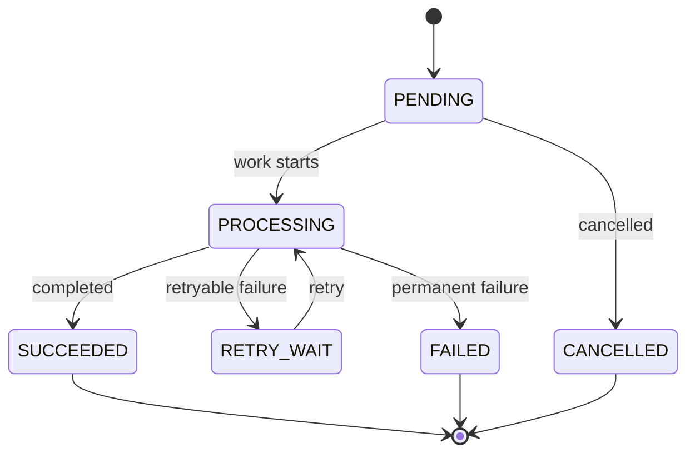

### Diagram E — Multi-region topology

Use only if availability, disaster recovery, or global latency makes it relevant.

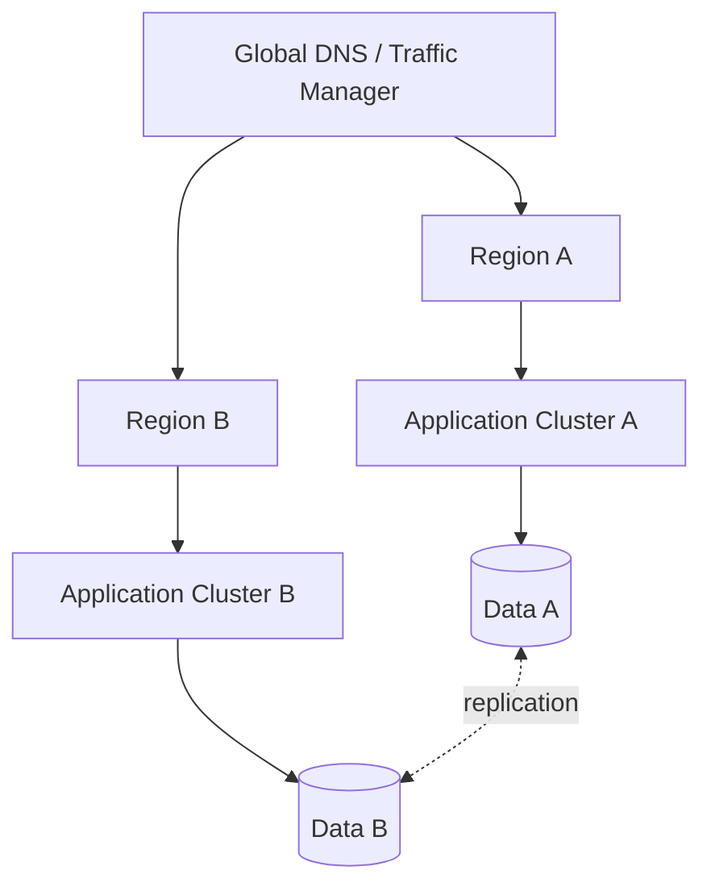

Clarify active-active versus active-passive, write ownership, conflict handling, replication lag, failover, RPO, and RTO.

---

## 17. How to Communicate While Drawing

For every important box or arrow, explain:

1. What responsibility does it own?
2. Why is it needed for a stated requirement?
3. Is the interaction synchronous or asynchronous?
4. What data does it own or cache?
5. What happens when it is slow or unavailable?
6. How does it scale?

Useful phrases:

- “I’m choosing this because our dominant access pattern is…”
- “The source of truth remains X; Y is a derived, eventually consistent view.”
- “Ordering is guaranteed only within one partition key, which is sufficient because…”
- “This write is idempotent using…, so a lost response can be retried safely.”
- “The trade-off is increased write cost in exchange for lower read latency.”
- “At the current scale I would start with…, and introduce partitioning when…”
- “The main failure mode is…, detected by…, and recovered through…”

Pause after the first complete architecture and ask:

> “Would you like me to deep-dive into the data model, the scaling bottleneck, or the consistency and failure handling?”

---

## 18. Common Mistakes and Better Alternatives

| Mistake                                            | Better approach                                                                                     |
| -------------------------------------------------- | --------------------------------------------------------------------------------------------------- |
| Jumping straight to Kafka, Redis, or microservices | Clarify requirements and derive components from them                                                |
| Drawing many boxes without flows                   | Walk through one critical write and one critical read                                               |
| Treating every operation as strongly consistent    | Define invariants and choose consistency per operation                                              |
| Saying “use a load balancer” as the scaling answer | Find the actual bottleneck: compute, database, partition, network, or dependency                    |
| Claiming “exactly once”                            | Explain at-least-once delivery plus idempotent processing, or define the narrow transactional scope |
| Ignoring retries and timeouts                      | Define timeout, retry budget, backoff, deduplication, and fallback                                  |
| Using a cache without invalidation rules           | State ownership, keys, TTL, refresh, eviction, and stale-data tolerance                             |
| Choosing a database by popularity                  | Start from access patterns, invariants, and growth                                                  |
| Overusing microservices                            | Begin with clear logical boundaries; deploy separately only when justified                          |
| Ignoring security and operations until the end     | Identify trust boundaries, telemetry, and recovery as flows are designed                            |
| Giving one perfect-looking final design            | Show an evolutionary path and explicit trade-offs                                                   |

---

## 19. A Compact Deep-Dive Checklist

When the interviewer asks “What happens at scale?” or “What can go wrong?”, inspect these dimensions:

### Data

- source of truth;
- access patterns and indexes;
- partitioning and hotspots;
- replication and lag;
- lifecycle, retention, backup, and restore;
- privacy deletion and audit requirements.

### Requests

- authentication and authorization;
- validation and idempotency;
- timeout and retry policy;
- pagination and payload limits;
- rate limiting and overload behavior.

### Events

- partition key and ordering scope;
- delivery guarantee;
- deduplication and idempotent consumer;
- poison messages and dead-letter handling;
- replay, schema evolution, and lag monitoring.

### Failure

- dependency slow or unavailable;
- partial completion;
- duplicate, delayed, or lost response;
- process, zone, region, or data loss;
- detection, mitigation, recovery, and reconciliation.

### Operations

- SLOs and alerts;
- logs, metrics, traces, and business invariants;
- rollout and rollback;
- capacity and cost;
- runbooks and ownership.

---

## 20. Final Two-Minute Summary Template

Close the interview with a concise recap:

> “We designed the system for [scale] with [latency/availability/consistency goals]. Clients enter through [edge], and stateless services handle [main responsibility]. [Database] is the source of truth, partitioned by [key], while [cache/search/read model] serves the dominant read pattern. Non-critical or bursty work moves through [broker] and idempotent workers. The critical invariant is protected by [transaction/conditional write/state machine], and cross-service work uses [outbox/saga/reconciliation]. The major trade-off is [X versus Y]. The first bottleneck is likely [component], which we would monitor using [signals] and evolve through [next step].”

This demonstrates that you understand the whole design, not just individual technologies.

---

## 21. One-Page Interview Checklist

```text
SCOPE
[ ] Actors and top use cases
[ ] Explicit exclusions
[ ] Read/write pattern

QUALITY ATTRIBUTES
[ ] Peak QPS and data volume
[ ] Latency and availability SLO
[ ] Consistency and durability requirements
[ ] Geography, security, compliance, and cost

CONTRACTS
[ ] Core APIs
[ ] Core events
[ ] Entities, keys, indexes, and invariants

DESIGN
[ ] System context
[ ] High-level component diagram
[ ] Critical write sequence
[ ] Critical read sequence
[ ] Source of truth and derived views

CORRECTNESS AND SCALE
[ ] Idempotency and concurrency
[ ] Partitioning, replication, and caching
[ ] Async processing, ordering, retries, and DLQ
[ ] Hotspots, overload, and backpressure

FAILURE AND OPERATIONS
[ ] Dependency and partial-failure behavior
[ ] RPO, RTO, backup restore, and reconciliation
[ ] Metrics, logs, traces, alerts, and business signals
[ ] Deployment, migration, rollback, and cost

CLOSE
[ ] Main decisions and trade-offs
[ ] Likely bottleneck
[ ] Evolution path
```

---

## 22. Final Principle

A strong HLD answer is a chain of reasoning:

```text
Requirement
    → constraint
    → design decision
    → component or data model
    → end-to-end flow
    → failure behavior
    → trade-off
```

If you can explain that chain clearly for the critical flows, you can handle most system design questions without memorizing dozens of unrelated architectures.
