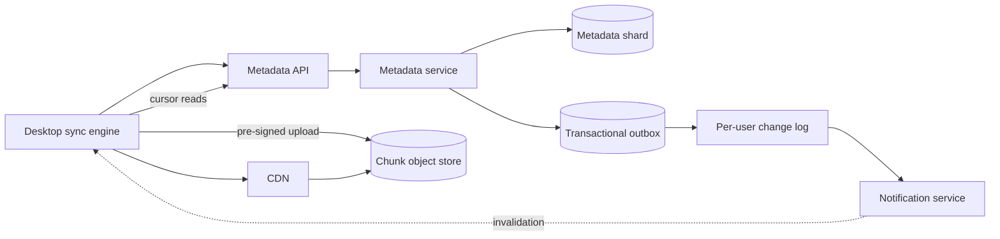

# Production Evolution

The demo's domain boundary is intended to survive replacement of its local infrastructure.

## Non-negotiable invariants

1. An acknowledged version references verified, durable chunks.
2. Metadata mutation and its change event commit atomically.
3. A device advances its durable cursor only after applying every prior event.
4. The same operation ID cannot create multiple logical mutations.
5. Server sequence numbers, not device clocks, order synchronization.
6. Concurrent user content is preserved rather than silently overwritten.

## Next production components

- Replicated SQL or key-value metadata shards routed by `userId`.
- Transactional outbox into a partitioned log.
- Object-store signed URLs and CDN delivery.
- Native device journal, filesystem watcher, debounce, and atomic file replacement.
- Snapshot-at-revision endpoint for expired cursors.
- Chunk reachability GC with a quarantine interval.
- Authentication, quotas, ACLs, encryption, abuse prevention, and audit logs.
- Metrics for convergence lag, commit latency, retry rate, conflict rate, dedupe ratio, missing blobs, and active cursors.
