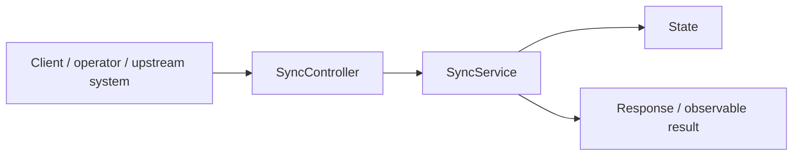
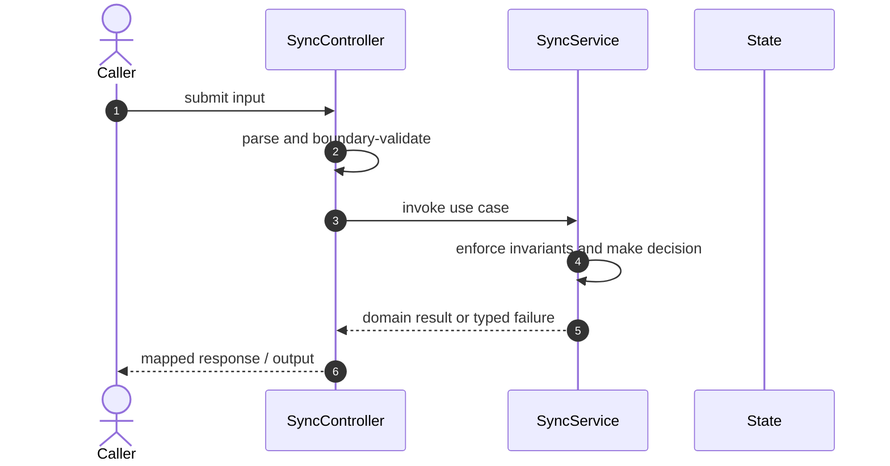

# Dropbox File Sync Demo Code Flow

This is the single code-flow guide for the project. It connects the business request to concrete source files, explains both architectural levels, and shows where validation, state changes, asynchronous work, and responses occur.

## Scope and outcome

A Java 17 and Spring Boot implementation of the important Dropbox sync invariants. It is deliberately small enough to explain in an interview while exercising real chunk transfer, version commits, conflicts, retries, persistence, downloads, rename/delete, and ordered change cursors.

The tracked production-code inventory used by this guide contains **6 source units** and **10 annotation-discovered HTTP operations**. Generated/build output and test sources are intentionally excluded from the runtime path.

## High-Level Design

At the system level, callers enter through an inbound adapter. The adapter owns transport concerns; application/domain code owns use-case decisions; repositories and gateways isolate state and external systems. Asynchronous adapters extend the flow without moving business invariants into controllers or consumers.

### Runtime stages

1. **Enter:** a request, command, scheduled trigger, protocol message, or UI action reaches the inbound boundary.
2. **Validate:** transport shape and required fields are rejected before domain mutation.
3. **Decide:** application/domain logic loads required state and applies invariants, idempotency, authorization, limits, or algorithms.
4. **Commit:** durable state changes pass through a repository/store; external calls pass through gateways; asynchronous work passes through message boundaries.
5. **Return and observe:** the adapter maps the result to an HTTP response, protocol response, CLI output, event, or metric.

## Low-Level Design

The low-level path keeps orchestration directional: inbound adapter → application/domain unit → persistence/outbound adapter. Contracts carry data between layers; configuration and security apply cross-cutting policy without becoming business logic.

### Component map

| Responsibility           | Concrete code                   |
| ------------------------ | ------------------------------- |
| Supporting logic         | `ApiException`, `Models`, `app` |
| Entry point              | `DropboxSyncApplication`        |
| Inbound adapter          | `SyncController`                |
| Application/domain logic | `SyncService`                   |

### Inbound operations

| Verb/trigger | Path or input          | Owning code      |
| ------------ | ---------------------- | ---------------- |
| `POST`       | `/uploads/plan`        | `SyncController` |
| `PUT`        | `/chunks/{hash}`       | `SyncController` |
| `POST`       | `/commits`             | `SyncController` |
| `GET`        | `/files`               | `SyncController` |
| `GET`        | `/changes`             | `SyncController` |
| `GET`        | `/stats`               | `SyncController` |
| `GET`        | `/files/{id}/download` | `SyncController` |
| `POST`       | `/files/{id}/move`     | `SyncController` |
| `DELETE`     | `/files/{id}`          | `SyncController` |
| `POST`       | `/admin/reset`         | `SyncController` |

## Detailed source walkthrough

Read this table top-down by category, then follow the linked files. “Key methods” are discovered from the checked-in implementation and identify useful debugging/interview entry points.

| Source file                                                                                        | Role                     | Responsibility and important methods                                                                                                                                                     |
| -------------------------------------------------------------------------------------------------- | ------------------------ | ---------------------------------------------------------------------------------------------------------------------------------------------------------------------------------------- |
| [`ApiException.java`](./src/main/java/dev/interview/dropbox/ApiException.java)                     | Supporting logic         | ApiException provides a focused algorithm or shared implementation detail. Key methods: `status()`, `code()`, `details()`.                                                               |
| [`DropboxSyncApplication.java`](./src/main/java/dev/interview/dropbox/DropboxSyncApplication.java) | Entry point              | DropboxSyncApplication bootstraps the process and wires the runtime. Key methods: `main()`.                                                                                              |
| [`SyncController.java`](./src/main/java/dev/interview/dropbox/SyncController.java)                 | Inbound adapter          | SyncController accepts an inbound call, validates its boundary contract, and delegates work. Key methods: `plan()`, `chunk()`, `commit()`, `files()`, `changes()`, `stats()`.            |
| [`SyncService.java`](./src/main/java/dev/interview/dropbox/SyncService.java)                       | Application/domain logic | SyncService coordinates the use case and enforces domain decisions. Key methods: `plan()`, `putChunk()`, `commit()`, `move()`, `delete()`, `files()`.                                    |
| [`Models.java`](./src/main/java/dev/interview/dropbox/model/Models.java)                           | Supporting logic         | Models provides a focused algorithm or shared implementation detail. Key methods: `ChunkRef()`, `UploadPlanRequest()`, `CommitRequest()`, `MoveRequest()`, `Version()`, `ChangeEvent()`. |
| [`app.js`](./static/app.js)                                                                        | Supporting logic         | app provides a focused algorithm or shared implementation detail.                                                                                                                        |

## End-to-end code-flow narrative

1. Start at `SyncController`. It receives the external input and should perform only boundary parsing, authentication/authorization handoff, and request validation.
2. Follow the call into `SyncService`. This is the principal place to explain the use case, invariant checks, deduplication/concurrency decision, and success/failure result.
3. Continue into `State` for the durable or in-memory state transition. Transaction and consistency guarantees belong at this boundary, not in response mapping.
4. This flow completes synchronously; background work is not part of the primary checked-in path.
5. External-system behavior is either absent or represented behind another listed adapter.
6. Return to `SyncController`, where typed outcomes become the public response or protocol result. Logging and metrics should preserve correlation identifiers without leaking secrets.

## Failure and correctness checkpoints

- **Invalid input:** rejected at the inbound contract before state mutation.
- **Domain conflict:** returned as a typed result; do not hide it as an infrastructure exception.
- **Duplicate or concurrent work:** handled where the project’s idempotency, locking, ordering, or atomic data structure is implemented.
- **Storage/integration failure:** transaction is rolled back or the operation remains safely retryable.
- **Async failure:** consumer retries must preserve idempotency; poison work must become observable rather than loop silently.
- **Observability:** trace the same request/correlation identity through inbound, domain, persistence, and async logs.

## How to trace a scenario in the debugger

1. Choose one operation from the inbound-operations table or the project’s demo script.
2. Break at `SyncController`, then step into `SyncService` rather than framework internals.
3. Inspect the command/request object immediately after validation.
4. Stop before and after the call to `State` to compare intended and durable state.
5. If messaging exists, capture the emitted identifier and continue from `the consumer/worker`.
6. Confirm the final public result and the corresponding logs/metrics.

## Related project documentation

- [Project README](./README.md)
- [Specialized diagrams](./docs/DIAGRAMS.md)
- [Interview guide](./docs/INTERVIEW_GUIDE.md)
