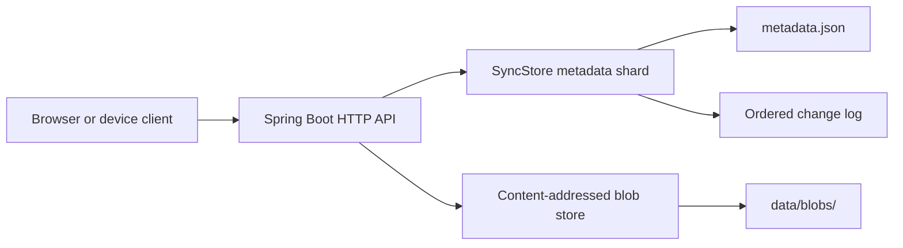
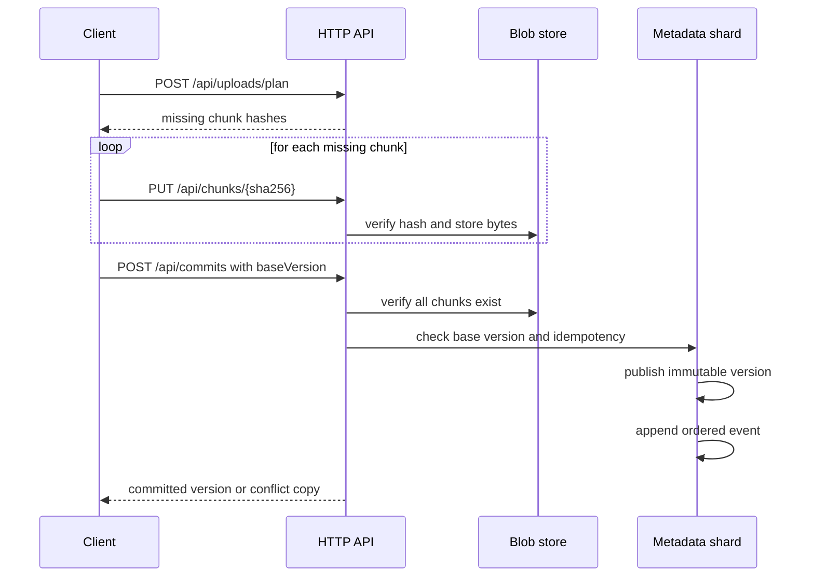
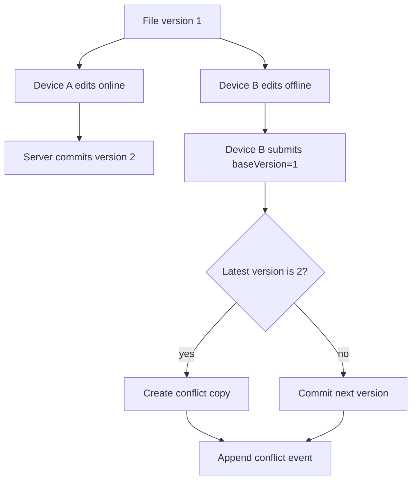

# Dropbox File Sync Demo Diagrams

## High-Level Architecture

```mermaid
flowchart LR
    Client["Browser or device client"] --> Api["Spring Boot HTTP API"]
    Api --> Metadata["SyncStore metadata shard"]
    Api --> BlobStore["Content-addressed blob store"]
    Metadata --> MetadataFile["metadata.json"]
    BlobStore --> BlobFiles["data/blobs/<sha256>"]
    Metadata --> ChangeLog["Ordered change log"]
```

## Low-Level Design

### Upload And Commit Flow

```mermaid
sequenceDiagram
    participant C as Client
    participant API as HTTP API
    participant B as Blob store
    participant M as Metadata shard
    C->>API: POST /api/uploads/plan
    API-->>C: missing chunk hashes
    loop for each missing chunk
        C->>API: PUT /api/chunks/{sha256}
        API->>B: verify hash and store bytes
    end
    C->>API: POST /api/commits with baseVersion
    API->>B: verify all chunks exist
    API->>M: check base version and idempotency
    M->>M: publish immutable version
    M->>M: append ordered event
    API-->>C: committed version or conflict copy
```

### Offline Conflict Flow

```mermaid
flowchart TB
    V1["File version 1"] --> DeviceA["Device A edits online"]
    V1 --> DeviceB["Device B edits offline"]
    DeviceA --> V2["Server commits version 2"]
    DeviceB --> Stale["Device B submits baseVersion=1"]
    Stale --> Conflict{"Latest version is 2?"}
    Conflict -->|yes| Copy["Create conflict copy"]
    Conflict -->|no| Replace["Commit next version"]
    Copy --> Log["Append conflict event"]
    Replace --> Log
```
