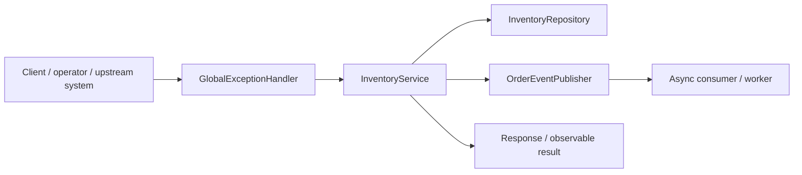
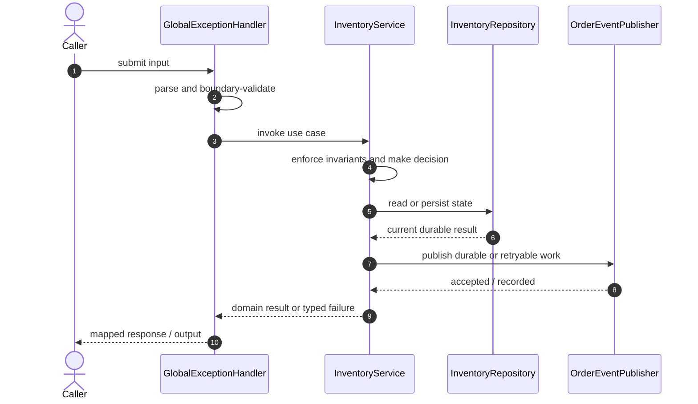

# E-Commerce Backend Code Flow

This is the single code-flow guide for the project. It connects the business request to concrete source files, explains both architectural levels, and shows where validation, state changes, asynchronous work, and responses occur.

## Scope and outcome

A Spring Boot e-commerce backend with inventory management, order placement, payment simulation, stock reservation, and Kafka order-event publishing.

The tracked production-code inventory used by this guide contains **28 source units** and **5 annotation-discovered HTTP operations**. Generated/build output and test sources are intentionally excluded from the runtime path.

## High-Level Design

At the system level, callers enter through an inbound adapter. The adapter owns transport concerns; application/domain code owns use-case decisions; repositories and gateways isolate state and external systems. Asynchronous adapters extend the flow without moving business invariants into controllers or consumers.

### Runtime stages

1. **Enter:** a request, command, scheduled trigger, protocol message, or UI action reaches the inbound boundary.
2. **Validate:** transport shape and required fields are rejected before domain mutation.
3. **Decide:** application/domain logic loads required state and applies invariants, idempotency, authorization, limits, or algorithms.
4. **Commit:** durable state changes pass through a repository/store; external calls pass through gateways; asynchronous work passes through message boundaries.
5. **Return and observe:** the adapter maps the result to an HTTP response, protocol response, CLI output, event, or metric.

## Low-Level Design

The low-level path keeps orchestration directional: inbound adapter → application/domain unit → persistence/outbound adapter. Contracts carry data between layers; configuration and security apply cross-cutting policy without becoming business logic.

### Component map

| Responsibility           | Concrete code                                                                                                                                                     |
| ------------------------ | ----------------------------------------------------------------------------------------------------------------------------------------------------------------- |
| Entry point              | `EcommerceApplication`                                                                                                                                            |
| Supporting logic         | `ApiError`, `DomainException`, `NotFoundException`, `InventoryItem`, `OrderLine`, `OrderStatus`, `PaymentStatus`                                                  |
| Inbound adapter          | `GlobalExceptionHandler`, `InventoryController`, `OrderController`                                                                                                |
| Persistence adapter      | `InventoryRepository`, `OrderRepository`, `PaymentRepository`                                                                                                     |
| API/message contract     | `InventoryResponse`, `UpsertInventoryRequest`, `OrderItemRequest`, `OrderLineResponse`, `OrderResponse`, `PlaceOrderRequest`, `PaymentRequest`, `PaymentResponse` |
| Application/domain logic | `InventoryService`, `OrderService`, `PaymentService`                                                                                                              |
| Domain/data model        | `CustomerOrder`, `PaymentRecord`                                                                                                                                  |
| Messaging/async adapter  | `OrderEventPublisher`                                                                                                                                             |

### Inbound operations

| Verb/trigger | Path or input                | Owning code           |
| ------------ | ---------------------------- | --------------------- |
| `POST`       | `(class-level/default path)` | `InventoryController` |
| `GET`        | `(class-level/default path)` | `InventoryController` |
| `POST`       | `(class-level/default path)` | `OrderController`     |
| `GET`        | `/{id}`                      | `OrderController`     |
| `POST`       | `/{id}/payments`             | `OrderController`     |

## Detailed source walkthrough

Read this table top-down by category, then follow the linked files. “Key methods” are discovered from the checked-in implementation and identify useful debugging/interview entry points.

| Source file                                                                                                           | Role                     | Responsibility and important methods                                                                                                                                                             |
| --------------------------------------------------------------------------------------------------------------------- | ------------------------ | ------------------------------------------------------------------------------------------------------------------------------------------------------------------------------------------------ |
| [`EcommerceApplication.java`](./src/main/java/com/example/capstone/ecommerce/EcommerceApplication.java)               | Entry point              | EcommerceApplication bootstraps the process and wires the runtime. Key methods: `main()`.                                                                                                        |
| [`ApiError.java`](./src/main/java/com/example/capstone/ecommerce/error/ApiError.java)                                 | Supporting logic         | ApiError provides a focused algorithm or shared implementation detail. Key methods: `of()`, `withFields()`.                                                                                      |
| [`DomainException.java`](./src/main/java/com/example/capstone/ecommerce/error/DomainException.java)                   | Supporting logic         | DomainException provides a focused algorithm or shared implementation detail.                                                                                                                    |
| [`GlobalExceptionHandler.java`](./src/main/java/com/example/capstone/ecommerce/error/GlobalExceptionHandler.java)     | Inbound adapter          | GlobalExceptionHandler accepts an inbound call, validates its boundary contract, and delegates work. Key methods: `handleNotFound()`, `handleDomain()`, `handleValidation()`.                    |
| [`NotFoundException.java`](./src/main/java/com/example/capstone/ecommerce/error/NotFoundException.java)               | Supporting logic         | NotFoundException provides a focused algorithm or shared implementation detail.                                                                                                                  |
| [`InventoryController.java`](./src/main/java/com/example/capstone/ecommerce/inventory/InventoryController.java)       | Inbound adapter          | InventoryController accepts an inbound call, validates its boundary contract, and delegates work. Key methods: `upsert()`, `list()`.                                                             |
| [`InventoryItem.java`](./src/main/java/com/example/capstone/ecommerce/inventory/InventoryItem.java)                   | Supporting logic         | InventoryItem provides a focused algorithm or shared implementation detail. Key methods: `replace()`, `reserve()`, `captureReserved()`, `releaseReserved()`, `getId()`, `getSku()`.              |
| [`InventoryRepository.java`](./src/main/java/com/example/capstone/ecommerce/inventory/InventoryRepository.java)       | Persistence adapter      | InventoryRepository reads or writes durable state behind a storage boundary.                                                                                                                     |
| [`InventoryResponse.java`](./src/main/java/com/example/capstone/ecommerce/inventory/InventoryResponse.java)           | API/message contract     | InventoryResponse carries validated data across an API or messaging boundary. Key methods: `from()`.                                                                                             |
| [`InventoryService.java`](./src/main/java/com/example/capstone/ecommerce/inventory/InventoryService.java)             | Application/domain logic | InventoryService coordinates the use case and enforces domain decisions. Key methods: `upsert()`, `list()`, `normalizeSku()`.                                                                    |
| [`UpsertInventoryRequest.java`](./src/main/java/com/example/capstone/ecommerce/inventory/UpsertInventoryRequest.java) | API/message contract     | UpsertInventoryRequest carries validated data across an API or messaging boundary.                                                                                                               |
| [`CustomerOrder.java`](./src/main/java/com/example/capstone/ecommerce/order/CustomerOrder.java)                       | Domain/data model        | CustomerOrder represents domain state, identity, or an invariant-bearing value. Key methods: `addLine()`, `markPaid()`, `markPaymentFailed()`, `getId()`, `getCustomerId()`, `getStatus()`.      |
| [`OrderController.java`](./src/main/java/com/example/capstone/ecommerce/order/OrderController.java)                   | Inbound adapter          | OrderController accepts an inbound call, validates its boundary contract, and delegates work. Key methods: `placeOrder()`, `get()`, `capturePayment()`.                                          |
| [`OrderEventPublisher.java`](./src/main/java/com/example/capstone/ecommerce/order/OrderEventPublisher.java)           | Messaging/async adapter  | OrderEventPublisher publishes, consumes, retries, or records asynchronous work. Key methods: `publish()`.                                                                                        |
| [`OrderItemRequest.java`](./src/main/java/com/example/capstone/ecommerce/order/OrderItemRequest.java)                 | API/message contract     | OrderItemRequest carries validated data across an API or messaging boundary.                                                                                                                     |
| [`OrderLine.java`](./src/main/java/com/example/capstone/ecommerce/order/OrderLine.java)                               | Supporting logic         | OrderLine provides a focused algorithm or shared implementation detail. Key methods: `getSku()`, `getName()`, `getQuantity()`, `getUnitPrice()`, `getLineTotal()`.                               |
| [`OrderLineResponse.java`](./src/main/java/com/example/capstone/ecommerce/order/OrderLineResponse.java)               | API/message contract     | OrderLineResponse carries validated data across an API or messaging boundary. Key methods: `from()`.                                                                                             |
| [`OrderRepository.java`](./src/main/java/com/example/capstone/ecommerce/order/OrderRepository.java)                   | Persistence adapter      | OrderRepository reads or writes durable state behind a storage boundary.                                                                                                                         |
| [`OrderResponse.java`](./src/main/java/com/example/capstone/ecommerce/order/OrderResponse.java)                       | API/message contract     | OrderResponse carries validated data across an API or messaging boundary. Key methods: `from()`.                                                                                                 |
| [`OrderService.java`](./src/main/java/com/example/capstone/ecommerce/order/OrderService.java)                         | Application/domain logic | OrderService coordinates the use case and enforces domain decisions. Key methods: `placeOrder()`, `get()`.                                                                                       |
| [`OrderStatus.java`](./src/main/java/com/example/capstone/ecommerce/order/OrderStatus.java)                           | Supporting logic         | OrderStatus provides a focused algorithm or shared implementation detail.                                                                                                                        |
| [`PlaceOrderRequest.java`](./src/main/java/com/example/capstone/ecommerce/order/PlaceOrderRequest.java)               | API/message contract     | PlaceOrderRequest carries validated data across an API or messaging boundary.                                                                                                                    |
| [`PaymentRecord.java`](./src/main/java/com/example/capstone/ecommerce/payment/PaymentRecord.java)                     | Domain/data model        | PaymentRecord represents domain state, identity, or an invariant-bearing value. Key methods: `getId()`, `getOrderId()`, `getAmount()`, `getCurrency()`, `getStatus()`, `getProviderReference()`. |
| [`PaymentRepository.java`](./src/main/java/com/example/capstone/ecommerce/payment/PaymentRepository.java)             | Persistence adapter      | PaymentRepository reads or writes durable state behind a storage boundary.                                                                                                                       |
| [`PaymentRequest.java`](./src/main/java/com/example/capstone/ecommerce/payment/PaymentRequest.java)                   | API/message contract     | PaymentRequest carries validated data across an API or messaging boundary.                                                                                                                       |
| [`PaymentResponse.java`](./src/main/java/com/example/capstone/ecommerce/payment/PaymentResponse.java)                 | API/message contract     | PaymentResponse carries validated data across an API or messaging boundary. Key methods: `from()`.                                                                                               |
| [`PaymentService.java`](./src/main/java/com/example/capstone/ecommerce/payment/PaymentService.java)                   | Application/domain logic | PaymentService coordinates the use case and enforces domain decisions. Key methods: `capture()`.                                                                                                 |
| [`PaymentStatus.java`](./src/main/java/com/example/capstone/ecommerce/payment/PaymentStatus.java)                     | Supporting logic         | PaymentStatus provides a focused algorithm or shared implementation detail.                                                                                                                      |

## End-to-end code-flow narrative

1. Start at `GlobalExceptionHandler`. It receives the external input and should perform only boundary parsing, authentication/authorization handoff, and request validation.
2. Follow the call into `InventoryService`. This is the principal place to explain the use case, invariant checks, deduplication/concurrency decision, and success/failure result.
3. Continue into `InventoryRepository` for the durable or in-memory state transition. Transaction and consistency guarantees belong at this boundary, not in response mapping.
4. Follow `OrderEventPublisher` when the synchronous decision emits follow-up work. Verify retry, duplicate-delivery, and dead-letter behavior independently of the request thread.
5. External-system behavior is either absent or represented behind another listed adapter.
6. Return to `GlobalExceptionHandler`, where typed outcomes become the public response or protocol result. Logging and metrics should preserve correlation identifiers without leaking secrets.

## Failure and correctness checkpoints

- **Invalid input:** rejected at the inbound contract before state mutation.
- **Domain conflict:** returned as a typed result; do not hide it as an infrastructure exception.
- **Duplicate or concurrent work:** handled where the project’s idempotency, locking, ordering, or atomic data structure is implemented.
- **Storage/integration failure:** transaction is rolled back or the operation remains safely retryable.
- **Async failure:** consumer retries must preserve idempotency; poison work must become observable rather than loop silently.
- **Observability:** trace the same request/correlation identity through inbound, domain, persistence, and async logs.

## How to trace a scenario in the debugger

1. Choose one operation from the inbound-operations table or the project’s demo script.
2. Break at `GlobalExceptionHandler`, then step into `InventoryService` rather than framework internals.
3. Inspect the command/request object immediately after validation.
4. Stop before and after the call to `InventoryRepository` to compare intended and durable state.
5. If messaging exists, capture the emitted identifier and continue from `OrderEventPublisher`.
6. Confirm the final public result and the corresponding logs/metrics.

## Related project documentation

- [Project README](./README.md)
- [Specialized diagrams](./docs/DIAGRAMS.md)
- [Interview guide](./docs/INTERVIEW_GUIDE.md)
