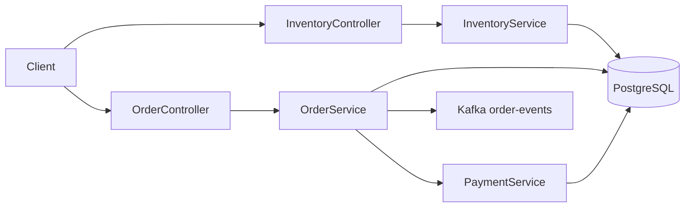
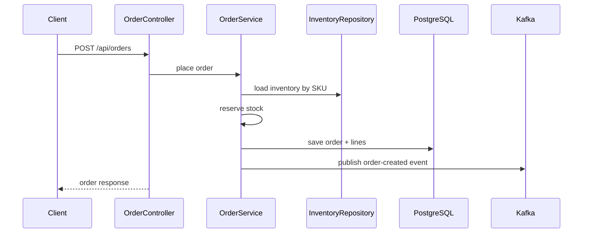
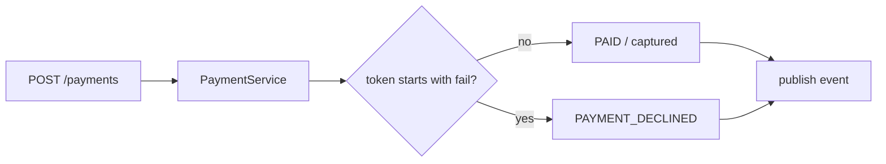

# E-Commerce Backend Diagrams

## Component View

```mermaid
flowchart LR
    Client["Client"] --> InventoryApi["InventoryController"]
    Client --> OrderApi["OrderController"]
    InventoryApi --> InventoryService["InventoryService"]
    OrderApi --> OrderService["OrderService"]
    OrderService --> PaymentService["PaymentService"]
    InventoryService --> DB[("PostgreSQL")]
    OrderService --> DB
    PaymentService --> DB
    OrderService --> Kafka["Kafka order-events"]
```

## Checkout Flow

```mermaid
sequenceDiagram
    participant C as Client
    participant API as OrderController
    participant O as OrderService
    participant I as InventoryRepository
    participant DB as PostgreSQL
    participant K as Kafka
    C->>API: POST /api/orders
    API->>O: place order
    O->>I: load inventory by SKU
    O->>O: reserve stock
    O->>DB: save order + lines
    O->>K: publish order-created event
    API-->>C: order response
```

## Payment Flow

```mermaid
flowchart LR
    PaymentRequest["POST /payments"] --> PaymentService["PaymentService"]
    PaymentService --> Decision{"token starts with fail?"}
    Decision -->|no| Paid["PAID / captured"]
    Decision -->|yes| Declined["PAYMENT_DECLINED"]
    Paid --> Event["publish event"]
    Declined --> Event
```
