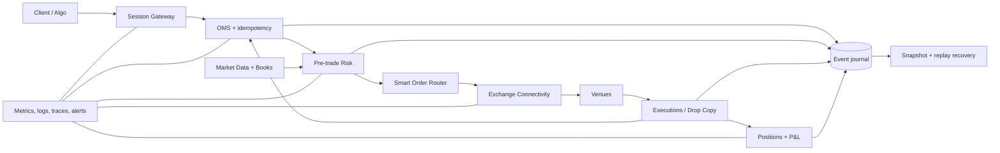

# End-to-End Electronic Trading Platform (HLD 29)

A runnable Java 17 vertical slice from authenticated client order through market data, synchronous risk, OMS idempotency, venue connectivity, execution handling, positions, recovery, and metrics.

## Choose a Track

| Goal                                               | Start here                                                                              |
| -------------------------------------------------- | --------------------------------------------------------------------------------------- |
| Prepare the 40–60 minute interview answer          | [INTERVIEW_GUIDE.md](INTERVIEW_GUIDE.md)                                                |
| Inspect architecture and failure behavior          | [docs/ARCHITECTURE.md](docs/ARCHITECTURE.md) and [FAILURE_DRILLS.md](FAILURE_DRILLS.md) |
| Evaluate integration ownership and deployment gaps | [PRODUCTION_READINESS.md](PRODUCTION_READINESS.md)                                      |

HLD 29 integrates thin HLD 26–28 boundaries; it must not duplicate their deep subsystem implementations.

## Run

```powershell
cd G:\TechStudyNotes\SystemDesignProjects\electronic-trading-platform
mvn test
mvn exec:java
```

The demo fills one order, creates a disconnect-after-write outcome for another, reconciles it through simulated drop copy, and rebuilds OMS/positions from the event journal.

## Architecture



## What Is Implemented

- Gateway authentication boundary and idempotent `clientOrderId` handling.
- Fresh-quote validation and synchronous position/notional reservation.
- OMS states for risk reject, venue reject, uncertain, and filled.
- Connectivity boundary and disconnect-after-write simulation.
- Execution-driven position updates and retained capital for uncertainty.
- Append-only event journal and deterministic OMS/position replay.
- Basic business metrics and four end-to-end tests.

All components run in one JVM so the full lifecycle is easy to inspect. The classes represent service boundaries; production needs durable replicated logs, databases outside the risk hot path, real gateways, authentication infrastructure, and active/active partitioning.

Use [INTERVIEW_GUIDE.md](INTERVIEW_GUIDE.md) for the timed answer, [docs/ARCHITECTURE.md](docs/ARCHITECTURE.md) for component/sequence diagrams, and [FAILURE_DRILLS.md](FAILURE_DRILLS.md) for incident prompts.
