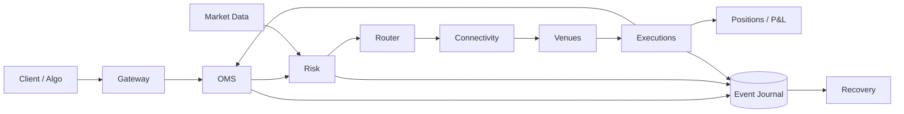
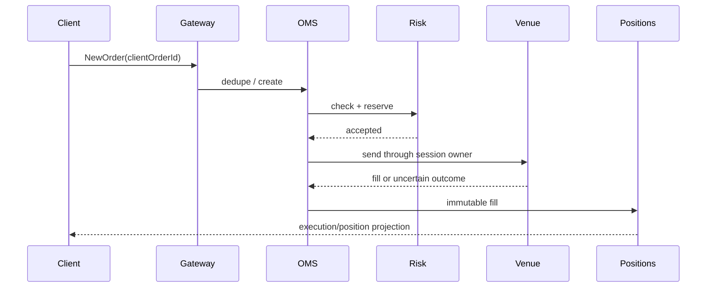

# Architecture

## High-Level Design

The synchronous path ends only after the platform’s defined acknowledgement boundary. Fills are immutable facts that drive positions, while risk reservations bridge any projection lag.

## Low-Level Design

`OmsService` owns lifecycle idempotency, `RiskService` owns reservations, `ConnectivityService` isolates the venue boundary, and the ordered `TradingEvent` journal rebuilds OMS and position projections.
