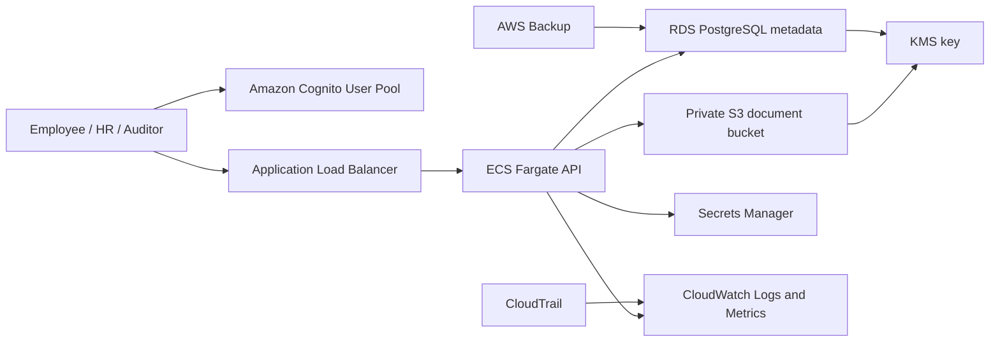

# Employee Document Upload System

Production-style cloud fundamentals project focused on explaining the infrastructure behind a simple employee document upload application.

The app is intentionally small. The learning target is the cloud system around it: identity, authorization, private object storage, relational metadata, logging, monitoring, CI/CD, infrastructure as code, cost controls, and backup strategy.

## What This System Does

Employees upload sensitive documents such as identity proofs, offer letters, tax forms, and policy acknowledgements. HR reviewers approve or reject uploaded documents. Auditors can inspect metadata and review state without modifying documents.

Core workflow:

1. A user signs in through Amazon Cognito.
2. The API validates the JWT and maps Cognito groups to application roles.
3. The API checks RBAC rules before creating an upload intent.
4. The API stores document metadata in Amazon RDS for PostgreSQL.
5. The API returns a short-lived S3 upload URL for a private, encrypted S3 bucket.
6. S3 stores the file; the database stores metadata and review state.
7. CloudWatch, CloudTrail, alarms, and backups make the workload operable.

## Architecture



## Project Layout

```text
employee-document-upload-system/
  app/                         # Thin Spring Boot API skeleton
  docs/                        # Infrastructure explanation material
  infra/terraform/             # AWS IaC for the production-style deployment
  .github/workflows/ci.yml     # CI/CD workflow example
```

## Roles

| Role | Purpose | Allowed examples |
| --- | --- | --- |
| `EMPLOYEE` | Upload and view their own documents | Create own upload intent, list own metadata |
| `HR_REVIEWER` | Review employee documents | List metadata, approve, reject |
| `AUDITOR` | Read-only compliance access | List metadata and review state |
| `ADMIN` | Break-glass/application administration | Manage all document metadata |

## Infrastructure Services Covered

| Requirement | AWS service or pattern |
| --- | --- |
| Authentication | Amazon Cognito User Pool |
| Authorization | Cognito groups for app RBAC, IAM roles for AWS access |
| Private storage | S3 bucket with public access blocked, KMS encryption, lifecycle rules |
| Database | RDS PostgreSQL in private subnets |
| Logging | CloudWatch Logs, ALB access logs pattern, CloudTrail |
| Monitoring | CloudWatch metrics and alarms for API, ALB, RDS |
| CI/CD | GitHub Actions build, test, image publish, Terraform validate/plan |
| IaC | Terraform |
| Cost | Service-by-service cost model and tradeoffs |
| Backup | RDS automated backups plus AWS Backup vault and restore runbook |

## Local App Commands

The API is a learning scaffold. It compiles and tests locally with Java 17 and Maven:

```powershell
cd employee-document-upload-system\app
mvn test
```

Run locally after providing PostgreSQL and JWT issuer settings:

```powershell
mvn spring-boot:run
```

The app exposes:

| Endpoint | Purpose |
| --- | --- |
| `GET /actuator/health` | Health check for load balancer and operators |
| `POST /api/documents/upload-intents` | Create metadata and return an upload URL contract |
| `GET /api/documents` | List visible document metadata |
| `POST /api/documents/{id}/review` | Approve or reject a document |

## Terraform Commands

Terraform is not installed in this local shell, but the IaC is structured for normal Terraform usage:

```powershell
cd employee-document-upload-system\infra\terraform
terraform init
terraform fmt -recursive
terraform validate
terraform plan -var-file terraform.tfvars
```

Do not run `terraform apply` until you have reviewed the generated plan and confirmed region-specific cost impact.

## Explanation Goal

When presenting this project, do not lead with endpoints. Lead with infrastructure decisions:

1. Why files go directly to private S3 instead of through the API.
2. Why metadata lives in PostgreSQL while file bytes live in object storage.
3. How Cognito groups differ from IAM roles.
4. How private subnets, security groups, and least privilege reduce blast radius.
5. What logs and alarms prove the system is healthy or unhealthy.
6. What gets backed up, how restore is tested, and what the recovery target is.
7. Which services dominate cost at small scale and what changes at production scale.

Start with [docs/infrastructure-explanation.md](docs/infrastructure-explanation.md).
