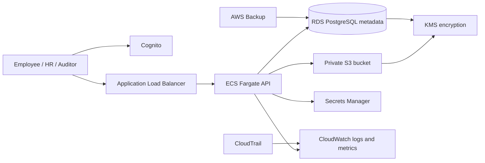
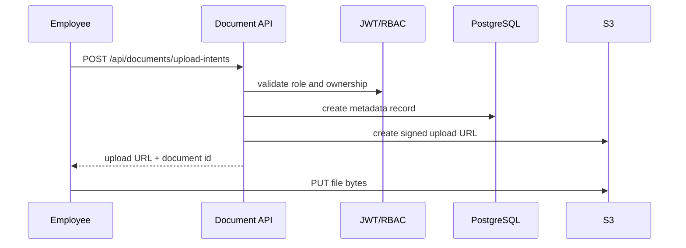
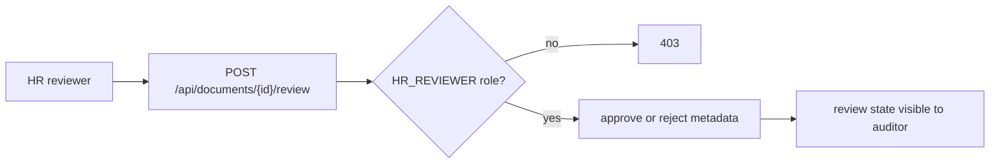

# Employee Document Upload System Diagrams

## High-Level Design

### Cloud Architecture

```mermaid
flowchart LR
    User["Employee / HR / Auditor"] --> Cognito["Cognito"]
    User --> ALB["Application Load Balancer"]
    ALB --> ECS["ECS Fargate API"]
    ECS --> RDS[("RDS PostgreSQL metadata")]
    ECS --> S3["Private S3 bucket"]
    ECS --> Secrets["Secrets Manager"]
    S3 --> KMS["KMS encryption"]
    RDS --> KMS
    ECS --> CloudWatch["CloudWatch logs and metrics"]
    CloudTrail["CloudTrail"] --> CloudWatch
    Backup["AWS Backup"] --> RDS
```

## Low-Level Design

### Upload Intent Flow

```mermaid
sequenceDiagram
    participant U as Employee
    participant API as Document API
    participant Auth as JWT/RBAC
    participant DB as PostgreSQL
    participant S3 as S3
    U->>API: POST /api/documents/upload-intents
    API->>Auth: validate role and ownership
    API->>DB: create metadata record
    API->>S3: create signed upload URL
    API-->>U: upload URL + document id
    U->>S3: PUT file bytes
```

### Review Flow

```mermaid
flowchart LR
    HR["HR reviewer"] --> Review["POST /api/documents/{id}/review"]
    Review --> RBAC{"HR_REVIEWER role?"}
    RBAC -->|no| Deny["403"]
    RBAC -->|yes| State["approve or reject metadata"]
    State --> Audit["review state visible to auditor"]
```
