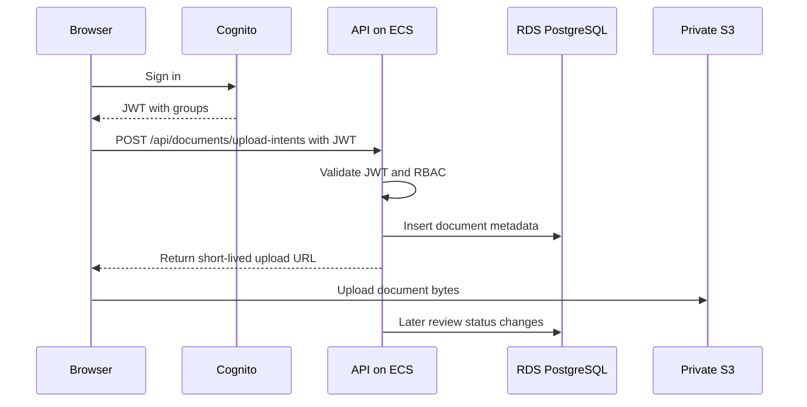

# Infrastructure Explanation

## One-Sentence Design

The system uses Cognito for user identity, a Spring Boot API on ECS Fargate for authorization and metadata, private S3 for document bytes, RDS PostgreSQL for document records, and CloudWatch/CloudTrail/AWS Backup for operations.

## Why This Is Not Just an Upload App

The useful part of this project is explaining boundaries:

- Users authenticate to Cognito, not directly to the API database.
- The API authorizes business actions, not raw AWS access from the browser.
- S3 stores large immutable objects; PostgreSQL stores queryable metadata.
- IAM permissions are granted to workloads, not end users.
- Logs, metrics, alarms, and backups are designed up front.

## Request Flow

## Component Responsibilities

| Component      | Responsibility                                        | What it must not do                     |
| -------------- | ----------------------------------------------------- | --------------------------------------- |
| Cognito        | Authenticate users and issue tokens                   | Decide every business rule              |
| API            | Enforce RBAC, create upload contracts, store metadata | Proxy large files unless required       |
| S3             | Store encrypted private document objects              | Become a public file server             |
| RDS PostgreSQL | Store document metadata and review status             | Store large binary files                |
| KMS            | Manage encryption keys for S3 and RDS                 | Replace application authorization       |
| CloudWatch     | Capture logs, metrics, alarms                         | Be the only audit trail                 |
| CloudTrail     | Record AWS API activity                               | Replace application-level audit records |
| AWS Backup     | Manage backup policy and recovery points              | Prove restore works without testing     |

## Network Design

The Terraform design creates:

- Public subnets for the load balancer.
- Private application subnets for ECS tasks.
- Private data subnets for RDS.
- Security groups that allow internet traffic only to the load balancer.
- Database access only from the ECS task security group.

For a learning environment, the IaC uses one NAT gateway by default to reduce cost. A stricter production design normally uses one NAT gateway per Availability Zone or VPC endpoints for AWS APIs to reduce cross-AZ dependency and NAT data-processing cost.

## Storage Design

Documents are stored in S3 because files are usually larger than metadata and do not need relational joins. The bucket is private, blocks public access, uses KMS encryption, enables versioning, and applies lifecycle transitions for older object versions.

The API stores this metadata in PostgreSQL:

- Document id.
- Owner user id.
- Original filename.
- MIME type.
- Content length.
- S3 bucket and key.
- Review status.
- Creation and review timestamps.

## Authentication vs Authorization

Authentication answers: who is this user?

Authorization answers: what is this user allowed to do?

Cognito authenticates users and places group claims in JWTs. The API maps those group claims to application roles such as `EMPLOYEE`, `HR_REVIEWER`, `AUDITOR`, and `ADMIN`. IAM roles are separate: they grant the ECS task permission to use S3, KMS, CloudWatch, and Secrets Manager.

## Failure Modes To Explain

| Failure              | Expected behavior                                                                                           |
| -------------------- | ----------------------------------------------------------------------------------------------------------- |
| Cognito unavailable  | Existing requests with valid tokens can continue until token validation needs fresh keys; new sign-ins fail |
| API task fails       | ECS replaces the task; ALB routes only to healthy tasks                                                     |
| Database unavailable | Upload intent creation fails because metadata cannot be committed                                           |
| S3 upload fails      | Metadata may remain pending; cleanup job or status reconciliation should mark stale intents                 |
| KMS access denied    | S3/RDS encryption operations fail; alarm on application errors and CloudTrail denies                        |
| High 5xx rate        | CloudWatch alarm notifies operators                                                                         |

## What To Say In An Interview

"The business feature is simple, but the design is about separating sensitive document bytes from metadata. Users sign in with Cognito. The API validates tokens and enforces RBAC. It never makes the S3 bucket public. Instead, it returns short-lived upload contracts and records metadata in PostgreSQL. The ECS task has an IAM role with least-privilege access to the bucket prefix, KMS key, database secret, and CloudWatch logs. RDS and ECS run in private subnets. CloudWatch alarms tell us about API, load balancer, and database health. Backups are automatic and restore is part of the runbook."
