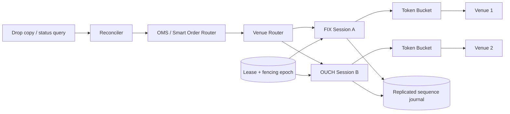

# Exchange Connectivity Platform (HLD 27)

A runnable Java 17 model of the boundary between an internal OMS and multiple electronic venues. The code focuses on the states that make this design difficult: FIX/OUCH session ownership, durable outbound sequence numbers, inbound gap recovery, throttling, duplicate suppression, active/standby fencing, and the **sent-but-not-acknowledged** outcome.

## Choose a Track

| Goal                                      | Start here                                                                              |
| ----------------------------------------- | --------------------------------------------------------------------------------------- |
| Prepare the 40–60 minute interview answer | [INTERVIEW_GUIDE.md](INTERVIEW_GUIDE.md)                                                |
| Inspect architecture and failure behavior | [docs/ARCHITECTURE.md](docs/ARCHITECTURE.md) and [FAILURE_DRILLS.md](FAILURE_DRILLS.md) |
| Evaluate real deployment gaps             | [PRODUCTION_READINESS.md](PRODUCTION_READINESS.md)                                      |

The codebase is shared; the evidence and completion criteria are separate.

## Run

```powershell
cd G:\TechStudyNotes\SystemDesignProjects\exchange-connectivity-platform
mvn test
mvn exec:java
```

The demo sends an acknowledged order, forces a disconnect after a write, promotes a standby from the shared journal, reconciles the uncertain order, and emits a resend request for an inbound gap.

## Architecture



The hot path is session-affine and ordered. The journal and lease are represented in memory for a deterministic local run; production mappings are a replicated log and a strongly consistent lease store.

## What Is Implemented

- Protocol-specific session identity for FIX and OUCH.
- Monotonic outbound sequences restored after failover.
- Inbound duplicate suppression and gap/resend detection.
- Per-venue token-bucket throttling.
- `clientOrderId` idempotency.
- Fencing epochs that stop the stale primary from sending.
- Explicit `UNKNOWN` state for disconnect-after-write and later reconciliation.
- Four executable tests covering recovery, throttling, gaps, duplicates, and uncertainty.

This is not a certified venue adapter: TLS, actual wire codecs, persistent storage, exchange conformance, clock synchronization, and production networking remain infrastructure seams.

Use [INTERVIEW_GUIDE.md](INTERVIEW_GUIDE.md) for the timed answer, [docs/ARCHITECTURE.md](docs/ARCHITECTURE.md) for component/state diagrams, and [FAILURE_DRILLS.md](FAILURE_DRILLS.md) for incident prompts.
