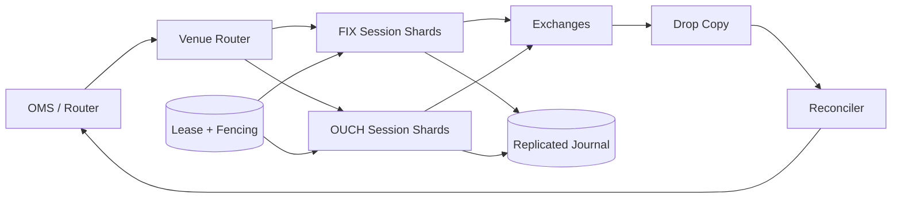
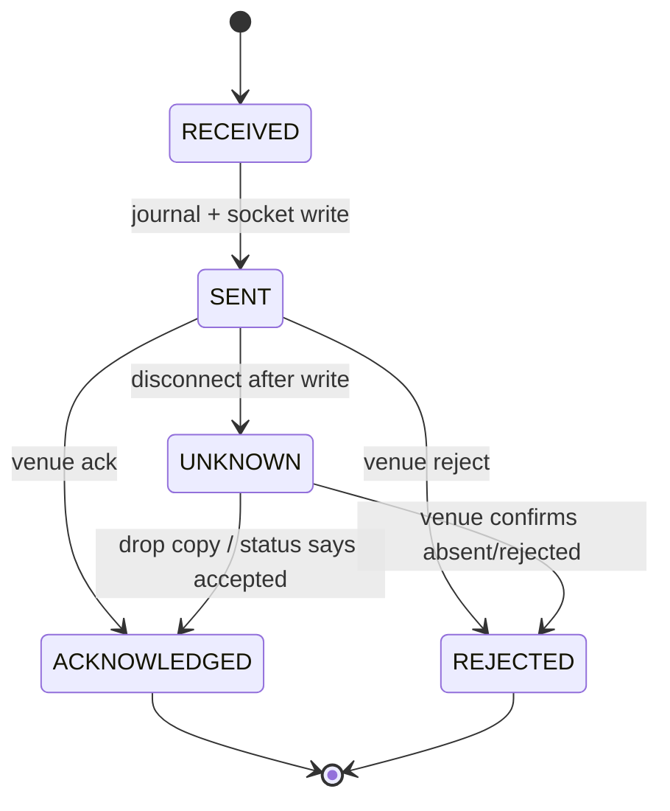

# Architecture

## High-Level Design

Sessions are the ordering and scaling boundary. The platform is active/active across many venue sessions, while each individual session has one fenced writer and a standby.

## Low-Level Design

`VenueSession` owns sequences and order state, `TokenBucket` owns rate capacity, and `FencingLease` provides monotonically increasing ownership. A durable implementation replaces the list journal and in-process lease without changing these boundaries.
