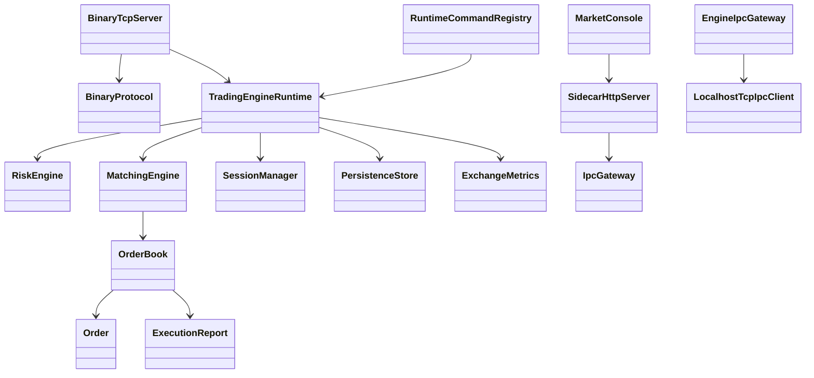

# Class Dependency Map

Important relationships:

- `RuntimeCommandRegistry` is the command boundary between IPC and engine runtime.
- `OrderBook` owns open orders and price levels. No sidecar or CLI class reaches it.
- `BinaryProtocol` is shared by client-facing data-plane code and tests.
- `ExchangeMetrics` is updated by runtime and network paths, then exposed through runtime command responses.
