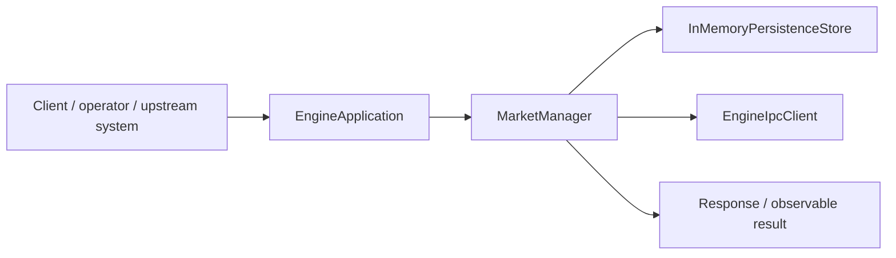
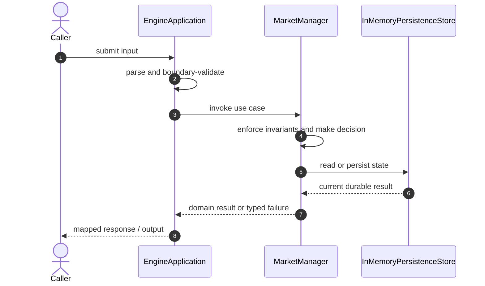

# ExchangeLite Code Flow

This is the single code-flow guide for the project. It connects the business request to concrete source files, explains both architectural levels, and shows where validation, state changes, asynchronous work, and responses occur.

## Scope and outcome

ExchangeLite is a production-style backend learning repository for a small exchange. The first milestone implements the core data-plane and control-plane split:

The tracked production-code inventory used by this guide contains **45 source units** and **0 annotation-discovered HTTP operations**. Generated/build output and test sources are intentionally excluded from the runtime path.

## High-Level Design

At the system level, callers enter through an inbound adapter. The adapter owns transport concerns; application/domain code owns use-case decisions; repositories and gateways isolate state and external systems. Asynchronous adapters extend the flow without moving business invariants into controllers or consumers.

### Runtime stages

1. **Enter:** a request, command, scheduled trigger, protocol message, or UI action reaches the inbound boundary.
2. **Validate:** transport shape and required fields are rejected before domain mutation.
3. **Decide:** application/domain logic loads required state and applies invariants, idempotency, authorization, limits, or algorithms.
4. **Commit:** durable state changes pass through a repository/store; external calls pass through gateways; asynchronous work passes through message boundaries.
5. **Return and observe:** the adapter maps the result to an HTTP response, protocol response, CLI output, event, or metric.

## Low-Level Design

The low-level path keeps orchestration directional: inbound adapter → application/domain unit → persistence/outbound adapter. Contracts carry data between layers; configuration and security apply cross-cutting policy without becoming business logic.

### Component map

| Responsibility           | Concrete code                                                                                                                                                                                                                                                                                                                                                                            |
| ------------------------ | ---------------------------------------------------------------------------------------------------------------------------------------------------------------------------------------------------------------------------------------------------------------------------------------------------------------------------------------------------------------------------------------- |
| Supporting logic         | `MarketConsole`, `ExecutionReport`, `OrderSide`, `OrderStatus`, `OrderType`, `Trade`, `RuntimeCommandCodec`, `RuntimeCommandType`, `ExchangeMetrics`, `MetricsSnapshot`, `BinaryMessageType`, `BinaryProtocol`, `FramedMessage`, `ProtocolException`, `OrderBook`, `OrderBookLevel`, `OrderBookSnapshot`, `RiskDecision`, `EngineJson`, `RuntimeCommandRegistry`, `TradingEngineRuntime` |
| API/message contract     | `CancelRequest`, `OrderRequest`, `RuntimeCommand`, `RuntimeResponse`                                                                                                                                                                                                                                                                                                                     |
| Outbound adapter         | `EngineIpcClient`, `LocalhostTcpIpcClient`, `EngineIpcGateway`, `IpcGateway`                                                                                                                                                                                                                                                                                                             |
| Entry point              | `EngineApplication`, `BinaryTcpServer`, `EngineIpcServer`, `LocalhostTcpIpcServer`, `UnixDomainSocketIpcServer`, `SidecarApplication`, `SidecarHttpServer`                                                                                                                                                                                                                               |
| Persistence adapter      | `InMemoryPersistenceStore`, `PersistenceStore`                                                                                                                                                                                                                                                                                                                                           |
| Application/domain logic | `MarketManager`, `MatchingEngine`, `RiskEngine`, `SessionManager`                                                                                                                                                                                                                                                                                                                        |
| Domain/data model        | `Order`                                                                                                                                                                                                                                                                                                                                                                                  |
| Configuration/security   | `EngineConfig`, `SidecarConfig`                                                                                                                                                                                                                                                                                                                                                          |

### Inbound operations

| Verb/trigger | Path or input                                                                                                        | Owning code             |
| ------------ | -------------------------------------------------------------------------------------------------------------------- | ----------------------- |
| N/A          | No annotation-based HTTP endpoint; execution starts through the process API, CLI, test harness, or protocol adapter. | See entry points below. |

## Detailed source walkthrough

Read this table top-down by category, then follow the linked files. “Key methods” are discovered from the checked-in implementation and identify useful debugging/interview entry points.

| Source file                                                                                                              | Role                     | Responsibility and important methods                                                                                                                                                                                               |
| ------------------------------------------------------------------------------------------------------------------------ | ------------------------ | ---------------------------------------------------------------------------------------------------------------------------------------------------------------------------------------------------------------------------------- |
| [`MarketConsole.java`](./cli/src/main/java/io/exchangelite/cli/MarketConsole.java)                                       | Supporting logic         | MarketConsole provides a focused algorithm or shared implementation detail. Key methods: `main()`.                                                                                                                                 |
| [`CancelRequest.java`](./common/src/main/java/io/exchangelite/common/domain/CancelRequest.java)                          | API/message contract     | CancelRequest carries validated data across an API or messaging boundary.                                                                                                                                                          |
| [`ExecutionReport.java`](./common/src/main/java/io/exchangelite/common/domain/ExecutionReport.java)                      | Supporting logic         | ExecutionReport provides a focused algorithm or shared implementation detail. Key methods: `rejected()`, `cancelled()`.                                                                                                            |
| [`OrderRequest.java`](./common/src/main/java/io/exchangelite/common/domain/OrderRequest.java)                            | API/message contract     | OrderRequest carries validated data across an API or messaging boundary. Key methods: `maxNotionalTicks()`.                                                                                                                        |
| [`OrderSide.java`](./common/src/main/java/io/exchangelite/common/domain/OrderSide.java)                                  | Supporting logic         | OrderSide provides a focused algorithm or shared implementation detail. Key methods: `code()`, `fromCode()`.                                                                                                                       |
| [`OrderStatus.java`](./common/src/main/java/io/exchangelite/common/domain/OrderStatus.java)                              | Supporting logic         | OrderStatus provides a focused algorithm or shared implementation detail.                                                                                                                                                          |
| [`OrderType.java`](./common/src/main/java/io/exchangelite/common/domain/OrderType.java)                                  | Supporting logic         | OrderType provides a focused algorithm or shared implementation detail. Key methods: `code()`, `fromCode()`.                                                                                                                       |
| [`Trade.java`](./common/src/main/java/io/exchangelite/common/domain/Trade.java)                                          | Supporting logic         | Trade provides a focused algorithm or shared implementation detail.                                                                                                                                                                |
| [`EngineIpcClient.java`](./common/src/main/java/io/exchangelite/common/ipc/EngineIpcClient.java)                         | Outbound adapter         | EngineIpcClient calls an external system through an isolated integration boundary.                                                                                                                                                 |
| [`LocalhostTcpIpcClient.java`](./common/src/main/java/io/exchangelite/common/ipc/LocalhostTcpIpcClient.java)             | Outbound adapter         | LocalhostTcpIpcClient calls an external system through an isolated integration boundary. Key methods: `execute()`.                                                                                                                 |
| [`RuntimeCommand.java`](./common/src/main/java/io/exchangelite/common/ipc/RuntimeCommand.java)                           | API/message contract     | RuntimeCommand carries validated data across an API or messaging boundary. Key methods: `of()`.                                                                                                                                    |
| [`RuntimeCommandCodec.java`](./common/src/main/java/io/exchangelite/common/ipc/RuntimeCommandCodec.java)                 | Supporting logic         | RuntimeCommandCodec provides a focused algorithm or shared implementation detail. Key methods: `encodeCommand()`, `decodeCommand()`, `encodeResponse()`, `decodeResponse()`.                                                       |
| [`RuntimeCommandType.java`](./common/src/main/java/io/exchangelite/common/ipc/RuntimeCommandType.java)                   | Supporting logic         | RuntimeCommandType provides a focused algorithm or shared implementation detail.                                                                                                                                                   |
| [`RuntimeResponse.java`](./common/src/main/java/io/exchangelite/common/ipc/RuntimeResponse.java)                         | API/message contract     | RuntimeResponse carries validated data across an API or messaging boundary. Key methods: `ok()`, `accepted()`, `error()`.                                                                                                          |
| [`ExchangeMetrics.java`](./common/src/main/java/io/exchangelite/common/metrics/ExchangeMetrics.java)                     | Supporting logic         | ExchangeMetrics provides a focused algorithm or shared implementation detail. Key methods: `recordAcceptedOrder()`, `recordRejectedOrder()`, `recordCancelledOrder()`, `recordTrade()`, `recordBytesRead()`, `recordIpcCommand()`. |
| [`MetricsSnapshot.java`](./common/src/main/java/io/exchangelite/common/metrics/MetricsSnapshot.java)                     | Supporting logic         | MetricsSnapshot provides a focused algorithm or shared implementation detail.                                                                                                                                                      |
| [`BinaryMessageType.java`](./common/src/main/java/io/exchangelite/common/protocol/BinaryMessageType.java)                | Supporting logic         | BinaryMessageType provides a focused algorithm or shared implementation detail. Key methods: `code()`, `fromCode()`.                                                                                                               |
| [`BinaryProtocol.java`](./common/src/main/java/io/exchangelite/common/protocol/BinaryProtocol.java)                      | Supporting logic         | BinaryProtocol provides a focused algorithm or shared implementation detail. Key methods: `encodeFrame()`, `decodeFrame()`, `encodeOrderRequest()`, `decodeOrderRequest()`, `encodeCancelRequest()`, `decodeCancelRequest()`.      |
| [`FramedMessage.java`](./common/src/main/java/io/exchangelite/common/protocol/FramedMessage.java)                        | Supporting logic         | FramedMessage provides a focused algorithm or shared implementation detail. Key methods: `payload()`.                                                                                                                              |
| [`ProtocolException.java`](./common/src/main/java/io/exchangelite/common/protocol/ProtocolException.java)                | Supporting logic         | ProtocolException provides a focused algorithm or shared implementation detail.                                                                                                                                                    |
| [`EngineApplication.java`](./engine/src/main/java/io/exchangelite/engine/app/EngineApplication.java)                     | Entry point              | EngineApplication bootstraps the process and wires the runtime. Key methods: `main()`.                                                                                                                                             |
| [`InMemoryPersistenceStore.java`](./engine/src/main/java/io/exchangelite/engine/core/InMemoryPersistenceStore.java)      | Persistence adapter      | InMemoryPersistenceStore reads or writes durable state behind a storage boundary. Key methods: `append()`, `recentReports()`.                                                                                                      |
| [`MarketManager.java`](./engine/src/main/java/io/exchangelite/engine/core/MarketManager.java)                            | Application/domain logic | MarketManager coordinates the use case and enforces domain decisions. Key methods: `open()`, `close()`, `isOpen()`, `openMarkets()`.                                                                                               |
| [`MatchingEngine.java`](./engine/src/main/java/io/exchangelite/engine/core/MatchingEngine.java)                          | Application/domain logic | MatchingEngine coordinates the use case and enforces domain decisions. Key methods: `submit()`, `cancel()`, `snapshots()`, `openOrders()`, `openOrderCount()`.                                                                     |
| [`Order.java`](./engine/src/main/java/io/exchangelite/engine/core/Order.java)                                            | Domain/data model        | Order represents domain state, identity, or an invariant-bearing value. Key methods: `from()`, `market()`, `clientOrderId()`, `accountId()`, `side()`, `type()`.                                                                   |
| [`OrderBook.java`](./engine/src/main/java/io/exchangelite/engine/core/OrderBook.java)                                    | Supporting logic         | OrderBook provides a focused algorithm or shared implementation detail. Key methods: `submit()`, `cancel()`, `snapshot()`, `openOrders()`, `openOrderCount()`.                                                                     |
| [`OrderBookLevel.java`](./engine/src/main/java/io/exchangelite/engine/core/OrderBookLevel.java)                          | Supporting logic         | OrderBookLevel provides a focused algorithm or shared implementation detail.                                                                                                                                                       |
| [`OrderBookSnapshot.java`](./engine/src/main/java/io/exchangelite/engine/core/OrderBookSnapshot.java)                    | Supporting logic         | OrderBookSnapshot provides a focused algorithm or shared implementation detail.                                                                                                                                                    |
| [`PersistenceStore.java`](./engine/src/main/java/io/exchangelite/engine/core/PersistenceStore.java)                      | Persistence adapter      | PersistenceStore reads or writes durable state behind a storage boundary.                                                                                                                                                          |
| [`RiskDecision.java`](./engine/src/main/java/io/exchangelite/engine/core/RiskDecision.java)                              | Supporting logic         | RiskDecision provides a focused algorithm or shared implementation detail. Key methods: `allow()`, `rejected()`.                                                                                                                   |
| [`RiskEngine.java`](./engine/src/main/java/io/exchangelite/engine/core/RiskEngine.java)                                  | Application/domain logic | RiskEngine coordinates the use case and enforces domain decisions. Key methods: `evaluate()`, `blockAccount()`, `json()`.                                                                                                          |
| [`SessionManager.java`](./engine/src/main/java/io/exchangelite/engine/core/SessionManager.java)                          | Application/domain logic | SessionManager coordinates the use case and enforces domain decisions. Key methods: `register()`, `unregister()`, `activeSessions()`, `json()`.                                                                                    |
| [`BinaryTcpServer.java`](./engine/src/main/java/io/exchangelite/engine/network/BinaryTcpServer.java)                     | Entry point              | BinaryTcpServer bootstraps the process and wires the runtime. Key methods: `start()`, `close()`.                                                                                                                                   |
| [`EngineIpcServer.java`](./engine/src/main/java/io/exchangelite/engine/network/EngineIpcServer.java)                     | Entry point              | EngineIpcServer bootstraps the process and wires the runtime.                                                                                                                                                                      |
| [`LocalhostTcpIpcServer.java`](./engine/src/main/java/io/exchangelite/engine/network/LocalhostTcpIpcServer.java)         | Entry point              | LocalhostTcpIpcServer bootstraps the process and wires the runtime. Key methods: `start()`, `port()`, `close()`.                                                                                                                   |
| [`UnixDomainSocketIpcServer.java`](./engine/src/main/java/io/exchangelite/engine/network/UnixDomainSocketIpcServer.java) | Entry point              | UnixDomainSocketIpcServer bootstraps the process and wires the runtime. Key methods: `start()`, `close()`.                                                                                                                         |
| [`EngineConfig.java`](./engine/src/main/java/io/exchangelite/engine/runtime/EngineConfig.java)                           | Configuration/security   | EngineConfig defines runtime wiring, authentication, authorization, or cross-cutting policy. Key methods: `fromEnvironment()`, `json()`.                                                                                           |
| [`EngineJson.java`](./engine/src/main/java/io/exchangelite/engine/runtime/EngineJson.java)                               | Supporting logic         | EngineJson provides a focused algorithm or shared implementation detail. Key methods: `quote()`, `array()`.                                                                                                                        |
| [`RuntimeCommandRegistry.java`](./engine/src/main/java/io/exchangelite/engine/runtime/RuntimeCommandRegistry.java)       | Supporting logic         | RuntimeCommandRegistry provides a focused algorithm or shared implementation detail. Key methods: `handle()`, `supports()`.                                                                                                        |
| [`TradingEngineRuntime.java`](./engine/src/main/java/io/exchangelite/engine/runtime/TradingEngineRuntime.java)           | Supporting logic         | TradingEngineRuntime provides a focused algorithm or shared implementation detail. Key methods: `submitOrder()`, `cancel()`, `registerSession()`, `unregisterSession()`, `metrics()`, `markUnhealthy()`.                           |
| [`EngineIpcGateway.java`](./sidecar/src/main/java/io/exchangelite/sidecar/EngineIpcGateway.java)                         | Outbound adapter         | EngineIpcGateway calls an external system through an isolated integration boundary. Key methods: `execute()`.                                                                                                                      |
| [`IpcGateway.java`](./sidecar/src/main/java/io/exchangelite/sidecar/IpcGateway.java)                                     | Outbound adapter         | IpcGateway calls an external system through an isolated integration boundary.                                                                                                                                                      |
| [`SidecarApplication.java`](./sidecar/src/main/java/io/exchangelite/sidecar/SidecarApplication.java)                     | Entry point              | SidecarApplication bootstraps the process and wires the runtime. Key methods: `main()`.                                                                                                                                            |
| [`SidecarConfig.java`](./sidecar/src/main/java/io/exchangelite/sidecar/SidecarConfig.java)                               | Configuration/security   | SidecarConfig defines runtime wiring, authentication, authorization, or cross-cutting policy. Key methods: `fromEnvironment()`.                                                                                                    |
| [`SidecarHttpServer.java`](./sidecar/src/main/java/io/exchangelite/sidecar/SidecarHttpServer.java)                       | Entry point              | SidecarHttpServer bootstraps the process and wires the runtime. Key methods: `start()`, `port()`, `close()`.                                                                                                                       |

## End-to-end code-flow narrative

1. Start at `EngineApplication`. It receives the external input and should perform only boundary parsing, authentication/authorization handoff, and request validation.
2. Follow the call into `MarketManager`. This is the principal place to explain the use case, invariant checks, deduplication/concurrency decision, and success/failure result.
3. Continue into `InMemoryPersistenceStore` for the durable or in-memory state transition. Transaction and consistency guarantees belong at this boundary, not in response mapping.
4. This flow completes synchronously; background work is not part of the primary checked-in path.
5. Inspect `EngineIpcClient` for timeout, retry, circuit-breaking, and external-contract mapping.
6. Return to `EngineApplication`, where typed outcomes become the public response or protocol result. Logging and metrics should preserve correlation identifiers without leaking secrets.

## Failure and correctness checkpoints

- **Invalid input:** rejected at the inbound contract before state mutation.
- **Domain conflict:** returned as a typed result; do not hide it as an infrastructure exception.
- **Duplicate or concurrent work:** handled where the project’s idempotency, locking, ordering, or atomic data structure is implemented.
- **Storage/integration failure:** transaction is rolled back or the operation remains safely retryable.
- **Async failure:** consumer retries must preserve idempotency; poison work must become observable rather than loop silently.
- **Observability:** trace the same request/correlation identity through inbound, domain, persistence, and async logs.

## How to trace a scenario in the debugger

1. Choose one operation from the inbound-operations table or the project’s demo script.
2. Break at `EngineApplication`, then step into `MarketManager` rather than framework internals.
3. Inspect the command/request object immediately after validation.
4. Stop before and after the call to `InMemoryPersistenceStore` to compare intended and durable state.
5. If messaging exists, capture the emitted identifier and continue from `the consumer/worker`.
6. Confirm the final public result and the corresponding logs/metrics.

## Related project documentation

- [Project README](./README.md)
- [Specialized diagrams](./docs/DIAGRAMS.md)
- [Interview guide](./docs/INTERVIEW_GUIDE.md)
