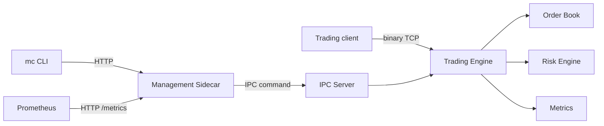

# ExchangeLite

ExchangeLite is a production-style backend learning repository for a small exchange. The first milestone implements the core data-plane and control-plane split:

- Data plane: binary TCP server, custom binary framing, risk checks, order book, matching engine, sessions, metrics, graceful shutdown hooks.
- Control plane: sidecar REST API that translates operator calls into IPC commands.
- IPC: localhost TCP implementation plus a Unix Domain Socket server implementation behind `EngineIpcServer`.
- CLI: `mc`-style operator console commands such as `stats`, `orders`, `markets`, `heap`, `threads`, `health`, and `shutdown`.
- Operations: Docker, Docker Compose, Kubernetes, Prometheus, Grafana, runbooks, ADRs, and learning maps.

This milestone is Java 17 compatible because this workstation currently has JDK 17 and Maven, but no JDK 21 or global Gradle. The repository includes Gradle build files as the intended build shape and Maven files as the locally validated fallback.

## Architecture



ASCII component map:

```text
client -> data TCP -> engine -> risk -> matching -> order book
mc     -> sidecar  -> IPC    -> runtime command registry -> engine inspection
```

The data plane never exposes HTTP. All operational HTTP traffic is terminated by the sidecar.

## Build And Test

```powershell
mvn test
```

## Run Locally

Terminal 1:

```powershell
mvn -pl engine -am package
java -cp "engine\target\exchange-lite-engine-0.1.0.jar;common\target\exchange-lite-common-0.1.0.jar" io.exchangelite.engine.app.EngineApplication
```

Terminal 2:

```powershell
mvn -pl sidecar -am package
java -cp "sidecar\target\exchange-lite-sidecar-0.1.0.jar;common\target\exchange-lite-common-0.1.0.jar" io.exchangelite.sidecar.SidecarApplication
```

Terminal 3:

```powershell
mvn -pl cli -am package
java -cp "cli\target\exchange-lite-cli-0.1.0.jar;common\target\exchange-lite-common-0.1.0.jar" io.exchangelite.cli.MarketConsole health
java -cp "cli\target\exchange-lite-cli-0.1.0.jar;common\target\exchange-lite-common-0.1.0.jar" io.exchangelite.cli.MarketConsole stats
```

## Repository Structure

```text
common/       Shared domain, protocol, IPC contracts, metrics.
engine/       Trading runtime, risk, matching, order book, data TCP, IPC servers.
sidecar/      REST management sidecar that delegates to engine IPC.
cli/          Operator console.
docs/         Design, lifecycle, package, and operations docs.
adr/          Architecture decision records.
docker/       Container build files.
kubernetes/   Shared-pod deployment manifests.
prometheus/   Prometheus scrape config.
grafana/      Starter dashboard.
benchmarks/   Benchmark methodology and future harness notes.
```

## Current Milestone Scope

Implemented:

- Limit and market order submission.
- Price-time priority matching.
- Risk limits for quantity, notional, and blocked accounts.
- Cancel by `clientOrderId` and account.
- Immutable request/report contracts.
- Binary frame encoding and decoding.
- TCP data server.
- Localhost TCP IPC server.
- Unix Domain Socket IPC server implementation for platforms that support it.
- Sidecar REST routes for inspection and runtime commands.
- CLI command mapping.
- Unit and integration-style tests.

Not yet implemented:

- Durable disk or database persistence.
- Authentication and authorization enforcement.
- TLS termination.
- Real load benchmark harness.
- Full Java 21 toolchain and Gradle wrapper validation on this workstation.

## Interview Notes

The central talking point is control-plane/data-plane separation. The trading engine owns latency-sensitive binary traffic and matching state. The sidecar owns operational HTTP, inspection, and metrics, and communicates through IPC. This mirrors production systems where management surfaces must be observable and operable without contaminating the hot path.
