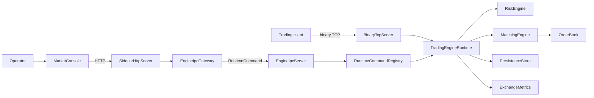

# System Map

## Component Responsibilities

- `common`: shared contracts that must stay stable across processes.
- `engine`: owns trading state, matching, risk, binary sessions, IPC command execution.
- `sidecar`: owns HTTP, operational translation, and future auth/audit.
- `cli`: human operator interface.
- `docker`, `kubernetes`, `prometheus`, `grafana`: operational packaging.

## Failure Boundaries

- Sidecar crash: trading can continue, but operations are degraded.
- Engine crash: trading and control commands fail; Kubernetes restarts the pod.
- IPC timeout: sidecar returns `502`; alert on sustained failures.
- Binary protocol corruption: reject at frame boundary before domain mutation.
