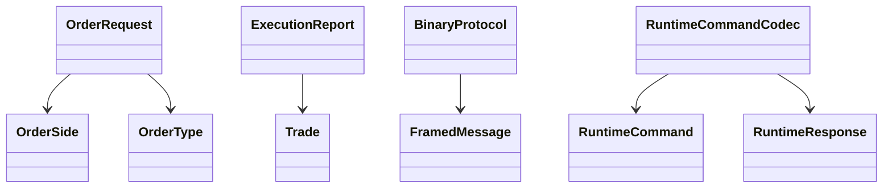

# common

The `common` module owns contracts shared across processes:

- Immutable domain records: `OrderRequest`, `CancelRequest`, `ExecutionReport`, and `Trade`.
- Custom binary protocol framing in `BinaryProtocol`.
- IPC command and response encoding in `RuntimeCommandCodec`.
- Lightweight counters in `ExchangeMetrics`.

## Production Rationale

Shared contracts prevent drift between the data plane, sidecar, and CLI. The binary protocol is explicit about byte order, version, magic, length, correlation id, and message type. That makes it easier to reject corrupt traffic and evolve the protocol without relying on reflection or ad hoc strings.

Failure modes:

- Invalid frame magic: reject before payload decode.
- Unsupported version: reject at frame boundary.
- Oversized payload: reject before allocation pressure becomes an incident.
- Malformed IPC command: return an IPC failure instead of mutating engine state.
