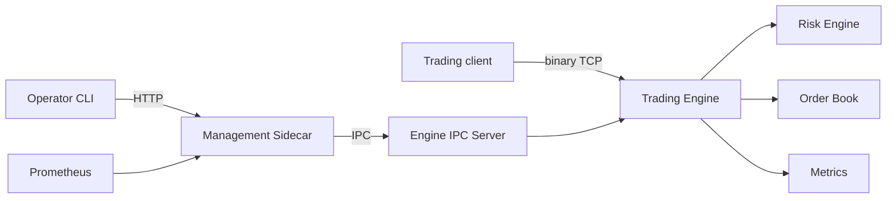
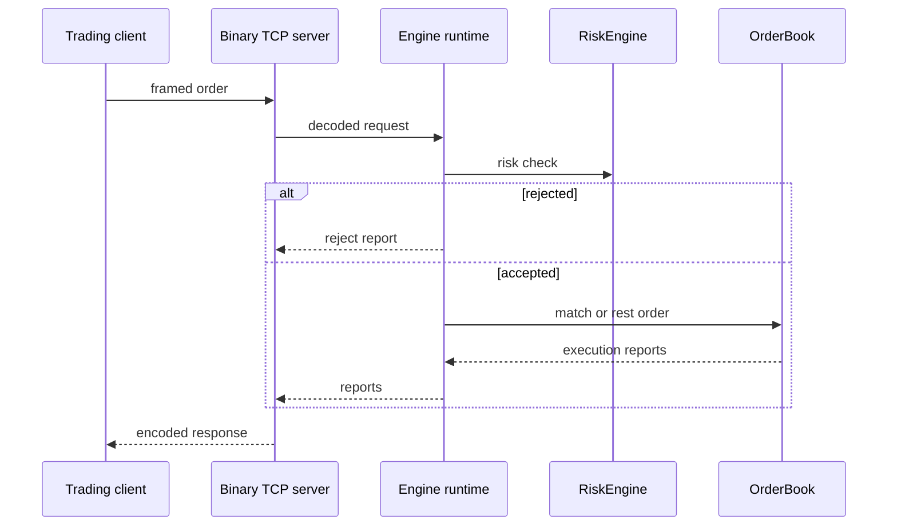
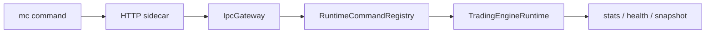

# ExchangeLite Diagrams

This file gives the fastest diagram entry point. Deeper maps are in `SYSTEM_MAP.md`, `CLASS_DEPENDENCY_MAP.md`, `REQUEST_LIFECYCLE.md`, and the ADRs.

## System View

## Order Flow

## Control Plane Flow

