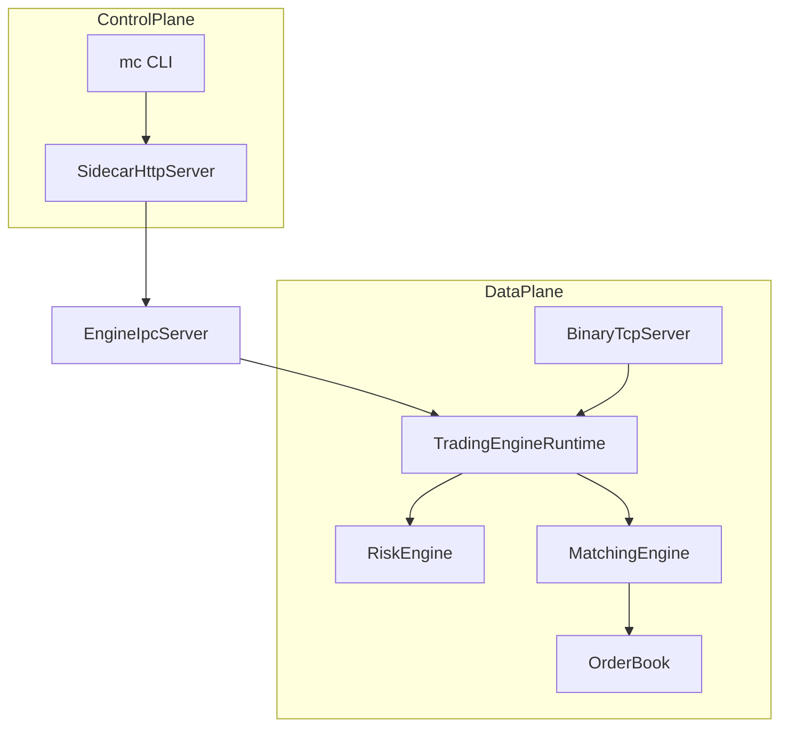
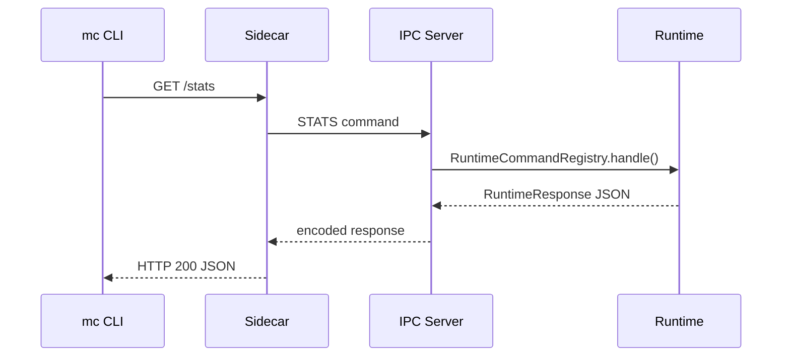

# Milestone 001 Design

## Problem Statement

Build a first runnable ExchangeLite slice that demonstrates the most important production boundary: latency-sensitive data-plane trading traffic is separated from control-plane operations traffic.

## Functional Requirements

- Accept new orders and cancels over a binary TCP protocol.
- Match buy and sell orders using price-time priority.
- Apply risk checks before matching.
- Expose operational inspection through a sidecar REST API.
- Route sidecar commands through IPC, not direct engine calls.
- Provide a CLI for operator commands.
- Include tests, docs, ADRs, and deployment artifacts.

## Non-Functional Requirements

- Deterministic matching behavior.
- Explicit protocol validation and bounded payload allocation.
- Single-host IPC abstraction with two implementations.
- No HTTP surface in the data plane.
- Low dependency footprint for the first milestone.

## Architecture



## Data Flow

1. Trading client sends a framed binary order to the engine.
2. The server validates magic, version, message type, length, and payload.
3. Runtime checks market state and risk.
4. Matching engine routes to the market book.
5. Order book matches against the best opposite price levels.
6. Runtime records metrics and recent execution reports.
7. Binary server returns an execution report frame.

## Sequence Diagram



## Public APIs

- Binary data plane: `NEW_ORDER`, `CANCEL_ORDER`, `HEARTBEAT`.
- Sidecar REST: `/health`, `/stats`, `/orders`, `/markets`, `/sessions`, `/risk`, `/heap`, `/threads`, `/config`, `/reload-config`, `/shutdown`, `/metrics`.
- CLI: `mc stats`, `mc orders`, `mc markets`, `mc sessions`, `mc risk`, `mc heap`, `mc threads`, `mc config`, `mc reload-config`, `mc health`, `mc shutdown`.

## Package Structure

```text
io.exchangelite.common.domain
io.exchangelite.common.protocol
io.exchangelite.common.ipc
io.exchangelite.common.metrics
io.exchangelite.engine.core
io.exchangelite.engine.network
io.exchangelite.engine.runtime
io.exchangelite.engine.app
io.exchangelite.sidecar
io.exchangelite.cli
```

## Implementation Plan

1. Define shared request, report, protocol, IPC, and metrics contracts.
2. Implement order book, risk engine, matching engine, sessions, and persistence abstraction.
3. Add binary TCP server and IPC servers.
4. Add sidecar route translation.
5. Add CLI command mapping.
6. Add tests and operational docs.

## Risk Analysis

- A synchronized book is simple but can bottleneck under multi-core pressure. Shard by market or move to one event loop per book later.
- In-memory persistence is useful for tests but not crash durable. Add write-ahead journal or database-backed event store before production use.
- No auth in milestone 1. Add mTLS or token auth before any non-local deployment.
- JDK 17 validation does not satisfy the final Java 21 requirement. Install JDK 21 and Gradle wrapper before release.
