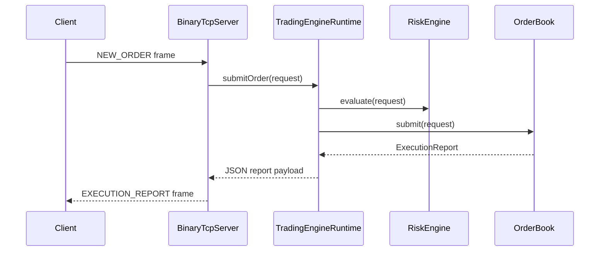

# engine

The `engine` module is the data plane. It exposes binary TCP for trading clients and IPC for the sidecar. It does not expose HTTP.

## Components

- `TradingEngineRuntime`: owns risk, matching, sessions, persistence, metrics, and inspection JSON.
- `RiskEngine`: validates quantity, notional, and account blocks before matching.
- `MatchingEngine`: routes market requests to an `OrderBook`.
- `OrderBook`: synchronized price-time priority book with `TreeMap` price levels and FIFO queues.
- `BinaryTcpServer`: data-plane binary protocol server.
- `LocalhostTcpIpcServer`: portable IPC implementation.
- `UnixDomainSocketIpcServer`: lower-overhead same-host IPC implementation where supported.
- `RuntimeCommandRegistry`: command pattern boundary for operational APIs.

## Threading Model

Milestone 1 uses cached platform threads because this workstation runs JDK 17. The architecture is ready to move acceptor workers to virtual threads once the JDK 21 toolchain is installed.

## Production Notes

The `OrderBook` is synchronized per market. That is simple, deterministic, and realistic for a single-symbol matching partition. A production exchange would shard by market and pin each book to a dedicated event loop or actor to reduce lock contention and preserve sequence ordering.
