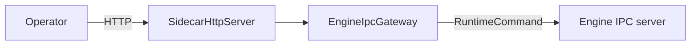

# sidecar

The `sidecar` module is the control plane. It exposes HTTP routes for operators and translates those routes into IPC commands.

## REST To IPC Mapping

```text
GET  /stats         -> STATS
GET  /orders        -> ORDERS
GET  /markets       -> MARKETS
GET  /sessions      -> SESSIONS
GET  /risk          -> RISK
GET  /heap          -> HEAP
GET  /threads       -> THREADS
GET  /config        -> CONFIG
POST /reload-config -> RELOAD_CONFIG
GET  /health        -> HEALTH
POST /shutdown      -> SHUTDOWN
GET  /metrics       -> METRICS
```



The sidecar never constructs engine objects directly. This keeps runtime inspection and operations separate from matching code.
