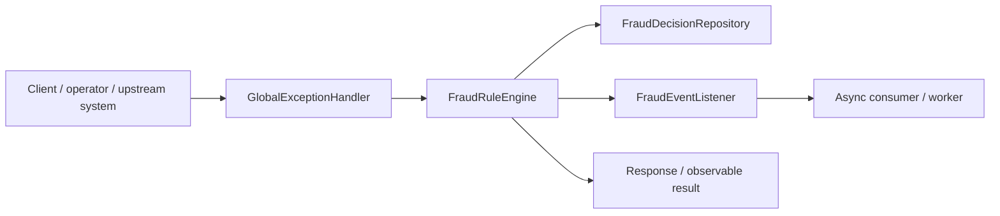
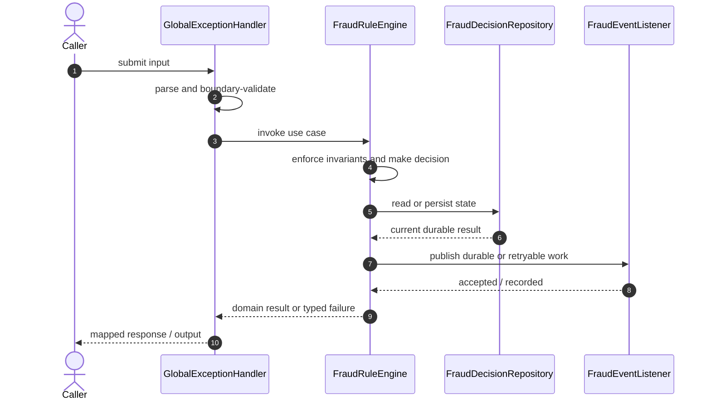

# Fraud Detection Platform Code Flow

This is the single code-flow guide for the project. It connects the business request to concrete source files, explains both architectural levels, and shows where validation, state changes, asynchronous work, and responses occur.

## Scope and outcome

A Spring Boot fraud detection platform with synchronous transaction scoring, Kafka event ingestion, Redis velocity checks, PostgreSQL audit storage, and a rule-engine based risk score.

The tracked production-code inventory used by this guide contains **17 source units** and **2 annotation-discovered HTTP operations**. Generated/build output and test sources are intentionally excluded from the runtime path.

## High-Level Design

At the system level, callers enter through an inbound adapter. The adapter owns transport concerns; application/domain code owns use-case decisions; repositories and gateways isolate state and external systems. Asynchronous adapters extend the flow without moving business invariants into controllers or consumers.

### Runtime stages

1. **Enter:** a request, command, scheduled trigger, protocol message, or UI action reaches the inbound boundary.
2. **Validate:** transport shape and required fields are rejected before domain mutation.
3. **Decide:** application/domain logic loads required state and applies invariants, idempotency, authorization, limits, or algorithms.
4. **Commit:** durable state changes pass through a repository/store; external calls pass through gateways; asynchronous work passes through message boundaries.
5. **Return and observe:** the adapter maps the result to an HTTP response, protocol response, CLI output, event, or metric.

## Low-Level Design

The low-level path keeps orchestration directional: inbound adapter → application/domain unit → persistence/outbound adapter. Contracts carry data between layers; configuration and security apply cross-cutting policy without becoming business logic.

### Component map

| Responsibility           | Concrete code                                                                   |
| ------------------------ | ------------------------------------------------------------------------------- |
| Entry point              | `FraudDetectionApplication`                                                     |
| Supporting logic         | `ApiError`, `NotFoundException`, `FraudDecision`, `RiskLevel`, `RuleEvaluation` |
| Inbound adapter          | `GlobalExceptionHandler`, `RiskController`                                      |
| Messaging/async adapter  | `FraudEventListener`, `FraudEventPublisher`                                     |
| Persistence adapter      | `FraudDecisionRepository`                                                       |
| API/message contract     | `FraudDecisionResponse`, `TransactionEvent`, `TransactionEventRequest`          |
| Application/domain logic | `FraudRuleEngine`, `FraudScoringService`, `VelocityService`                     |

### Inbound operations

| Verb/trigger | Path or input            | Owning code      |
| ------------ | ------------------------ | ---------------- |
| `POST`       | `/events/transactions`   | `RiskController` |
| `GET`        | `/risks/{transactionId}` | `RiskController` |

## Detailed source walkthrough

Read this table top-down by category, then follow the linked files. “Key methods” are discovered from the checked-in implementation and identify useful debugging/interview entry points.

| Source file                                                                                                           | Role                     | Responsibility and important methods                                                                                                                                                         |
| --------------------------------------------------------------------------------------------------------------------- | ------------------------ | -------------------------------------------------------------------------------------------------------------------------------------------------------------------------------------------- |
| [`FraudDetectionApplication.java`](./src/main/java/com/example/capstone/fraud/FraudDetectionApplication.java)         | Entry point              | FraudDetectionApplication bootstraps the process and wires the runtime. Key methods: `main()`.                                                                                               |
| [`ApiError.java`](./src/main/java/com/example/capstone/fraud/error/ApiError.java)                                     | Supporting logic         | ApiError provides a focused algorithm or shared implementation detail. Key methods: `of()`.                                                                                                  |
| [`GlobalExceptionHandler.java`](./src/main/java/com/example/capstone/fraud/error/GlobalExceptionHandler.java)         | Inbound adapter          | GlobalExceptionHandler accepts an inbound call, validates its boundary contract, and delegates work. Key methods: `handleNotFound()`, `handleValidation()`.                                  |
| [`NotFoundException.java`](./src/main/java/com/example/capstone/fraud/error/NotFoundException.java)                   | Supporting logic         | NotFoundException provides a focused algorithm or shared implementation detail.                                                                                                              |
| [`FraudEventListener.java`](./src/main/java/com/example/capstone/fraud/event/FraudEventListener.java)                 | Messaging/async adapter  | FraudEventListener publishes, consumes, retries, or records asynchronous work. Key methods: `onTransaction()`.                                                                               |
| [`FraudEventPublisher.java`](./src/main/java/com/example/capstone/fraud/event/FraudEventPublisher.java)               | Messaging/async adapter  | FraudEventPublisher publishes, consumes, retries, or records asynchronous work. Key methods: `publish()`.                                                                                    |
| [`FraudDecision.java`](./src/main/java/com/example/capstone/fraud/risk/FraudDecision.java)                            | Supporting logic         | FraudDecision provides a focused algorithm or shared implementation detail. Key methods: `getId()`, `getTransactionId()`, `getUserId()`, `getRiskScore()`, `getRiskLevel()`, `getReasons()`. |
| [`FraudDecisionRepository.java`](./src/main/java/com/example/capstone/fraud/risk/FraudDecisionRepository.java)        | Persistence adapter      | FraudDecisionRepository reads or writes durable state behind a storage boundary.                                                                                                             |
| [`FraudDecisionResponse.java`](./src/main/java/com/example/capstone/fraud/risk/FraudDecisionResponse.java)            | API/message contract     | FraudDecisionResponse carries validated data across an API or messaging boundary. Key methods: `from()`.                                                                                     |
| [`FraudRuleEngine.java`](./src/main/java/com/example/capstone/fraud/risk/FraudRuleEngine.java)                        | Application/domain logic | FraudRuleEngine coordinates the use case and enforces domain decisions. Key methods: `evaluate()`.                                                                                           |
| [`FraudScoringService.java`](./src/main/java/com/example/capstone/fraud/risk/FraudScoringService.java)                | Application/domain logic | FraudScoringService coordinates the use case and enforces domain decisions. Key methods: `score()`, `get()`.                                                                                 |
| [`RiskController.java`](./src/main/java/com/example/capstone/fraud/risk/RiskController.java)                          | Inbound adapter          | RiskController accepts an inbound call, validates its boundary contract, and delegates work. Key methods: `ingest()`, `get()`.                                                               |
| [`RiskLevel.java`](./src/main/java/com/example/capstone/fraud/risk/RiskLevel.java)                                    | Supporting logic         | RiskLevel provides a focused algorithm or shared implementation detail.                                                                                                                      |
| [`RuleEvaluation.java`](./src/main/java/com/example/capstone/fraud/risk/RuleEvaluation.java)                          | Supporting logic         | RuleEvaluation provides a focused algorithm or shared implementation detail.                                                                                                                 |
| [`TransactionEvent.java`](./src/main/java/com/example/capstone/fraud/transaction/TransactionEvent.java)               | API/message contract     | TransactionEvent carries validated data across an API or messaging boundary.                                                                                                                 |
| [`TransactionEventRequest.java`](./src/main/java/com/example/capstone/fraud/transaction/TransactionEventRequest.java) | API/message contract     | TransactionEventRequest carries validated data across an API or messaging boundary. Key methods: `toEvent()`.                                                                                |
| [`VelocityService.java`](./src/main/java/com/example/capstone/fraud/velocity/VelocityService.java)                    | Application/domain logic | VelocityService coordinates the use case and enforces domain decisions. Key methods: `recordAndCount()`.                                                                                     |

## End-to-end code-flow narrative

1. Start at `GlobalExceptionHandler`. It receives the external input and should perform only boundary parsing, authentication/authorization handoff, and request validation.
2. Follow the call into `FraudRuleEngine`. This is the principal place to explain the use case, invariant checks, deduplication/concurrency decision, and success/failure result.
3. Continue into `FraudDecisionRepository` for the durable or in-memory state transition. Transaction and consistency guarantees belong at this boundary, not in response mapping.
4. Follow `FraudEventListener` when the synchronous decision emits follow-up work. Verify retry, duplicate-delivery, and dead-letter behavior independently of the request thread.
5. External-system behavior is either absent or represented behind another listed adapter.
6. Return to `GlobalExceptionHandler`, where typed outcomes become the public response or protocol result. Logging and metrics should preserve correlation identifiers without leaking secrets.

## Failure and correctness checkpoints

- **Invalid input:** rejected at the inbound contract before state mutation.
- **Domain conflict:** returned as a typed result; do not hide it as an infrastructure exception.
- **Duplicate or concurrent work:** handled where the project’s idempotency, locking, ordering, or atomic data structure is implemented.
- **Storage/integration failure:** transaction is rolled back or the operation remains safely retryable.
- **Async failure:** consumer retries must preserve idempotency; poison work must become observable rather than loop silently.
- **Observability:** trace the same request/correlation identity through inbound, domain, persistence, and async logs.

## How to trace a scenario in the debugger

1. Choose one operation from the inbound-operations table or the project’s demo script.
2. Break at `GlobalExceptionHandler`, then step into `FraudRuleEngine` rather than framework internals.
3. Inspect the command/request object immediately after validation.
4. Stop before and after the call to `FraudDecisionRepository` to compare intended and durable state.
5. If messaging exists, capture the emitted identifier and continue from `FraudEventListener`.
6. Confirm the final public result and the corresponding logs/metrics.

## Related project documentation

- [Project README](./README.md)
- [Specialized diagrams](./docs/DIAGRAMS.md)
- [Interview guide](./docs/INTERVIEW_GUIDE.md)
