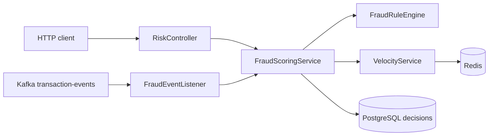
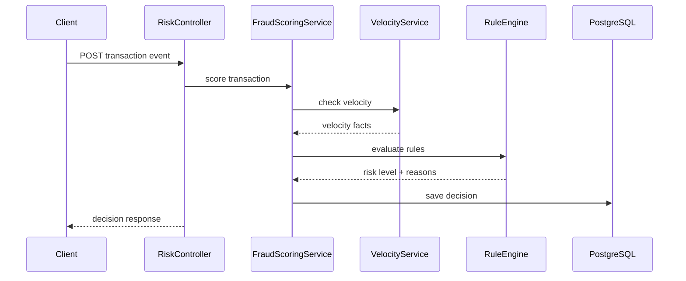
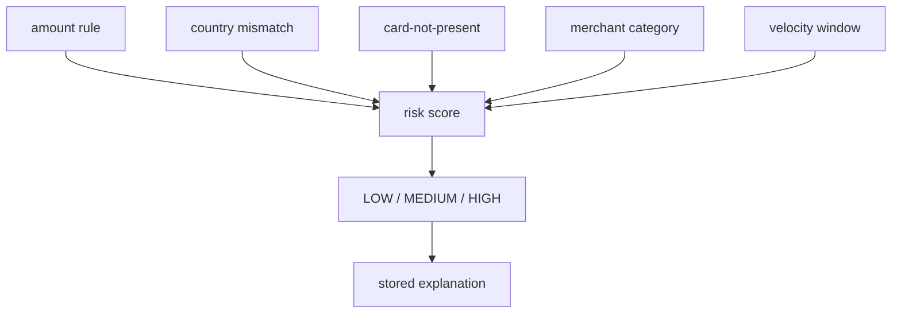

# Fraud Detection Platform Diagrams

## High-Level Design

### Component View

```mermaid
flowchart LR
    Client["HTTP client"] --> API["RiskController"]
    KafkaIn["Kafka transaction-events"] --> Listener["FraudEventListener"]
    API --> Scoring["FraudScoringService"]
    Listener --> Scoring
    Scoring --> Rules["FraudRuleEngine"]
    Scoring --> Velocity["VelocityService"]
    Velocity --> Redis[("Redis")]
    Scoring --> DB[("PostgreSQL decisions")]
```

## Low-Level Design

### Scoring Flow

```mermaid
sequenceDiagram
    participant C as Client
    participant API as RiskController
    participant S as FraudScoringService
    participant V as VelocityService
    participant R as RuleEngine
    participant DB as PostgreSQL
    C->>API: POST transaction event
    API->>S: score transaction
    S->>V: check velocity
    V-->>S: velocity facts
    S->>R: evaluate rules
    R-->>S: risk level + reasons
    S->>DB: save decision
    API-->>C: decision response
```

### Decision Model

```mermaid
flowchart TB
    Amount["amount rule"] --> Score["risk score"]
    Country["country mismatch"] --> Score
    Card["card-not-present"] --> Score
    Category["merchant category"] --> Score
    Velocity["velocity window"] --> Score
    Score --> Level["LOW / MEDIUM / HIGH"]
    Level --> Audit["stored explanation"]
```
