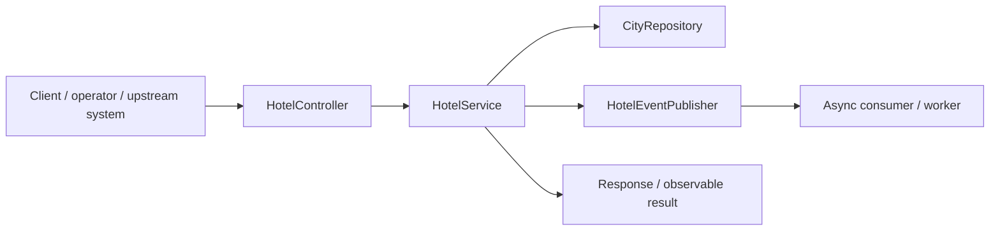
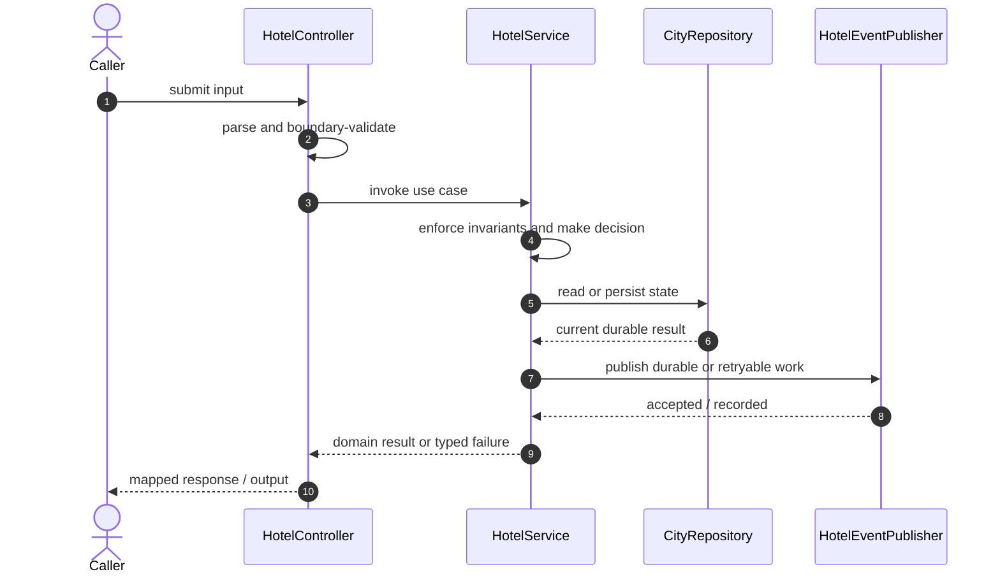

# Hotel Booking Service Code Flow

This is the single code-flow guide for the project. It connects the business request to concrete source files, explains both architectural levels, and shows where validation, state changes, asynchronous work, and responses occur.

## Scope and outcome

Spring Boot hotel API project at `G:\TechStudyNotes\SystemDesignProjects\hotel-booking-service`.

The tracked production-code inventory used by this guide contains **23 source units** and **3 annotation-discovered HTTP operations**. Generated/build output and test sources are intentionally excluded from the runtime path.

## High-Level Design

At the system level, callers enter through an inbound adapter. The adapter owns transport concerns; application/domain code owns use-case decisions; repositories and gateways isolate state and external systems. Asynchronous adapters extend the flow without moving business invariants into controllers or consumers.

### Runtime stages

1. **Enter:** a request, command, scheduled trigger, protocol message, or UI action reaches the inbound boundary.
2. **Validate:** transport shape and required fields are rejected before domain mutation.
3. **Decide:** application/domain logic loads required state and applies invariants, idempotency, authorization, limits, or algorithms.
4. **Commit:** durable state changes pass through a repository/store; external calls pass through gateways; asynchronous work passes through message boundaries.
5. **Return and observe:** the adapter maps the result to an HTTP response, protocol response, CLI output, event, or metric.

## Low-Level Design

The low-level path keeps orchestration directional: inbound adapter → application/domain unit → persistence/outbound adapter. Contracts carry data between layers; configuration and security apply cross-cutting policy without becoming business logic.

### Component map

| Responsibility           | Concrete code                                                                                                                                         |
| ------------------------ | ----------------------------------------------------------------------------------------------------------------------------------------------------- |
| Entry point              | `BookingApplication`                                                                                                                                  |
| Supporting logic         | `HotelApiDelegate`, `HotelServiceApiDelegate`, `SearchApiDelegate`, `City`, `Hotel`, `ResourceNotFoundException`, `DistanceCalculator`, `HotelMapper` |
| Configuration/security   | `KafkaTopicConfig`, `SecurityConfig`                                                                                                                  |
| Inbound adapter          | `HotelController`, `RestExceptionHandler`                                                                                                             |
| API/message contract     | `HotelResponse`, `HotelSearchResponse`, `HotelDeletedEvent`, `ErrorResponse`                                                                          |
| Messaging/async adapter  | `HotelEventPublisher`, `KafkaHotelEventPublisher`, `NoOpHotelEventPublisher`                                                                          |
| Persistence adapter      | `CityRepository`, `HotelRepository`                                                                                                                   |
| Application/domain logic | `HotelService`                                                                                                                                        |

### Inbound operations

| Verb/trigger | Path or input      | Owning code       |
| ------------ | ------------------ | ----------------- |
| `GET`        | `/hotel/{id}`      | `HotelController` |
| `DELETE`     | `/hotel/{id}`      | `HotelController` |
| `GET`        | `/search/{cityId}` | `HotelController` |

## Detailed source walkthrough

Read this table top-down by category, then follow the linked files. “Key methods” are discovered from the checked-in implementation and identify useful debugging/interview entry points.

| Source file                                                                                                     | Role                     | Responsibility and important methods                                                                                                                                       |
| --------------------------------------------------------------------------------------------------------------- | ------------------------ | -------------------------------------------------------------------------------------------------------------------------------------------------------------------------- |
| [`BookingApplication.java`](./src/main/java/org/chijai/booking/BookingApplication.java)                         | Entry point              | BookingApplication bootstraps the process and wires the runtime. Key methods: `main()`.                                                                                    |
| [`HotelApiDelegate.java`](./src/main/java/org/chijai/booking/api/HotelApiDelegate.java)                         | Supporting logic         | HotelApiDelegate provides a focused algorithm or shared implementation detail.                                                                                             |
| [`HotelServiceApiDelegate.java`](./src/main/java/org/chijai/booking/api/HotelServiceApiDelegate.java)           | Supporting logic         | HotelServiceApiDelegate provides a focused algorithm or shared implementation detail. Key methods: `getHotel()`, `deleteHotel()`, `searchClosestHotels()`.                 |
| [`SearchApiDelegate.java`](./src/main/java/org/chijai/booking/api/SearchApiDelegate.java)                       | Supporting logic         | SearchApiDelegate provides a focused algorithm or shared implementation detail.                                                                                            |
| [`KafkaTopicConfig.java`](./src/main/java/org/chijai/booking/config/KafkaTopicConfig.java)                      | Configuration/security   | KafkaTopicConfig defines runtime wiring, authentication, authorization, or cross-cutting policy.                                                                           |
| [`SecurityConfig.java`](./src/main/java/org/chijai/booking/config/SecurityConfig.java)                          | Configuration/security   | SecurityConfig defines runtime wiring, authentication, authorization, or cross-cutting policy. Key methods: `securityFilterChain()`, `passwordEncoder()`.                  |
| [`HotelController.java`](./src/main/java/org/chijai/booking/controller/HotelController.java)                    | Inbound adapter          | HotelController accepts an inbound call, validates its boundary contract, and delegates work. Key methods: `getHotel()`, `deleteHotel()`, `searchClosestHotels()`.         |
| [`City.java`](./src/main/java/org/chijai/booking/domain/City.java)                                              | Supporting logic         | City provides a focused algorithm or shared implementation detail. Key methods: `getId()`, `getName()`, `getLatitude()`, `getLongitude()`.                                 |
| [`Hotel.java`](./src/main/java/org/chijai/booking/domain/Hotel.java)                                            | Supporting logic         | Hotel provides a focused algorithm or shared implementation detail. Key methods: `getId()`, `getName()`, `getAddress()`, `getLatitude()`, `getLongitude()`, `isDeleted()`. |
| [`HotelResponse.java`](./src/main/java/org/chijai/booking/dto/HotelResponse.java)                               | API/message contract     | HotelResponse carries validated data across an API or messaging boundary.                                                                                                  |
| [`HotelSearchResponse.java`](./src/main/java/org/chijai/booking/dto/HotelSearchResponse.java)                   | API/message contract     | HotelSearchResponse carries validated data across an API or messaging boundary.                                                                                            |
| [`HotelDeletedEvent.java`](./src/main/java/org/chijai/booking/event/HotelDeletedEvent.java)                     | API/message contract     | HotelDeletedEvent carries validated data across an API or messaging boundary.                                                                                              |
| [`HotelEventPublisher.java`](./src/main/java/org/chijai/booking/event/HotelEventPublisher.java)                 | Messaging/async adapter  | HotelEventPublisher publishes, consumes, retries, or records asynchronous work.                                                                                            |
| [`KafkaHotelEventPublisher.java`](./src/main/java/org/chijai/booking/event/KafkaHotelEventPublisher.java)       | Messaging/async adapter  | KafkaHotelEventPublisher publishes, consumes, retries, or records asynchronous work. Key methods: `hotelDeleted()`.                                                        |
| [`NoOpHotelEventPublisher.java`](./src/main/java/org/chijai/booking/event/NoOpHotelEventPublisher.java)         | Messaging/async adapter  | NoOpHotelEventPublisher publishes, consumes, retries, or records asynchronous work. Key methods: `hotelDeleted()`.                                                         |
| [`ErrorResponse.java`](./src/main/java/org/chijai/booking/exception/ErrorResponse.java)                         | API/message contract     | ErrorResponse carries validated data across an API or messaging boundary.                                                                                                  |
| [`ResourceNotFoundException.java`](./src/main/java/org/chijai/booking/exception/ResourceNotFoundException.java) | Supporting logic         | ResourceNotFoundException provides a focused algorithm or shared implementation detail.                                                                                    |
| [`RestExceptionHandler.java`](./src/main/java/org/chijai/booking/exception/RestExceptionHandler.java)           | Inbound adapter          | RestExceptionHandler accepts an inbound call, validates its boundary contract, and delegates work. Key methods: `handleResourceNotFound()`.                                |
| [`CityRepository.java`](./src/main/java/org/chijai/booking/repository/CityRepository.java)                      | Persistence adapter      | CityRepository reads or writes durable state behind a storage boundary.                                                                                                    |
| [`HotelRepository.java`](./src/main/java/org/chijai/booking/repository/HotelRepository.java)                    | Persistence adapter      | HotelRepository reads or writes durable state behind a storage boundary.                                                                                                   |
| [`DistanceCalculator.java`](./src/main/java/org/chijai/booking/service/DistanceCalculator.java)                 | Supporting logic         | DistanceCalculator provides a focused algorithm or shared implementation detail. Key methods: `haversineInKm()`.                                                           |
| [`HotelMapper.java`](./src/main/java/org/chijai/booking/service/HotelMapper.java)                               | Supporting logic         | HotelMapper provides a focused algorithm or shared implementation detail. Key methods: `toResponse()`, `toSearchResponse()`.                                               |
| [`HotelService.java`](./src/main/java/org/chijai/booking/service/HotelService.java)                             | Application/domain logic | HotelService coordinates the use case and enforces domain decisions. Key methods: `getHotel()`, `softDeleteHotel()`, `searchClosestHotels()`.                              |

## End-to-end code-flow narrative

1. Start at `HotelController`. It receives the external input and should perform only boundary parsing, authentication/authorization handoff, and request validation.
2. Follow the call into `HotelService`. This is the principal place to explain the use case, invariant checks, deduplication/concurrency decision, and success/failure result.
3. Continue into `CityRepository` for the durable or in-memory state transition. Transaction and consistency guarantees belong at this boundary, not in response mapping.
4. Follow `HotelEventPublisher` when the synchronous decision emits follow-up work. Verify retry, duplicate-delivery, and dead-letter behavior independently of the request thread.
5. External-system behavior is either absent or represented behind another listed adapter.
6. Return to `HotelController`, where typed outcomes become the public response or protocol result. Logging and metrics should preserve correlation identifiers without leaking secrets.

## Failure and correctness checkpoints

- **Invalid input:** rejected at the inbound contract before state mutation.
- **Domain conflict:** returned as a typed result; do not hide it as an infrastructure exception.
- **Duplicate or concurrent work:** handled where the project’s idempotency, locking, ordering, or atomic data structure is implemented.
- **Storage/integration failure:** transaction is rolled back or the operation remains safely retryable.
- **Async failure:** consumer retries must preserve idempotency; poison work must become observable rather than loop silently.
- **Observability:** trace the same request/correlation identity through inbound, domain, persistence, and async logs.

## How to trace a scenario in the debugger

1. Choose one operation from the inbound-operations table or the project’s demo script.
2. Break at `HotelController`, then step into `HotelService` rather than framework internals.
3. Inspect the command/request object immediately after validation.
4. Stop before and after the call to `CityRepository` to compare intended and durable state.
5. If messaging exists, capture the emitted identifier and continue from `HotelEventPublisher`.
6. Confirm the final public result and the corresponding logs/metrics.

## Related project documentation

- [Project README](./README.md)
- [Specialized diagrams](./docs/DIAGRAMS.md)
- [Interview guide](./docs/INTERVIEW_GUIDE.md)
