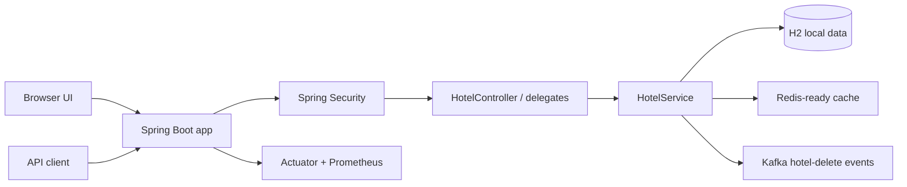
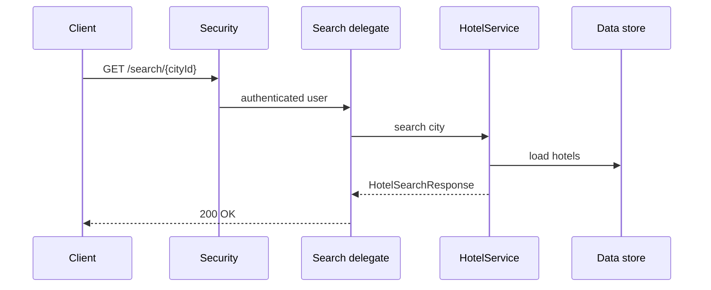
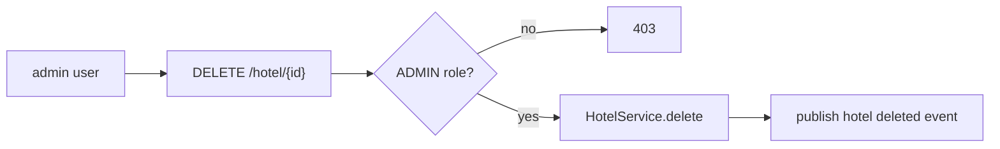

# Hotel Booking Service Diagrams

## High-Level Design

### Component View

```mermaid
flowchart LR
    Browser["Browser UI"] --> App["Spring Boot app"]
    Client["API client"] --> App
    App --> Security["Spring Security"]
    Security --> Controller["HotelController / delegates"]
    Controller --> Service["HotelService"]
    Service --> DB[("H2 local data")]
    Service --> Cache["Redis-ready cache"]
    Service --> Kafka["Kafka hotel-delete events"]
    App --> Metrics["Actuator + Prometheus"]
```

## Low-Level Design

### Search Flow

```mermaid
sequenceDiagram
    participant C as Client
    participant S as Security
    participant API as Search delegate
    participant H as HotelService
    participant DB as Data store
    C->>S: GET /search/{cityId}
    S->>API: authenticated user
    API->>H: search city
    H->>DB: load hotels
    H-->>API: HotelSearchResponse
    API-->>C: 200 OK
```

### Delete Flow

```mermaid
flowchart LR
    Admin["admin user"] --> Delete["DELETE /hotel/{id}"]
    Delete --> Authz{"ADMIN role?"}
    Authz -->|no| Deny["403"]
    Authz -->|yes| Service["HotelService.delete"]
    Service --> Event["publish hotel deleted event"]
```
