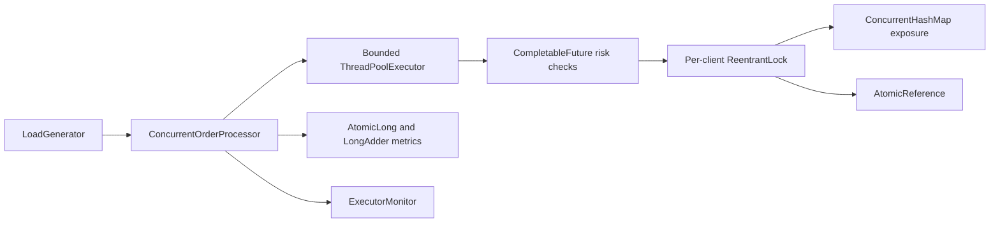
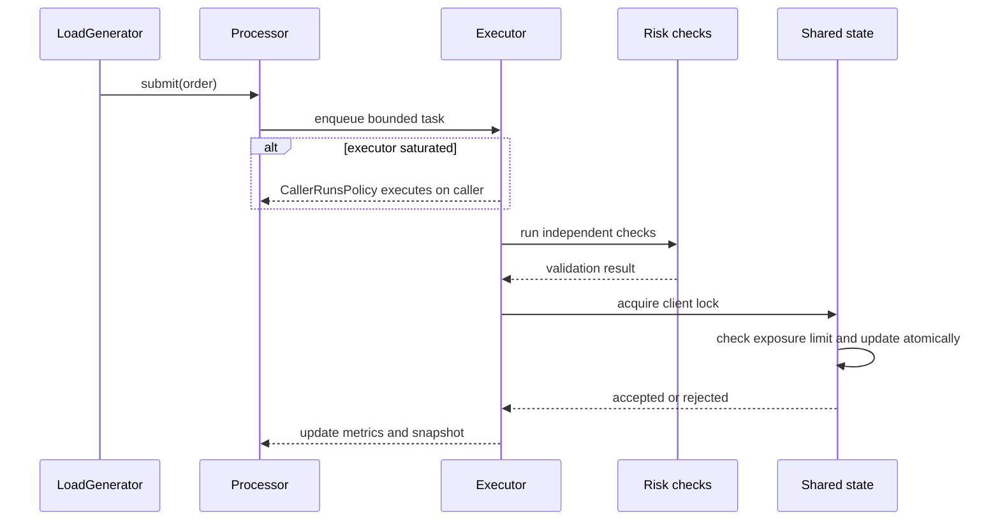
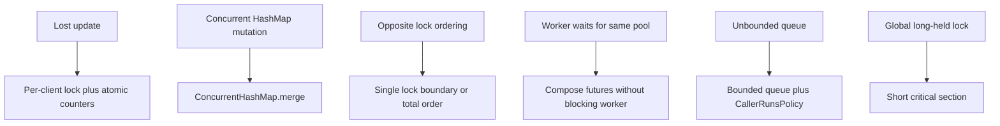

# Java Concurrency Lab Diagrams

## Safe Processor Architecture

```mermaid
flowchart LR
    Generator["LoadGenerator"] --> Processor["ConcurrentOrderProcessor"]
    Processor --> Pool["Bounded ThreadPoolExecutor"]
    Pool --> Checks["CompletableFuture risk checks"]
    Checks --> Lock["Per-client ReentrantLock"]
    Lock --> Exposure["ConcurrentHashMap exposure"]
    Lock --> Snapshot["AtomicReference<RiskState>"]
    Processor --> Metrics["AtomicLong and LongAdder metrics"]
    Processor --> Monitor["ExecutorMonitor"]
```

## Order Admission Flow

```mermaid
sequenceDiagram
    participant L as LoadGenerator
    participant P as Processor
    participant E as Executor
    participant R as Risk checks
    participant S as Shared state
    L->>P: submit(order)
    P->>E: enqueue bounded task
    alt executor saturated
        E-->>P: CallerRunsPolicy executes on caller
    end
    E->>R: run independent checks
    R-->>E: validation result
    E->>S: acquire client lock
    S->>S: check exposure limit and update atomically
    S-->>E: accepted or rejected
    E-->>P: update metrics and snapshot
```

## Failure-To-Fix Map

```mermaid
flowchart TB
    Lost["Lost update"] --> LockFix["Per-client lock plus atomic counters"]
    HashMap["Concurrent HashMap mutation"] --> ChmFix["ConcurrentHashMap.merge"]
    Deadlock["Opposite lock ordering"] --> OrderFix["Single lock boundary or total order"]
    Starvation["Worker waits for same pool"] --> FutureFix["Compose futures without blocking worker"]
    Overload["Unbounded queue"] --> Backpressure["Bounded queue plus CallerRunsPolicy"]
    Contention["Global long-held lock"] --> ScopeFix["Short critical section"]
```
