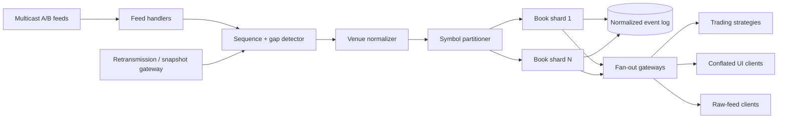

# Market Data Platform (HLD 28)

A runnable Java 17 model of a high-throughput market-data pipeline. It handles out-of-order multicast-style packets, gap detection and retransmission, normalization, order-level book reconstruction, depth snapshots, fan-out, and slow-consumer isolation.

## Choose a Track

| Goal                                      | Start here                                                                              |
| ----------------------------------------- | --------------------------------------------------------------------------------------- |
| Prepare the 40–60 minute interview answer | [INTERVIEW_GUIDE.md](INTERVIEW_GUIDE.md)                                                |
| Inspect architecture and failure behavior | [docs/ARCHITECTURE.md](docs/ARCHITECTURE.md) and [FAILURE_DRILLS.md](FAILURE_DRILLS.md) |
| Evaluate real deployment gaps             | [PRODUCTION_READINESS.md](PRODUCTION_READINESS.md)                                      |

The codebase is shared; the evidence and completion criteria are separate.

## Run

```powershell
cd G:\TechStudyNotes\SystemDesignProjects\market-data-platform
mvn test
mvn exec:java
```

The demo intentionally skips sequence 2 on the live feed, retrieves it from a retransmission source, applies packets 1-4 in order, reconstructs an AAPL book, and shows both fast and conflating consumers.

## Architecture



## What Is Implemented

- Strict per-channel sequence tracking and duplicate suppression.
- Buffering of later packets while missing ranges are recovered.
- A venue-to-canonical normalization boundary.
- Order-level add/reduce/delete/trade application and aggregated price levels.
- Per-subscriber bounded queues with conflate-or-disconnect policies.
- Three tests for recovery ordering, book correctness, and slow consumers.

The local recovery source is a map, not a real multicast A/B arbiter or TCP replay service. Kernel bypass, NUMA pinning, binary codecs, replicated logs, feed entitlements, and exchange certification are production seams.

Use [INTERVIEW_GUIDE.md](INTERVIEW_GUIDE.md) for the timed answer, [docs/ARCHITECTURE.md](docs/ARCHITECTURE.md) for component/sequence diagrams, and [FAILURE_DRILLS.md](FAILURE_DRILLS.md) for incident prompts.
