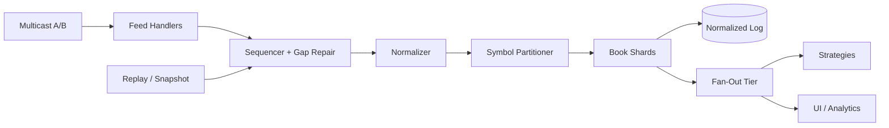
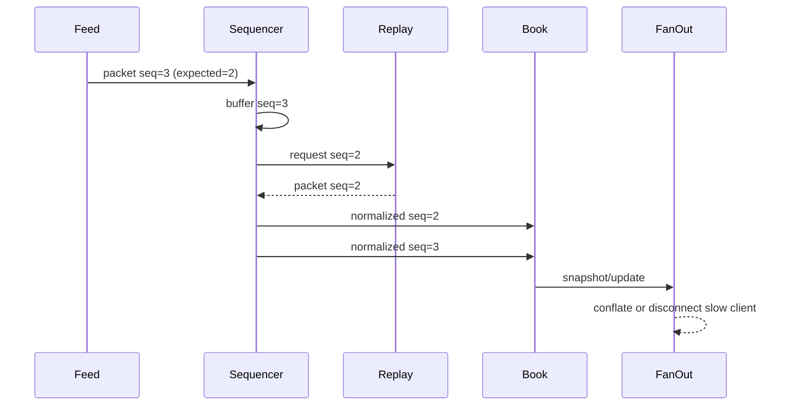

# Architecture

## High-Level Design

Venue/channel order is repaired before normalization. After normalization, the stream is repartitioned so one shard owns each symbol book.

## Low-Level Design

`SequencedFeedHandler` emits only a contiguous prefix, `OrderBook` owns order and price-level state, and every `Subscriber` has an independent bounded queue and overflow policy.
